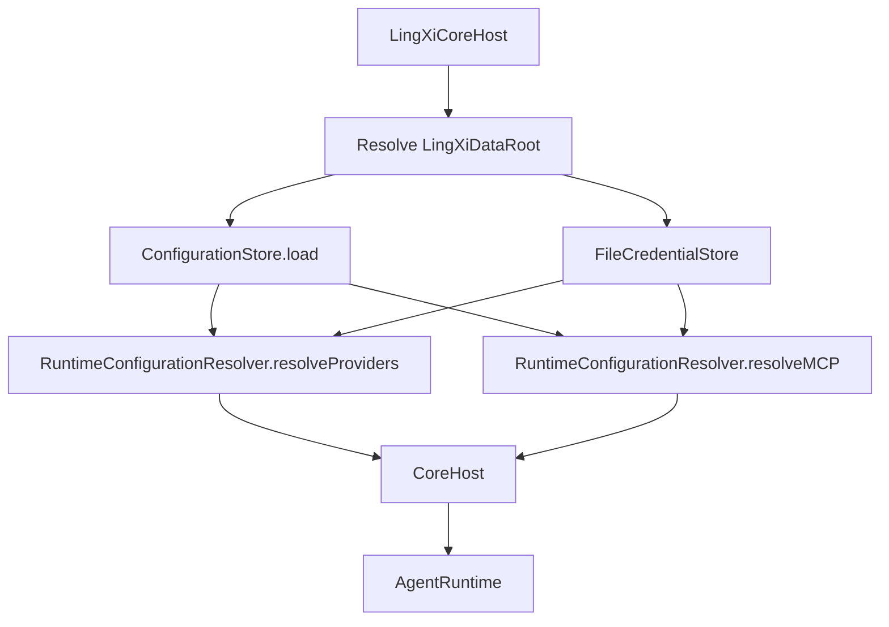
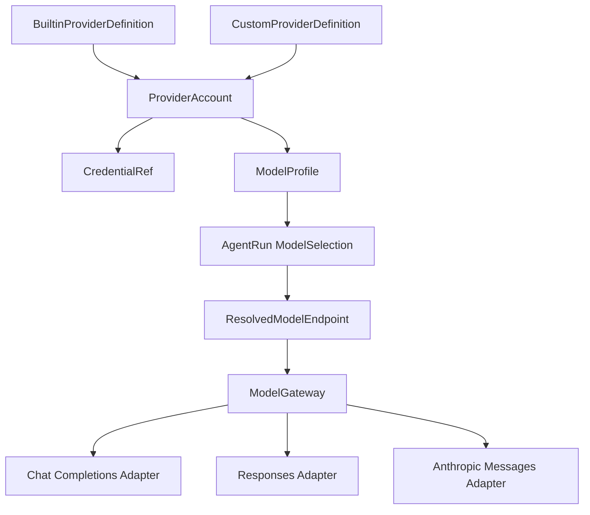
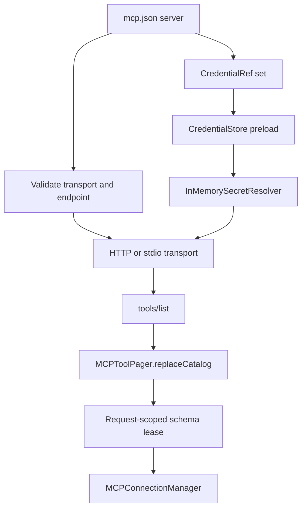
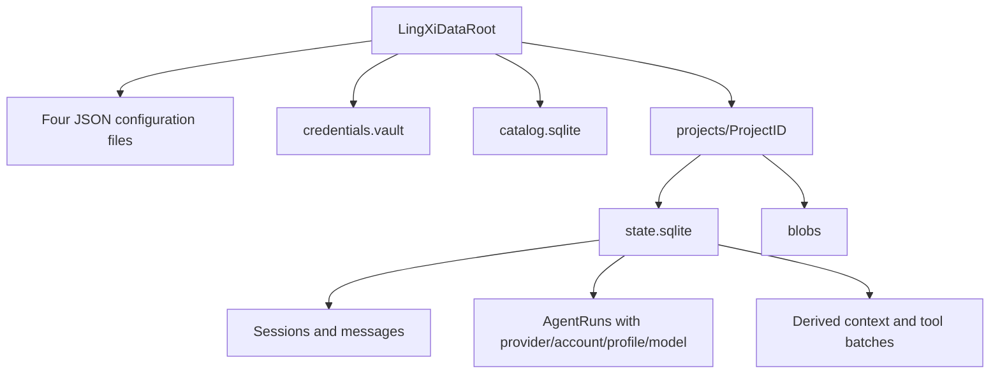
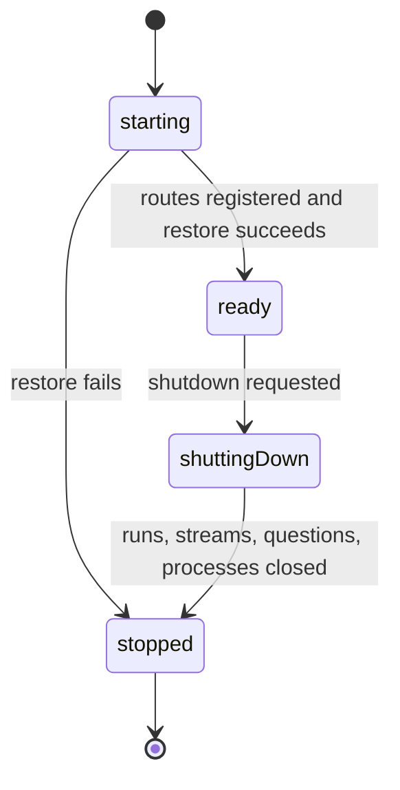

# P1-P13 Stabilization and Architecture Consolidation

Updated: 2026-08-30

## Scope

This document records the stabilized P1-P13 runtime. It does not introduce Phase 14, Workflow, Goal, long-term memory, GUI, or remote runtime features.

## Audit Matrix

| Area | Status | Durable truth / guard |
|---|---|---|
| Client/Core wire errors | Complete | Typed `CoreError`; failed stream terminal; legacy stream-end decode retained |
| Core lifecycle | Complete | Ready/stopped command gate; restore failure stops Core; shutdown cancels active work |
| Workspace path boundary | Complete | Shared `SensitivePathPolicy`; workspace containment; secret-path regression tests |
| Persistent configuration | Complete | `config.json`, `providers.json`, `mcp.json`, `plugins.json`; bundled offline schemas |
| Data root | Complete | Host resolves `LINGXI_DATA_ROOT` override or `~/.lingxiagent`; Core receives the resolved path |
| Credentials | Complete with documented limitation | `CredentialRef` in config; plaintext `credentials.vault` isolated by 0700/0600 permissions |
| Provider resolution | Complete for configured custom profiles | Explicit Account + ModelProfile + default selection; no model-name or Provider-name inference |
| OpenAI Chat wire | Complete | Request-scoped model, structured tool history, strict stream terminal handling |
| OpenAI Responses wire | Complete | Execution-scoped provenance; remote state defaults off and requires explicit Profile enablement |
| Anthropic Messages wire | Complete offline | Native message/tool blocks and SSE correlation; no OAuth implementation |
| MCP runtime | Complete for current transports | HTTP/stdio mapping, credential preload, discovery, leases, schema limits, stdio timeout |
| AgentRun model identity | Complete | Provider, account, profile, model persisted independently per run |
| Architecture boundaries | Complete | Domain environment-access, Client/Core dependency, adapter strategy and identity guards |
| Real Provider acceptance | Externally blocked | Last smoke result was HTTP 429; no retry performed |

## Configuration Precedence

1. Explicit test/debug injection.
2. AgentRun `ModelSelection`.
3. Persistent user configuration under `LingXiDataRoot`.
4. Verified Builtin Provider defaults, when available.
5. Explicit unresolved error.

Environment variables are limited to process bootstrap, diagnostics, test fixtures, and explicit debug injection. They are not production user configuration truth.

## Bootstrap Graph



## Provider Resolution



Persisted values: Custom Provider definitions, accounts, credential references, ModelProfiles, default selection, and AgentRun selection.

Ephemeral values: raw credentials, resolved endpoints, adapters, HTTP sessions, Responses provenance, and MCP schema leases.

## Wire Capability Matrix

| Wire | Request translation | Streaming | Tool calls | Parallel tool calls | Reasoning deltas | Remote state |
|---|---:|---:|---:|---:|---:|---:|
| OpenAI-compatible Chat Completions | Yes | Yes | Yes | Yes | Compatible extension fields | No |
| OpenAI Responses | Yes | Yes | Yes | Yes | Yes | Explicit Profile opt-in only |
| Anthropic Messages | Yes | Yes | Yes | Yes | Native thinking deltas | No |

Model capabilities are declared by `ModelProfile`; the runtime does not infer them from model names.

## Builtin Catalog Status

The catalog contains 22 stable product IDs. Definitions without recorded official sources intentionally have no endpoint, auth, wire, or capability claims and remain `unverified`. Antigravity consumer OAuth is marked `unsupported`. A Builtin entry is not runtime-resolvable until its official definition is verified.

| Providers | Status |
|---|---|
| Anthropic, Cloudflare AI Gateway, DeepSeek, Hugging Face | Unverified |
| llama.cpp, LM Studio, MiniMax, Ollama, Ollama Cloud | Unverified |
| OpenAI, Gemini | Unverified |
| Antigravity consumer OAuth | Unsupported |
| OpenCode Zen, OpenCode Go, OpenRouter, xAI | Unverified |
| Z.AI, Zhi Pu Coding Plan, MIMO API, MIMO Coding Plan | Unverified |
| Alibaba Bailian, Qwen Coding Plan | Unverified |

## MCP Resolution



HTTP endpoints must use HTTPS, except HTTP loopback. Stdio commands must be absolute, receive a sanitized environment, and obey `timeoutSeconds`. Disabled servers do not require their credentials to be present.

## Persistence Graph



Durable truth is preserved during migrations. Rebuildable indexes may be invalidated independently. Raw credentials must not enter Session history, AgentRun rows, Context, tool archives, protocol messages, logs, or fixtures.

## Core State



## Verification

Canonical offline command:

```sh
swift test --skip RealProviderSmokeTests
```

Latest result: 176 tests in 26 suites passed, including the stdio timeout regression.

Semgrep MCP was unavailable in the connected MCP set. A local source-pattern audit found no dynamic `eval`/`exec`; subprocess, filesystem, network, and credential call sites were manually reviewed at their shared boundaries.

## External Follow-up

- Rotate and remove the plaintext credentials previously reported in `Tests/develop.env`; this remains a user-owned action and the file was not read or modified.
- Re-run Real Provider smoke only after the external 429 condition is cleared and explicit approval is given.
- Attach official source URLs and verified endpoint/auth/model metadata before promoting any Builtin Provider from `unverified`.
- Notion synchronization remains stopped because the production Development databases and policy page could not be located.
