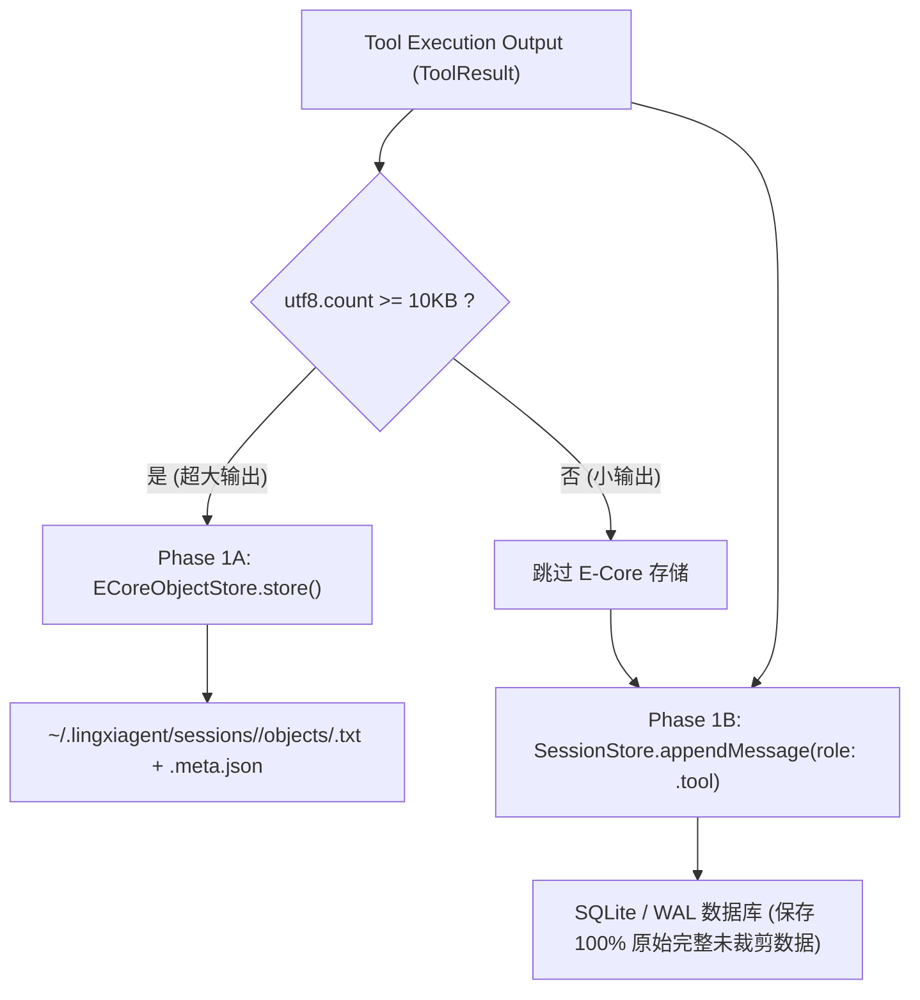
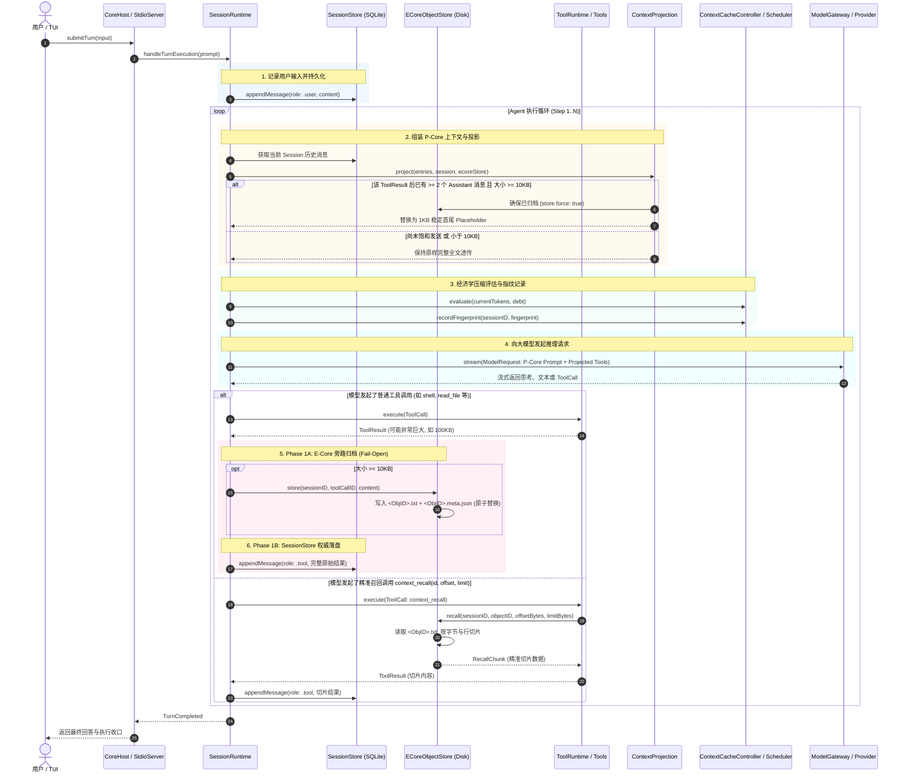
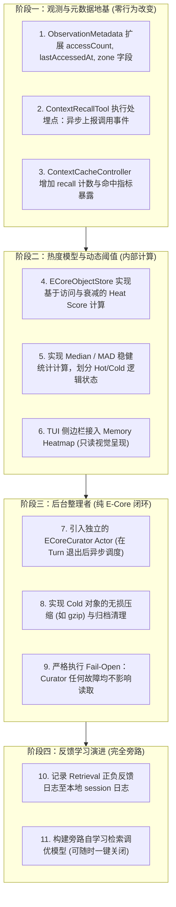

# LingXiAgent P-Core / E-Core 上下文系统只读审计报告

> **审计执行**：LingXiFox（本狐）  
> **审计时间**：2026-09-16  
> **审计性质**：源码级只读审计（Read-Only Codebase Audit）  
> **源码基线**：Git commit HEAD (`main` 分支)，Apple Swift 6.4 (`swiftlang-6.4.0.34.1`)  
> **核心原则**：以真实源码为唯一权威依据；不推测、不迎合假定、不修改任何生产代码与配置。

---

## 目录
1. [涉事模块与源码文件全景清单](#1-涉事模块与源码文件全景清单)
2. [当前真实模块关系与工作机制深度剖析](#2-当前真实模块关系与工作机制深度剖析)
   - 2.1 P-Core 的真实数据组成
   - 2.2 Stable Context 与 Prefix Cache 维护机制
   - 2.3 E-Core Index / Handle 进 P-Core 的真实机制（Context Projection）
   - 2.4 E-Core 原始对象的物理存储布局
   - 2.5 ToolResult 的落盘与分流（SessionStore vs E-Core）
   - 2.6 ContextObjectID 的生成算法与安全校验
   - 2.7 SHA256 / FNV-1a 去重与幂等写入机制
   - 2.8 字节 / 行切片召回实现细节
   - 2.9 Fail-Open 降级体系
   - 2.10 SessionStore 与 E-Core 的权威边界
   - 2.11 Provider 请求前最终 Prompt / Context 组装全流程
3. [真实端到端数据流与调用链图谱](#3-真实端到端数据流与调用链图谱)
4. [核心组件规格矩阵（Component Specification Matrix）](#4-核心组件规格矩阵component-specification-matrix)
5. [E-Core 现有概念与复用基础专项排查](#5-e-core-现有概念与复用基础专项排查)
6. [核心责任归属边界矩阵](#6-核心责任归属边界矩阵)
7. [现有性能指标与观测体系](#7-现有性能指标与观测体系)
8. [未来增强能力（A-G）的最小侵入点深度推演](#8-未来增强能力a-g的最小侵入点深度推演)
9. [A-G 增强能力规格与防护评估表](#9-a-g-增强能力规格与防护评估表)
10. [最小增量实施路线建议（零破坏演进）](#10-最小增量实施路线建议零破坏演进)
11. [设计文档与真实代码的差异对照表](#11-设计文档与真实代码的差异对照表)

---

## 1. 涉事模块与源码文件全景清单

全仓库中与 **P-Core / E-Core / Context / Session / ToolResult / ContextObject / Recall / Index** 相关的核心实现源码文件共计 14 个，具体如下：

| 序号 | 源码路径 | 模块定位 | 核心职责 |
| :--- | :--- | :--- | :--- |
| 1 | [`Sources/LingXiCore/Modules/Context/ECoreObjectFabric.swift`](file:///Volumes/Development/Projects/projects/LingXiAgent/Sources/LingXiCore/Modules/Context/ECoreObjectFabric.swift) | E-Core 对象织物 | `ContextObjectID` 强类型定义、`ObservationMetadata` 元数据、`ECoreObjectStore` 磁盘持久化与切片召回 |
| 2 | [`Sources/LingXiCore/Modules/Context/ContextProjection.swift`](file:///Volumes/Development/Projects/projects/LingXiAgent/Sources/LingXiCore/Modules/Context/ContextProjection.swift) | P-Core 投影器 | `FULL_SENDS` 判定、1KB 稳定首尾 Placeholder 构造、P-Core 动态投影转换 |
| 3 | [`Sources/LingXiCore/Modules/Context/ContextCacheController.swift`](file:///Volumes/Development/Projects/projects/LingXiAgent/Sources/LingXiCore/Modules/Context/ContextCacheController.swift) | 缓存与调度中枢 | L1/L2 页面调度、CacheEpoch 演进、Prefix 指纹跟踪、真实命中率统计与 Revert 协同 |
| 4 | [`Sources/LingXiCore/Modules/Context/L1ContextEngine.swift`](file:///Volumes/Development/Projects/projects/LingXiAgent/Sources/LingXiCore/Modules/Context/L1ContextEngine.swift) | L1 上下文引擎 | 将 Session 消息与常驻页面转换为结构化 `[ContextEntry]` |
| 5 | [`Sources/LingXiCore/Modules/Context/CacheAwareContextScheduler.swift`](file:///Volumes/Development/Projects/projects/LingXiAgent/Sources/LingXiCore/Modules/Context/CacheAwareContextScheduler.swift) | 经济学调度器 | 计算 Cache Debt、评估压缩时机（Skip / Economic / Emergency） |
| 6 | [`Sources/LingXiCore/Modules/Context/ContextCompaction.swift`](file:///Volumes/Development/Projects/projects/LingXiAgent/Sources/LingXiCore/Modules/Context/ContextCompaction.swift) | 上下文压缩器 | 淘汰非关键历史、衍生摘要归档至 `DerivedContextStore` |
| 7 | [`Sources/LingXiCore/Modules/Session/SessionRuntime.swift`](file:///Volumes/Development/Projects/projects/LingXiAgent/Sources/LingXiCore/Modules/Session/SessionRuntime.swift) | 执行运行时主循环 | Tool 执行与结果落盘、Phase 1A/1B 串联、Context 组装发往 Provider |
| 8 | [`Sources/LingXiCore/Modules/Tool/BuiltinTools.swift`](file:///Volumes/Development/Projects/projects/LingXiAgent/Sources/LingXiCore/Modules/Tool/BuiltinTools.swift) | 工具注册与内置工具 | `ContextRecallTool`（`context_recall` 命令行接入）、内置工具暴露列表 |
| 9 | [`Sources/LingXiCore/Modules/Tool/ToolRuntime.swift`](file:///Volumes/Development/Projects/projects/LingXiAgent/Sources/LingXiCore/Modules/Tool/ToolRuntime.swift) | 工具运行时与路由 | `coreToolIDs` 冻结排序、`search_tools` / `load_tool` 动态租借管理器 |
| 10 | [`Sources/LingXiCore/Modules/Context/ContextPager.swift`](file:///Volumes/Development/Projects/projects/LingXiAgent/Sources/LingXiCore/Modules/Context/ContextPager.swift) | 代码库分页器 | 代码库文件的 Page 切分、BM25/关键词检索与持久化索引 |
| 11 | [`Sources/LingXiCore/Modules/Context/ProjectScanner.swift`](file:///Volumes/Development/Projects/projects/LingXiAgent/Sources/LingXiCore/Modules/Context/ProjectScanner.swift) | 项目扫描器 | 工作区代码文件发现、过滤与指纹计算 |
| 12 | [`Sources/LingXiCore/Modules/CodebaseGraph/CodebaseGraphEngine.swift`](file:///Volumes/Development/Projects/projects/LingXiAgent/Sources/LingXiCore/Modules/CodebaseGraph/CodebaseGraphEngine.swift) | 代码知识图谱 | AST 符号与依赖图生成、跨文件调用边构建与拓扑概览 |
| 13 | [`Sources/LingXiProtocol/Snapshots.swift`](file:///Volumes/Development/Projects/projects/LingXiAgent/Sources/LingXiProtocol/Snapshots.swift) | 跨端契约 | `ContextStateSnapshot`、`eCoreObjectCount`、`eCoreTotalBytes` 序列化协议 |
| 14 | [`Sources/LingXiCore/Modules/Session/SQLiteSessionPersistence.swift`](file:///Volumes/Development/Projects/projects/LingXiAgent/Sources/LingXiCore/Modules/Session/SQLiteSessionPersistence.swift) | 权威会话持久化 | SQLite 底座存储、WAL 事务写入与 Revision 严格单调递增 |

---

## 2. 当前真实模块关系与工作机制深度剖析

### 2.1 P-Core 的真实数据组成
P-Core（Primary Core，主要执行核）并非独立的进程，而是**面向大语言模型推理暴露的轻量、高度结构化、前缀稳定的上下文活跃工作集（Active Working Set）**。

在当前代码中（[`SessionRuntime.swift:423-586`](file:///Volumes/Development/Projects/projects/LingXiAgent/Sources/LingXiCore/Modules/Session/SessionRuntime.swift#L423-L586)），发送给 Provider 的 P-Core 上下文由以下 4 种数据物理构成：
1. **Pinned System Prompt（固定系统提示词）**：
   - 包含系统核心身份、人设、三大纪律八项注意、工作方式；
   - 在当前 `CacheEpoch` 内完全静态不可变，保证 Prefix 最顶层绝对锁定。
2. **Epoch Provider-Visible Tool Manifest（单调冻结工具定义表）**：
   - 包含 15 个 `coreToolIDs` 以及当前会话动态租借的专用工具；
   - 严格遵循**单调追加（Monotonic Append Only）**规则，在同一个 Epoch 内禁止删除、缩水或打乱顺序，杜绝 Client Cache Bust。
3. **L1 Working Set（受控历史与常驻页面）**：
   - 历史消息经 `ContextProjection` 投影后的条目（小工具结果保持内联，超大工具结果转为稳定首尾 Placeholder）；
   - 通过 `context_search` 显式调入 L1 的代码库文件片段（`[ContextPage]`）；
   - 衍生上下文摘要（`[DerivedContextPage]`）。
4. **Current Turn Input（当前轮次输入）**：
   - 当前用户的最新指令输入与可能挂载的后台命令异步通知（`bgNotice`）。

---

### 2.2 Stable Context 与 Prefix Cache 维护机制
为达到主流大模型（如 Claude Prompt Caching、OpenAI Prompt Cache、DeepSeek Context Cache）的极高命中率，LingXiAgent 建立了严格的**防抖动与指纹对齐体系**：
- **`PrefixFingerprint` 计算**（[`ContextCacheController.swift:375-406`](file:///Volumes/Development/Projects/projects/LingXiAgent/Sources/LingXiCore/Modules/Context/ContextCacheController.swift#L375-L406)）：
  拆分为 6 段哈希进行分别校验：
  1. `systemHash`：系统提示词哈希；
  2. `coreToolsHash`：核心工具列表哈希；
  3. `leasedToolsHash`：已租借动态工具列表哈希；
  4. `skillPrefixHash`：工作区技能提示词哈希；
  5. `requestProfileHash`：请求配置哈希；
  6. `historyStableHash`：历史因果序列哈希。
- **Client Cache Bust 实时检测**：
  若上下两轮间 `systemHash` 或 `coreToolsHash` 发生改变，系统即时触发 `CLIENT CACHE BUST DETECTED` 诊断并记录到 `CacheDebt`。
- **Epoch 推进隔离**：
  只有发生真正的破坏性变更（如用户显式切换模型、切换 Provider 或执行 `/revert` 回滚）时，才通过 `advanceEpoch` 推进 Epoch，否则保持上一轮指纹作为基线。

---

### 2.3 E-Core Index / Handle 如何进入 P-Core
E-Core 的对象索引（Handle）进入 P-Core 的唯一官方通道是 **[`ContextProjection.project`](file:///Volumes/Development/Projects/projects/LingXiAgent/Sources/LingXiCore/Modules/Context/ContextProjection.swift#L19-L106)**。

其执行逻辑遵循三大铁律：
1. **`FULL_SENDS` 饱和透传保护**：
   - 每个产生的 ToolResult，在它之后的 Assistant 消息数 `assistantCount < configuration.fullSendCount`（默认 2 次）时，**无条件完整透传全文**，确保模型在当轮和紧随其后的一轮能完整感知全部输出；
2. **阈值门槛（Objectization Threshold）**：
   - 只有 `content.utf8.count >= configuration.objectizationThreshold`（默认 10,240 字节，即 10KB）的超大输出才符合投影资格；小于 10KB 的保持普通文本内联；
3. **1KB 确定性首尾 Placeholder 构建**：
   - 当满足上述条件时，P-Core 将该结果动态替换为稳定 Placeholder：
     ```text
     [Context Object: obj_shell_call-123_a1b2c3d4]
     Tool: shell
     Size: 84520 bytes, 1420 lines
     Content Type: text/plain
     Hash: 000012345678abcd
     --- First 512 bytes ---
     ...前 512 字节内容...
     --- Last 512 bytes ---
     ...后 512 字节内容...
     ---
     To retrieve additional lines or full content, use `context_recall(id: "obj_shell_call-123_a1b2c3d4", offset: <bytes>, limit: <bytes>)`.
     ```
   - 替换后的条目被打上元数据 `["context_object_id": objectID.rawValue, "projected": "true"]`。

---

### 2.4 E-Core 原始对象的物理存储布局
E-Core 对象采用纯文件系统原子存储，完全独立于 SQLite。

- **根目录路径**（[`ECoreObjectFabric.swift:141-147`](file:///Volumes/Development/Projects/projects/LingXiAgent/Sources/LingXiCore/Modules/Context/ECoreObjectFabric.swift#L141-L147)）：
  `~/.lingxiagent/sessions/<SessionID>/objects/`
- **每个对象落地两个文件**：
  1. **原始数据载荷**：`<ContextObjectID>.txt`（UTF-8 纯文本全文，无任何压缩与篡改）；
  2. **元数据描述文件**：`<ContextObjectID>.meta.json`（包含 `ObservationMetadata` 结构体 JSON 序列化结果）。
- **临时写入隔离**：
  写入时先写入 `.<ContextObjectID>.<UUID>.tmp`，完成刷盘后通过系统原子重命名（`FileManager.default.moveItem`）覆盖目标文件，杜绝读取到写一半的残缺文件。

---

### 2.5 ToolResult 的落盘与分流（SessionStore vs E-Core）
在 [`SessionRuntime.swift:1069-1085`](file:///Volumes/Development/Projects/projects/LingXiAgent/Sources/LingXiCore/Modules/Session/SessionRuntime.swift#L1069-L1085) 中，当工具执行完毕产生 `ToolResult` 时，发生**双路并行落盘分流**：



**关键结论**：
- **SessionStore 是唯一的不可篡改权威真相（Source of Truth）**。不管 ToolResult 有多大，SessionStore 的数据库记录中永远完整保存原始数据；
- **E-Core 是旁路加速与分片提取载体**；
- **P-Core 从不持久化**，它只是在组装 Provider 请求的一瞬间由 `ContextProjection` 基于 SessionStore + E-Core 计算出的动态内存视图。

---

### 2.6 ContextObjectID 的生成算法与安全校验
- **生成算法**（[`ECoreObjectFabric.swift:36-49`](file:///Volumes/Development/Projects/projects/LingXiAgent/Sources/LingXiCore/Modules/Context/ECoreObjectFabric.swift#L36-L49)）：
  1. `cleanTool`：提取 `toolName` 中字母数字下划线，若为空则兜底为 `"obj"`；
  2. `cleanCall`：提取 `toolCallID` 前 12 位合法字符；
  3. `hashStr`：对 content 的 UTF-8 字节流运行 **FNV-1a 64-bit 哈希算法**（偏移基准 `14695981039346656037`，素数乘数 `1099511628211`），输出 8 位 16 进制字符串；
  4. 格式：`obj_\(cleanTool)_\(cleanCall)_\(hashStr)`。
- **安全校验规则**（[`ECoreObjectFabric.swift:10-18`](file:///Volumes/Development/Projects/projects/LingXiAgent/Sources/LingXiCore/Modules/Context/ECoreObjectFabric.swift#L10-L18)）：
  - 严格限制字符集：只允许 `a-z`, `A-Z`, `0-9`, `_`, `-`；
  - 严格限制长度：`1 <= count <= 128`；
  - 任何包含 `/`, `\`, `..` 或不可见控制字符的传入直接抛出 `CoreError(.toolArgumentInvalid)`，彻底从类型构造阶段杜绝路径穿越（Path Traversal）。

---

### 2.7 SHA256 / FNV-1a 去重与幂等写入机制
在当前代码中：
- `ObservationMetadata` 内部记录了针对对象全文的 `contentHash`（16 位十六进制 FNV-1a 哈希）；
- 在 [`ECoreObjectStore.store`](file:///Volumes/Development/Projects/projects/LingXiAgent/Sources/LingXiCore/Modules/Context/ECoreObjectFabric.swift#L205-L209) 中：
  ```swift
  if !FileManager.default.fileExists(atPath: targetURL.path) {
      try content.write(to: tempURL, atomically: true, encoding: .utf8)
      _ = try? FileManager.default.removeItem(at: targetURL)
      try FileManager.default.moveItem(at: tempURL, to: targetURL)
  }
  ```
  如果磁盘上已存在同名 `<ContextObjectID>.txt`，则**直接跳过重复的物理磁盘写入**，实现基于内容哈希文件名的天然写入幂等去重。

---

### 2.8 字节 / 行切片召回实现细节
在 [`ECoreObjectFabric.swift:237-319`](file:///Volumes/Development/Projects/projects/LingXiAgent/Sources/LingXiCore/Modules/Context/ECoreObjectFabric.swift#L237-L319) 的 `recall` 方法中：
1. **入参规格**：`sessionID`, `objectID`, `offsetBytes = 0`, `limitBytes = nil`, `limitLines = nil`；
2. **硬边界保护**：
   - 单次最大召回字节数受配置上限约束：`min(limitBytes ?? 16KB, configuration.recallMaxBytes)`；
   - 单次最大召回行数受配置上限约束：`min(limitLines ?? 400, configuration.recallMaxLines)`；
3. **两阶段切片与边界修齐**：
   - 阶段一：在字节级别提取 `utf8Data.subdata(in: startIdx..<endIdx)`，解码为 UTF-8 字符串；
   - 阶段二：按 `\n` 切分为行，若行数超过 `maxLines`，仅保留前 `maxLines` 行并在切片末尾追加换行符对齐；
4. **精确行号反算**：
   - 遍历 `offsetBytes` 前面的字节统计换行符个数，确定起始行号 `startLine`；
   - 计算得到切片的终止行号 `endLine`，并返回包含 `hasMore: (startIdx + actualLength) < totalBytes` 的 `RecallChunk`。

---

### 2.9 Fail-Open 降级体系
系统严格贯彻“三大纪律八项注意”之安全性与健壮性铁律，在所有层级部署了 Fail-Open 兜底网：
1. **E-Core 存储写入失败**（[`ECoreObjectFabric.swift:219-223`](file:///Volumes/Development/Projects/projects/LingXiAgent/Sources/LingXiCore/Modules/Context/ECoreObjectFabric.swift#L219-L223)）：
   - 磁盘 IO 故障或权限不足时，向 stderr 输出 `[E-CORE WARNING]` 诊断，返回 `nil`，主流程毫发无伤；
2. **P-Core 动态投影异常**（[`ContextProjection.swift:24-26`](file:///Volumes/Development/Projects/projects/LingXiAgent/Sources/LingXiCore/Modules/Context/ContextProjection.swift#L24-L26)）：
   - 开关关闭或投影异常时，直接原封不动返回未经投影的原始 `entries`，确保发给模型的 Context 永远合法可用；
3. **召回目标不存在**（[`BuiltinTools.swift:500-502`](file:///Volumes/Development/Projects/projects/LingXiAgent/Sources/LingXiCore/Modules/Tool/BuiltinTools.swift#L500-L502)）：
   - 返回友好提示字符串 `Context object '<id>' not found in session '<sid>'`，不抛出致命异常，引导模型继续推理。

---

### 2.10 SessionStore 与 E-Core 的边界
| 维度 | SessionStore | E-Core (ECoreObjectStore) |
| :--- | :--- | :--- |
| **角色地位** | 业务与历史权威真相（Source of Truth） | 观测对象旁路加速织物（Sidecar Fabric） |
| **存储介质** | SQLite / WAL 关系数据库 | 独立文件系统（`.txt` + `.meta.json`） |
| **数据内容** | 完整的用户输入、Assistant 消息、100% 原始 ToolResult | 超过 10KB 的超大工具输出快照 |
| **可否删除/改写** | 严禁改写，仅在显式 `/undo` 或会话删除时修改 | 纯只读数据源，仅在 `prune`（undo 协同）时同步清理废弃文件 |
| **对模型的可见性** | 不直接对模型暴露，必须经过 ContextEngine 提炼 | 通过 Placeholder 中的 `ContextObjectID` 供模型显式按需召回 |

---

### 2.11 Provider 请求前最终 Prompt / Context 是如何组装的
在 [`SessionRuntime.swift:420-630`](file:///Volumes/Development/Projects/projects/LingXiAgent/Sources/LingXiCore/Modules/Session/SessionRuntime.swift#L420-L630) 中，组装步骤极其严密：
1. **L1 Working Set 获取**：读取当前 Session 常驻的项目文件片段（`residentPages`）；
2. **全量条目提取**：`L1ContextEngine.entries(...)` 提取 Session 历史，将消息展开为 `[ContextEntry]`；
3. **注入后台命令通知**：若存在运行中或刚结束的后台任务，追加 `bgNotice`；
4. **执行 Phase 1B Context Projection**：`ContextProjection.project` 将大 ToolResult 转为 1KB 稳定首尾 Placeholder；
5. **经济学压缩评估**：`CacheAwareContextScheduler.evaluate` 判断是 `skip`、`economicCompact` 还是 `emergencyWindowProtection`；
6. **合流衍生上下文**：将 `residentDerived` 历史摘要追加到 Context 末尾；
7. **硬限制保护**：若总 Token 仍超过 `hardInputLimit`，触发紧急兜底裁剪；
8. **记录 Token 与前缀指纹**：记录本轮 `finalTokens` 与 `currentTurnFingerprint`；
9. **构建冻结工具列表**：按字母序排列核心工具，并将当前 Epoch 暴露的动态工具单调追加；
10. **派发给 ModelGateway**：将 Prompt、ContextEntry 序列与 Tools 组装为 `ModelRequest`，正式发起流式请求。

---

## 3. 真实端到端数据流与调用链图谱

以下流程图完全忠实于当前源码的真实执行调用关系：



---

## 4. 核心组件规格矩阵（Component Specification Matrix）

| 组件名称 | 源码文件路径 | Swift 语言构件 | 关键方法 | 核心输入 / 输出 | 状态所有权 | 是否持久化 | 线程安全设计 | 关键路径定位 |
| :--- | :--- | :--- | :--- | :--- | :--- | :--- | :--- | :--- |
| **`ECoreObjectStore`** | `ECoreObjectFabric.swift:123` | `actor` | `store`, `fetch`, `recall`, `prune`, `metadata` | In: 内容字符串/分片参数<br>Out: `ObservationMetadata` / `RecallChunk` | 全局单例或 CacheController 持有 | **是**（磁盘 `.txt` + `.meta.json`） | Actor 隔离，线程安全 | **是**（Tool 完成时旁路存，召回时读） |
| **`ContextProjection`** | `ContextProjection.swift:11` | `struct` | `project`, `buildPlaceholder` | In: 原始 `[ContextEntry]`<br>Out: 投影后 `[ContextEntry]` | 无状态（瞬态计算工具） | **否**（纯内存动态计算） | `Sendable` 结构体，只读不可变 | **是**（模型请求发包前必经路径） |
| **`ContextCacheController`**| `ContextCacheController.swift:93` | `actor` | `recordProviderCacheHit`, `recordFingerprint`, `handleSearch`, `reconcileAfterRevert` | In: 命中 token/指纹/检索词<br>Out: 状态快照/检索结果 | 会话运行时核心持有 | **是**（部分遥测持久化到 `telemetry.json`） | Actor 隔离，线程安全 | **是**（指纹记录与命中率采集） |
| **`ContextRecallTool`** | `BuiltinTools.swift:438` | `struct: ToolExecutor` | `execute` | In: JSON 参数 (`id`, `offset`)<br>Out: 切片内容字符串 | 注册于 ToolRegistry | **否** | `Sendable`，内部访问 ECoreObjectStore Actor | **否**（仅当模型主动调用 `context_recall` 时触发） |
| **`SessionRuntime`** | `SessionRuntime.swift:58` | `actor` | `handleTurnExecution`, `settleBatch` | In: User Prompt<br>Out: TurnResult | 会话生命周期所有者 | **否**（自身为内存状态机，状态托付 Store） | Actor 隔离，线程安全 | **核心中枢**（驱动整个 Agent Loop） |
| **`SQLiteSessionPersistence`** | `SQLiteSessionPersistence.swift:23` | `final class` | `appendMessage`, `appendToolResultMessageAndSettle`, `revertLastTurn` | In: Message / ToolBatch<br>Out: SessionRevision | CoreHost / Store 持有 | **是**（SQLite 数据库与 WAL 文件） | `@unchecked Sendable`，内部锁或串行隔离 | **是**（权威状态落盘） |
| **`CacheAwareContextScheduler`** | `CacheAwareContextScheduler.swift:22`| `actor` | `evaluate`, `recordHit`, `recordBust`, `debtState` | In: Token 计数与预算<br>Out: `CompactionDecision` | CacheController 持有 | **否**（内存运行时经济学债务状态） | Actor 隔离，线程安全 | **是**（压缩时机决策） |

---

## 5. E-Core 现有概念与复用基础专项排查

针对主人特别关注的 10 项核心概念，本狐在现有 E-Core 代码库中进行了地毯式源码核查：

| 概念项 | 当前状态 | 真实存在位置与具体表现 | 结论与复用建议 |
| :--- | :--- | :--- | :--- |
| **`access count`** | **在 E-Core 中不存在** | 仅存在于文件缓存 `L1ResidentPage.accessCount` ([`ContextCacheController.swift:39`](file:///Volumes/Development/Projects/projects/LingXiAgent/Sources/LingXiCore/Modules/Context/ContextCacheController.swift#L39)) 与 `WarmL2Entry.accessCount`，`ECoreObjectStore` 自身**完全无此字段**。 | 后续需在 `ObservationMetadata` 或外挂计数表中增加。 |
| **`last access`** | **在 E-Core 中不存在** | 仅存在于文件缓存 `L1ResidentPage.lastUsed: UInt64` ([`ContextCacheController.swift:38`](file:///Volumes/Development/Projects/projects/LingXiAgent/Sources/LingXiCore/Modules/Context/ContextCacheController.swift#L38))。`ObservationMetadata` 仅记录了 `createdAt: Date`。 | 后续需在 `ObservationMetadata` 扩展 `lastAccessedAt: Date?`。 |
| **`object metadata`** | **已存在** | [`ECoreObjectFabric.swift:52-81`](file:///Volumes/Development/Projects/projects/LingXiAgent/Sources/LingXiCore/Modules/Context/ECoreObjectFabric.swift#L52-L81) 中的 `ObservationMetadata`，包含 `objectID`, `toolCallID`, `toolName`, `contentType`, `totalLines`, `totalBytes`, `createdAt`, `contentHash`。 | **高度可复用**，可以直接在 struct 中扩展可选字段。 |
| **`relevance / importance`** | **在 E-Core 中不存在** | 仅在 `ContextCacheController.calculatePriority` 中对文件 Page 计算文本匹配分。E-Core 观测对象没有任何相关性/重要性评级。 | 适宜引入 `relevanceScore: Double`。 |
| **`retrieval score`** | **在 E-Core 中不存在** | 仅在文件检索（ContextPager BM25）中有分数。`context_recall` 是通过精确 `objectID` 主键寻址，当前没有检索评分。 | 适宜在未来自学习语义检索阶段引入。 |
| **`relation / dependency`** | **在 E-Core 中不存在** | 代码级依赖关系存在于 `CodebaseGraphEngine`，但 E-Core 对象之间目前彼此孤立，没有前后因果调用或派生依赖关系链。 | 适宜引入 `parentObjectID` 或 `derivedFrom` 关系。 |
| **`embedding`** | **全仓库完全不存在** | 整个 LingXiAgent 仓库当前 100% 采用符号、关键词、倒排索引与哈希匹配，**零 Vector / Embedding 依赖**。 | 若引入必须遵守“依赖从简”原则并取得主人许可。 |
| **`cache`** | **已存在** | `ECoreObjectStore.metadataCache` 作为元数据内存缓存；`ContextCacheController` 作为上下文缓存控制器。 | **高度可复用**，存储层缓存机制完备。 |
| **`hot / cold`** | **在 E-Core 中不存在** | `ContextCacheController` 存在 L2 (Warm) 与 L3 (Cold) 的概念，但仅用于代码文件与衍生摘要，**E-Core 对象目前无冷热分区**。 | **本次架构演进的核心切入点**。 |
| **`statistics / metrics`** | **已存在** | [`ContextCacheController.swift:533-548`](file:///Volumes/Development/Projects/projects/LingXiAgent/Sources/LingXiCore/Modules/Context/ContextCacheController.swift#L533-L548) 中已实现 `eCoreUsageTokens`, `eCoreObjectCount`, `eCoreTotalBytes`。 | **高度可复用**，可直接在其基础上扩充热冷区统计。 |

---

## 6. 核心责任归属边界矩阵

| 责任维度 | 核心负责组件 | 辅助/协作者 | 触发时机与具体逻辑 |
| :--- | :--- | :--- | :--- |
| **驱逐 (Eviction)** | `ContextCacheController` & `ContextCompactor` | `ECoreObjectStore` | 1. L1 页面超出 `l1SoftLimit` 时 demote 进 L2；<br>2. 会话总 Token 超出经济阈值时触发 `ContextCompactor`；<br>3. 用户 `/undo` 回滚时触发 `ECoreObjectStore.prune` 清理失效对象。 |
| **召回 (Recall)** | 模型主动调用（发起者）<br>`ContextRecallTool`（执行者） | `ECoreObjectStore` | 模型根据 Placeholder 中的提示，调用 `context_recall(id:offset:limit)`，由工具路由到底座 `recall` 切片。 |
| **索引生成** | `ContextProjection` (P-Core) | `ContextObjectID` | 在组装给模型的 Prompt 前夕，对满足 `FULL_SENDS` 且 `>=10KB` 的工具结果生成 1KB 稳定首尾摘要。 |
| **生命周期管理** | `SessionRuntime` | `SessionStore` & `ECoreObjectStore` | 伴随 Session 的开启、Turn 执行、Settle、Revert、Reset 而全生命周期流转。 |
| **Token 预算控制** | `SessionRuntime` (`ContextBudget`) | `ContextCacheController.policy` | 每轮推理前根据模型上下文窗口计算 `softInputLimit`, `hardInputLimit`, `reserve`。 |
| **上下文压缩** | `ContextCompactor` | `CacheAwareContextScheduler` | 调度器根据债务和 Token 判定决策（`economicCompact` 或 `emergency`），由 Compactor 实施摘要与淘汰。 |

---

## 7. 现有性能指标与观测体系

当前代码中已完整建立并运行的性能与缓存指标体系如下：

| 指标名称 | 源码采集点 | 维护组件 | 当前表现与用途 | 是否可直接扩展 |
| :--- | :--- | :--- | :--- | :--- |
| **Cache Hit (命中数)** | `ContextCacheController.swift:305` | `ContextCacheController` | 记录 Provider 返回的 `cachedTokens`，用于计算命中率与 TUI 状态展示 | **是**，字段完备 |
| **Prefix Reuse (复用率)** | `ContextCacheController.swift:333` | `ContextCacheController` | `Double(cachedTokens) / Double(prev)`，评估客户端结构前缀复用效率 | **是** |
| **Cache Debt (缓存债务)** | `CacheAwareContextScheduler.swift:85`| `CacheAwareContextScheduler` | 记录因客户端 Cache Bust 导致的累计浪费 Token 惩罚值，驱动压缩决策 | **是** |
| **连续命中 (Consecutive Hits)**| `CacheAwareContextScheduler.swift:95`| `CacheAwareContextScheduler` | 记录连续命中轮次，连续命中越高时系统越倾向于跳过压缩以保护缓存 | **是** |
| **E-Core Object Count** | `ContextCacheController.swift:539` | `ContextCacheController` | 当前 Session 沉淀在磁盘上的 E-Core 观测对象总数，TUI Sidebar 展示 | **是** |
| **E-Core Total Bytes** | `ContextCacheController.swift:545` | `ContextCacheController` | 当前 Session 在 E-Core 存储的对象总物理字节数 | **是** |
| **E-Core Usage Tokens** | `ContextCacheController.swift:533` | `ContextCacheController` | 按 4 字节约 1 Token 估算的外部对象等效 Token 量 | **是** |
| **E-Core Recall 计数** | `ContextRecallTool.swift:492` | **目前无独立计数器** | 目前仅作为常规工具在 `TurnProfiler` 记录执行耗时，**尚未建立专有召回率统计** | **需扩展**（极易在 Tool 执行处埋点） |
| **P-Core Usage Tokens** | `ContextCacheController.swift:528` | `ContextCacheController` | 上次 Provider 输入或当前 L1 基础占用 Tokens | **是** |
| **Turn Latency** | `TurnProfiler.swift` | `SessionRuntime` | 细分为 Context 组装耗时、Provider 首字耗时、流式耗时、Tool 耗时 | **是** |

---

## 8. 未来增强能力（A-G）的最小侵入点深度推演

在满足主人设定的**“不改动 P-Core 行为、不修改现有召回协议、不改写原始数据、自学习完全旁路运行”**硬性原则下，本狐对 7 项增强能力的落地侵入点推演如下：

### A. E-Core Hot / Cold Zone
- **现状**：E-Core 目录下所有 `<objectID>.txt` 处于同一扁平目录。
- **最小侵入点**：在 [`ECoreObjectStore`](file:///Volumes/Development/Projects/projects/LingXiAgent/Sources/LingXiCore/Modules/Context/ECoreObjectFabric.swift#L123) 内部维护逻辑或物理分区：
  - **逻辑分区（推荐，侵入性最小）**：无需移动文件，在 `ObservationMetadata` 中扩展 `zone: "hot" | "cold"`，并在内存维护 `hotObjectIDs: Set<ContextObjectID>`；
  - **物理分区**：在 `objects/` 下建立 `hot/` 与 `cold/` 子目录，`fetch` 与 `recall` 依次扫描两目录（Fail-Open）。
- **收益**：P-Core 和外部调用方完全透明，仅通过 `objectID` 访问，底层自动感知热冷。

### B. 每个 E-Core Object 的动态 Heat Score
- **现状**：对象仅有 `createdAt`，无任何动态访问热度记录。
- **最小侵入点**：在 [`ContextRecallTool.execute`](file:///Volumes/Development/Projects/projects/LingXiAgent/Sources/LingXiCore/Modules/Tool/BuiltinTools.swift#L471) 中：
  - 当发生 `context_recall` 时，顺带向 `ecoreStore` 发送一条异步事件 `recordAccess(objectID)`；
  - 热度公式：$Heat = Frequency \times e^{-\lambda \Delta t} + RecentRecallBonus$；
  - 记录在内存或追加到 `<objectID>.meta.json`。

### C. Percentile / Median / MAD 动态 Hot 阈值
- **现状**：无热度统计。
- **最小侵入点**：在 `ECoreObjectStore` 内部或独立的 `ECoreCurator` 中新增纯数学计算函数：
  - 输入：所有对象的 `Heat Score` 数组；
  - 输出：`HotThreshold = Median + k \times MAD`（比标准差更抗极端值干扰）；
  - 阈值动态决定对象属于 Hot 还是 Cold。

### D. E-Core Curator（只整理 E-Core，不允许修改 P-Core）
- **现状**：目前只有撤回时的 `prune` 方法。
- **最小侵入点**：新增后台 Actor `actor ECoreCurator`：
  - 运行机制：脱离 Agent Loop，在 `SessionRuntime` 退出当前轮次后或系统空闲时异步挂载；
  - 职责权限：只允许将长久未访问、Heat 低于阈值的对象降级为 Cold（如执行 Gzip 压缩、移动至 cold 归档目录），**严禁触碰任何 P-Core 数据与 SessionStore 消息**。

### E. Retrieval 正负反馈日志
- **现状**：`context_recall` 工具只有标准工具结果输出，无反馈闭环。
- **最小侵入点**：
  - **正反馈捕获**：在下一轮 Assistant 回复中，若其思考过程（`reasoningContent`）或回复文本中包含了该召回切片的特征内容或对象 ID，记为一次 **Positive Hit**；
  - **负反馈捕获**：模型召回后紧接着报错、重试或忽略该内容，记为 **Negative Hit**；
  - 写入 `~/.lingxiagent/sessions/<SID>/feedback.jsonl`（纯旁路异步日志）。

### F. 后台自学习 Retriever
- **现状**：`ContextRecallTool` 是纯被动工具。
- **最小侵入点**：
  - 构建独立的离线/后台 Actor `SelfLearningRetriever`；
  - 读取 E 项产生的 `feedback.jsonl`，优化检索特征词权重；
  - **绝不接入 Agent Loop 关键路径**；一旦出现任何异常或学习系统关闭，`ContextRecallTool` 继续保持原样确定性运行。

### G. Memory / Codebase Heatmap
- **现状**：TUI Sidebar 仅展示总对象数与总字节数。
- **最小侵入点**：
  - 在 [`ContextCacheController`](file:///Volumes/Development/Projects/projects/LingXiAgent/Sources/LingXiCore/Modules/Context/ContextCacheController.swift#L533) 中扩展一个只读查询方法 `eCoreHeatmap(sessionID:) -> [HeatmapBucket]`；
  - TUI 端在 `ApplicationTUI.swift:2050` 处读取并在侧边栏绘制热度微柱状图或色块，纯展示层消费。

---

## 9. A-G 增强能力规格与防护评估表

| 能力编号与名称 | 推荐挂载组件 | 可复用的现有组件 | 是否需新增类型 | 是否触碰 Agent Loop | 是否破坏 Prefix Cache | Fail-Open 兜底保障方案 |
| :--- | :--- | :--- | :--- | :--- | :--- | :--- |
| **A. Hot / Cold Zone** | `ECoreObjectStore` | `ObservationMetadata` | 是 (`enum ECoreZone`) | **否**（存储内部维护） | **零破坏**（P-Core 只看 ID） | 默认全量对象视为 Hot，回退平铺寻址 |
| **B. 动态 Heat Score** | `ECoreObjectStore` | `ObservationMetadata` | 是 (`struct ECoreHeat`) | **否**（召回后异步触发） | **零破坏** | 热度缺失回退默认分 1.0 |
| **C. Median / MAD 阈值**| `ECoreCurator` | Swift 标准库算法 | 是 (`struct RobustStats`)| **否**（完全后台计算） | **零破坏** | 样本不足回退固定静态阈值 |
| **D. E-Core Curator** | 新增后台 Actor | `ECoreObjectStore.listObjects` | 是 (`actor ECoreCurator`) | **否**（轮次收口后异步调度）| **零破坏**（禁止修改 P-Core） | Curator 异常退出时 E-Core 保持原样 |
| **E. 反馈日志记录** | `ContextRecallTool` | `EventSink` / `Telemetry` | 是 (`struct RecallFeedback`) | **否**（旁路写入） | **零破坏** | 写入异常直接静默丢弃，不抛错 |
| **F. 自学习 Retriever** | 独立离线学习器 | 反馈日志文件 | 是 (`actor LearningRetriever`)| **绝对不触碰** | **零破坏** | 关闭或异常时无缝回退基线工具 |
| **G. Heatmap 可视化** | `ApplicationTUI` | `TUISidebarModel` | 是 (`struct HeatmapData`) | **否**（纯 UI 渲染） | **零破坏** | 无数据时不渲染图表或展示默认灰度 |

---

## 10. 最小增量修改顺序（零破坏演进）

在不编写任何代码的前提下，为确保生产安全性与系统稳定性，建议后续分四期递进实施：



---

## 11. 设计文档与真实代码的差异对照表

在本次深度审计中，本狐对照历史设计描述与当前真实代码，提取出以下 5 处关键演进差异：

| 关注维度 | 历史/外部设计理解 | 当前真实源码行为 | 源码证据 |
| :--- | :--- | :--- | :--- |
| **ToolResult 存储完整性** | 误以为大对象在 SessionStore 中会被截断或替换 | **SessionStore 永远保存 100% 原始完整数据**。P-Core 仅在向 Provider 发包前进行瞬时动态投影，数据库绝对不缩水。 | [`SessionRuntime.swift:1083`](file:///Volumes/Development/Projects/projects/LingXiAgent/Sources/LingXiCore/Modules/Session/SessionRuntime.swift#L1083)<br>[`ContextProjection.swift:88`](file:///Volumes/Development/Projects/projects/LingXiAgent/Sources/LingXiCore/Modules/Context/ContextProjection.swift#L88) |
| **首尾 Placeholder 触发时机** | 误以为只要超过 10KB 立即在第一轮就生成 Placeholder | **`FULL_SENDS` 饱和保证**：必须在该 Tool 结果之后已经产生了 `>= 2` 次 Assistant 响应，第 3 次请求起才转为 Placeholder。 | [`ContextProjection.swift:51-57`](file:///Volumes/Development/Projects/projects/LingXiAgent/Sources/LingXiCore/Modules/Context/ContextProjection.swift#L51-L57) |
| **三级缓存体系中的 L3** | 误以为 L3 是存超大文件的对象池 | **L3 占用当前直接硬编码返回 0**。真正的超大对象全部由 `ECoreObjectStore` 接管，L3 仅作为历史总结衍生页面的备用标记。 | [`ContextCacheController.swift:561-568`](file:///Volumes/Development/Projects/projects/LingXiAgent/Sources/LingXiCore/Modules/Context/ContextCacheController.swift#L561-L568) |
| **Tool 定义的缓存稳定性** | 误以为工具可以按需随时在每轮中自由增删 | **Epoch Tool 绝对冻结与单调追加**：当前 Epoch 内工具列表只能追加不能减少或乱序，否则会触发客户端 Cache Bust 警告。 | [`SessionRuntime.swift:616-624`](file:///Volumes/Development/Projects/projects/LingXiAgent/Sources/LingXiCore/Modules/Session/SessionRuntime.swift#L616-L624) |
| **E-Core 物理组织** | 误以为 E-Core 存储在 SQLite 或特定二进制数据库中 | **纯粹的文件系统原子写入**：每个对象直接落为 `<ObjID>.txt` 和 `<ObjID>.meta.json` 两个纯文本文件，完全与 DB 解耦。 | [`ECoreObjectFabric.swift:198-213`](file:///Volumes/Development/Projects/projects/LingXiAgent/Sources/LingXiCore/Modules/Context/ECoreObjectFabric.swift#L198-L213) |

---

> **审计总结**：  
> 当前 LingXiAgent 仓库中的 P-Core 与 E-Core 实现架构非常健康、边界清晰。P-Core 牢牢把控推理前缀稳定性与极限 Token 约束，E-Core 稳稳托底海量观测数据权威并提供精准切片召回。未来引入 Hot/Cold 与自学习能力具有非常理想的落脚点，完全可以在不伤及 P-Core 和主 Agent Loop 的前提下实现优雅的零破坏平滑演进！
