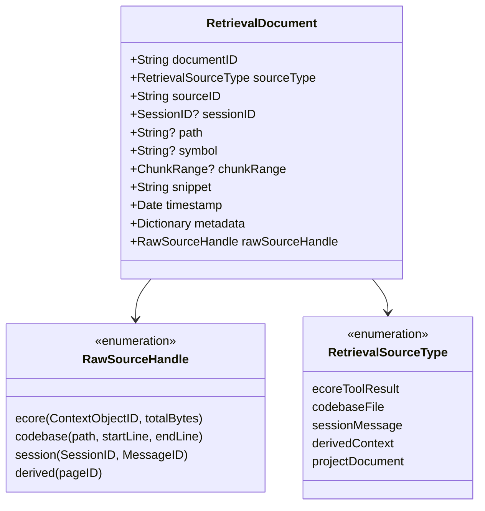
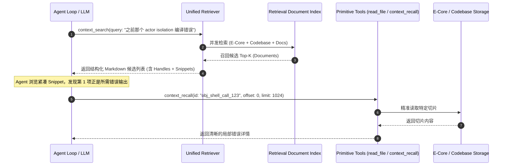
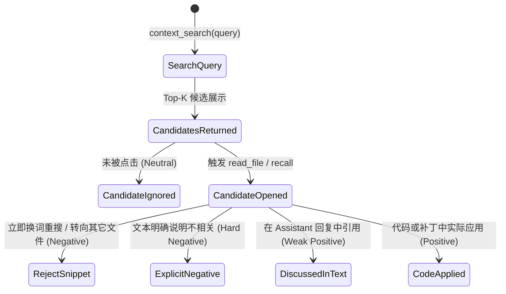

# LingXiAgent 统一语义检索层架构审计与设计方案 (Unified Retrieval Layer Audit)

> **审计状态**：只读架构审计与顶层设计交付（禁止修改任何生产代码）  
> **审计日期**：2026-09-16  
> **报告版本**：Unified Retrieval Architecture Baseline v1.0  
> **交付目标路径**：`Docs/Unified-Retrieval-Architecture-Audit.md`  
> **设计红线**：
> 1. P-Core 行为不变，Canonical Truth 保持唯一；
> 2. E-Core 存储 Source of Truth 保持不变；
> 3. 保留并复用现有底层精准读取 primitive（`context_recall`, `read_file`）；
> 4. SessionStore 保持不变；
> 5. 绝对保护 Prefix Cache 和 Stable Context，**严禁检索命中后自动注入 P-Core**；
> 6. Retriever 故障时现有 Agent 行为 100% Fail-Open 降级；
> 7. 严禁在 Agent Loop 中训练模型或同步重建沉重索引。

---

## 一、背景事实与问题定性

在 Phase 0.6 真实生产环境回溯与实采审计中，我们确立了以下确凿事实：

```
Stored Objects   = 207  (100.0%)
Projected Objects = 159  (76.8%  突破前台保护期，在提示词中呈现占位符)
Recalled Objects  = 0    (0.0%   实际发生召回转化为 0)
Never Projected   = 48   (23.2%  受 FULL_SENDS 保护期屏蔽，模型前台始终是全文内联)
```

### 为什么不能把 `context_recall(objectID)` 作为主要检索入口？

1. **认知失配（Cognitive Impedance Mismatch）**：
   - `context_recall(id: "obj_xxx", offset: Int, limit: Int)` 是一个典型的**底层物理随机读取原语（Low-Level Physical Read Primitive）**。它要求调用方预先精确知道对象的唯一哈希 ID（例如 `obj_execute_command_call_abc123_def456`）以及期望读取的字节偏移。
   - 大模型在经过多轮长会话推理后，其注意力重心早已切换到业务代码与错误修复上，**天然无法精准记忆冗长的上下文哈希标识**；且模型天生倾向于直接调用通用语义工具（如 `read_file`、`grep`），而不是翻找占位符里的专有句柄。
2. **缺少“智能发现”层（Missing Discovery Layer）**：
   - 当前架构在“大输出落盘（E-Core Store）”与“精准切片读取（context_recall）”之间，**缺失了最重要的‘语义发现与多路召回（Unified Retrieval Layer）’**。
   - 当用户或模型表达：“找一下之前那个 Swift actor isolation 编译错误”时，系统当前没有任何机制能将这句自然语言意图，映射到历史上第 5 轮由 `shell` 产生的那个 18KB E-Core 对象上。

因此，我们的目标**绝对不是废弃 `context_recall`**，而是让现有工具各司其职：
- **高层检索层（Unified Retriever）**：负责**“找到什么（What & Where）”**，通过自然语言或当前意图检索历史上下文与资产，返回紧凑的 Handles 与 Snippets；
- **底层执行层（Primitive Tools）**：负责**“精准读取（How & Depth）”**，由模型根据返回的 Handle，按需发起 `context_recall` 或 `read_file` 深入拉取特定片段。

---

## 二、当前所有检索入口的全景只读审计

我们对当前 LingXiAgent 源码中分散的 10 个检索与读取入口进行了全面盘点与深度分析：

| 检索入口 / 模块 | 数据源 (Source) | 索引方式 (Index) | Query 输入 | 返回结构 | Ranking 算法 | 是否在 Agent Loop | 是否持久化 | 复用性评估 |
| :--- | :--- | :--- | :--- | :--- | :--- | :--- | :--- | :--- |
| **1. `ContextPager`**<br>[`ContextPager.swift`](file:///Volumes/Development/Projects/projects/LingXiAgent/Sources/LingXiCore/Modules/Context/ContextPager.swift) | Codebase 源码文件 (通过 `ProjectScanner`) | 分块页面 (`ContextPage`, 约100-200行) + 符号索引 + 引用索引 | `ContextQuery` (symbolHints, relationHints, terms) | `ContextPagerResult` (`[ContextPage]`) | `ContextPageRankingPolicy` (精确匹配 1200分, 引用关联 800分, 前缀 500分) | 否 (主要在上下文装配与搜索时内部调用) | 是 (持久化到 SQLite `project_files`, `project_pages`, `cached_symbols`) | **极高**。已有成熟的分块、符号与引用打分器，是统一 Retriever 的天然 Codebase 支柱。 |
| **2. `context_search`**<br>[`ContextCacheController.swift:581`](file:///Volumes/Development/Projects/projects/LingXiAgent/Sources/LingXiCore/Modules/Context/ContextCacheController.swift#L581) | L2 Warm Cache + L3 Cold Cache (`DerivedContextStore`) + Codebase Index | 内存字典 + 派生文本扫描 | `query: String`, `limit: Int` | 文本说明字符串 (同时**副作用静默推入 L1 working set**) | `calculatePriority` (词频 + 任务亲和度 + 活跃文件加权) | 是 (作为 `ContextRetrieveTool` 暴露给模型) | 混合 (L2 内存易失，L3 持久化在 SQLite `derived_context`) | **必须重构**。当前会将命中直接强塞进 L1 破坏 Prefix Cache，必须将其解耦为纯查询。 |
| **3. `context_recall`**<br>[`ECoreObjectFabric.swift:288`](file:///Volumes/Development/Projects/projects/LingXiAgent/Sources/LingXiCore/Modules/Context/ECoreObjectFabric.swift#L288) | E-Core 落盘原始对象 (`objects/*.txt`) | 基于 `ContextObjectID` 的直接文件查找 | `id: String`, `offset: Int`, `limit: Int` | `RecallChunk` (首尾行号、字节长度、切片内容、是否 EOF) | 无排序 (按指定 offset/limit 精确字节与行切片) | 是 (作为 `ContextRecallTool` 暴露给模型) | 是 (磁盘原子文件 + `.meta.json`) | **保留为底层原语**。作为 Retriever 发现后的终点读取执行者。 |
| **4. `read_file`**<br>[`BuiltinTools.swift:580`](file:///Volumes/Development/Projects/projects/LingXiAgent/Sources/LingXiCore/Modules/Tool/BuiltinTools.swift#L580) | 本地工作区源码与资源文件 | 文件系统原生路径与 inode | `path: String`, `start_line: Int?`, `end_line: Int?` | 带有行号的源码切片文本 | 无排序 (严格文件行切片) | 是 (核心主力 Tool) | 是 (本地文件系统) | **保留为底层原语**。作为 Codebase 类检索结果的精准读取者。 |
| **5. `grep`**<br>[`BuiltinTools.swift:749`](file:///Volumes/Development/Projects/projects/LingXiAgent/Sources/LingXiCore/Modules/Tool/BuiltinTools.swift#L749) | 工作区全量 UTF-8 文件 | 无常驻索引，子进程即时遍历 (调用系统 `ripgrep` `rg --json`) | `pattern: String`, `path: String?`, `max_results: Int?` | `[GrepMatch]` (path, line, content) | 按路径与行号字典序排序 | 是 (主力搜索 Tool) | 否 (即时进程搜索) | **适合补充**。作为词法字面量搜索的兜底比对工具。 |
| **6. `CodebaseGraphEngine`**<br>[`CodebaseGraphEngine.swift`](file:///Volumes/Development/Projects/projects/LingXiAgent/Sources/LingXiCore/Modules/CodebaseGraph/CodebaseGraphEngine.swift) | 工作区源码 AST 与拓扑依赖边 | 内存图拓扑结构 (`nodes: [GraphNode]`, `edges: [GraphEdge]`) | 符号名称、ID、调用方向 (`TraceDirection`) | `[GraphNode]`, `CallTraceReport`, `ArchitectureOverview` | 基于名称长度与完全匹配优先；拓扑 BFS 遍历 | 间接 (MCP / TUI 分析) | 是 (磁盘 JSON 缓存) | **极高**。可为检索提供“代码拓扑距离（Graph Proximity）”这一关键重排特征。 |
| **7. `SessionStore` 历史**<br>[`SessionStore.swift`](file:///Volumes/Development/Projects/projects/LingXiAgent/Sources/LingXiCore/Modules/Session/SessionStore.swift) / [`SQLitePersistenceStore.swift`](file:///Volumes/Development/Projects/projects/LingXiAgent/Sources/LingXiCore/Infrastructure/Persistence/SQLitePersistenceStore.swift) | 历史会话消息与交互批次 | SQLite B-Tree (`messages`, `message_parts`, `tool_exchange_batches`) | `sessionID: SessionID` | `Session`, `[Message]`, `ToolResult` | 无语义排序 (按 `ordinal` 时序排列) | 否 (主要用于断点恢复与回放) | 是 (SQLite `state.sqlite`) | **可接入**。可提取历史用户目标与关键结论，作为会话记忆语料。 |
| **8. `DerivedContextStore`**<br>[`ContextCompaction.swift:282`](file:///Volumes/Development/Projects/projects/LingXiAgent/Sources/LingXiCore/Modules/Context/ContextCompaction.swift#L282) | 会话压缩溢出页面 (`DerivedContextPage`) | 内存字典 + SQLite `derived_context` | `sessionID: SessionID`, `query: String`, `limit: Int` | `[DerivedContextPage]` | `lexical * 10 + sourceWeight + l2Bonus + index` | 间接 (通过 Compactor 与 CacheController) | 是 (SQLite `derived_context`) | **可接入**。专用于长会话中早期对话摘要的局部检索。 |
| **9. `ProjectIndexTool`**<br>[`BuiltinTools.swift:1899`](file:///Volumes/Development/Projects/projects/LingXiAgent/Sources/LingXiCore/Modules/Tool/BuiltinTools.swift#L1899) | `ProjectSymbolIndex` + `ProjectReferenceIndex` | 符号倒排哈希表 + 引用关系表 | `symbol: String`, `mode: exact/qualified/prefix` | JSON 格式的符号列表与引用文件行号 | 符号模式过滤无权值排序 | 是 (ToolID: `symbol_lookup`, `find_references`, `dependency_query`) | 是 (SQLite 缓存) | **可复用其底层索引**。提供精准符号定位能力。 |
| **10. `code_intelligence`**<br>[`BuiltinTools.swift:1907`](file:///Volumes/Development/Projects/projects/LingXiAgent/Sources/LingXiCore/Modules/Tool/BuiltinTools.swift#L1907) | 外部 LSP (Language Server Protocol) 服务进程 | LSP 语言服务器内存语义索引 | `action: String`, `path: String`, `line: Int`, `character: Int` | LSP 协议对象 (hover, definition, diagnostics) | 由语言服务器决定 | 是 (ToolID: `code_intelligence`) | 否 (依赖外部进程常驻) | **外设辅助**。不适合作为基础检索语料库，仅可作为高精度补充。 |

---

## 三、明确统一检索语料库 (Retrieval Corpus)

不同语料在收益、复杂度与数据可靠性上存在显著分化。我们坚决反对“第一版将所有类型一锅端接入”，必须按性价比分级推进：

```
[Phase 1 核心语料] ────> A. E-Core ToolResult (大工具落盘对象)  ── 解决 0-recall 痛点，极高收益
                     └───> B. 当前 Codebase 源码分块            ── 已有成熟切片，极高收益
                     └───> C. 项目文档 (Architecture / Docs)  ── 规则与规范核心，高收益

[Phase 2 扩展语料] ────> D. Session 历史对话 (User / Assistant) ── 跨轮记忆，中等收益
                     └───> E. Derived Context (会话压缩摘要)   ── 长会话局部检索，中收益

[Phase 3 高阶语料] ────> F. Build / Test Logs                  ── 动态临时输出，易过期
                     └───> G. CodebaseGraph 拓扑边              ── 作为重排特征，而非扁平语料
```

### 1. 评估矩阵与第一阶段选型

| 候选语料 | 预期业务收益 (Value) | 实现复杂度 (Complexity) | 数据权威度与可靠性 (Reliability) | 第一阶段接入决策 | 决策原因与边界 |
| :--- | :--- | :--- | :--- | :--- | :--- |
| **A. E-Core ToolResult** | **极高** (激活 207+ 沉睡对象，破局 0-recall) | **低** (已有 `.meta.json` + `.txt`，格式统一规范) | **极高** (SHA256 去重落盘，原子存储) | **【第一阶段核心】** | 彻底改变大模型“记不住 ID 无法使用 context_recall”的死结，模型可用自然语言直接搜出历史超大输出。 |
| **B. 当前 Codebase** | **极高** (统一代码片段与跨文件上下文定位) | **极低** (直接复用 `ContextPager` 与 `ProjectPageStore` 已建好的 Pages) | **极高** (本地真实工作区文件，与 disk 一致) | **【第一阶段核心】** | 现有基础设施已完成代码解析、符号提取与切片，无需重复造轮子。 |
| **C. 项目文档与规范** | **高** (检索架构基线、规范约定与开发指南) | **极低** (复用 Markdown 解析器与文档扫描) | **高** (Git 版本受控资产) | **【第一阶段核心】** | 模型经常需要查阅 `AGENTS.md`、`Docs/*.md` 中的开发规范，可与 Codebase 共享切片管线。 |
| **D. Session 历史对话** | 中 (找回以往讨论过的技术决策) | 中 (需隔离不同会话上下文与敏感信息) | 高 (SQLite 存储) | 待 Phase 2 | 需先行设计跨 Session 权限隔离与隐私策略，避免历史脏会话干扰当前执行。 |
| **E. Derived Context** | 中 (找回单会话压缩前的对话片段) | 低 (已有 `DerivedContextStore`) | 中 (经过摘要压缩的信息损失) | 待 Phase 2 | 仅在极长会话（> 50 轮触发多次 Compaction）中具备明显价值。 |
| **F. Build / Test Logs** | 中 (排查历史构建失败原因) | 中 (日志量大且非结构化，噪声极多) | 低 (高频变化且存在时效性过期) | 待 Phase 3 | 日志体积容易爆炸，且多数只对当下轮次有效，暂不进入常驻检索。 |
| **G. CodebaseGraph 拓扑** | 高 (调用链与依赖关系) | 高 (非纯文本，属于非欧几里得图结构) | 高 (AST 准确推导) | **作为 Feature 而非 Corpus** | 图谱更适合在 Ranking 阶段计算两点之间的拓扑跳数（Hop Distance），作为重排权重，不应打平为纯文本检索。 |

---

## 四、统一只读抽象设计：`RetrievalDocument`

必须建立跨语料库的统一只读抽象，**绝对禁止复制或替代现有的底层 Source of Truth**：



### 1. 结构体设计规范

```swift
/// 统一检索文档（仅属于只读派生索引视图，绝非权威数据源）
public struct RetrievalDocument: Sendable, Identifiable, Codable {
    /// 全局唯一派生索引标识，格式如 "ecore:obj_123", "code:Sources/App.swift#L10-L40"
    public let documentID: String
    
    /// 来源类型枚举
    public let sourceType: RetrievalSourceType
    
    /// 原始实体唯一标识 (ContextObjectID / relativePath / messageID)
    public let sourceID: String
    
    /// 会话专属语料所属 SessionID（Codebase 等全局语料为 nil）
    public let sessionID: SessionID?
    
    /// 关联文件相对路径（若适用）
    public let path: String?
    
    /// 关联核心符号名称（若适用）
    public let symbol: String?
    
    /// 物理切片范围（行号范围或字节区间）
    public let chunkRange: ChunkRange?
    
    /// 高密度紧凑摘要片段（<= 512 字符，用于展示给 Agent 做决策，禁止塞入全量内容）
    public let snippet: String
    
    /// 创建或最后修改时间戳（用于时效性打分）
    public let timestamp: Date
    
    /// 扩展元数据 (如 toolName, exitCode, contentType 等)
    public let metadata: [String: String]
    
    /// 底层精准读取句柄（下游工具按需深入调用的唯一依据）
    public let rawSourceHandle: RawSourceHandle
}

public enum RetrievalSourceType: String, Codable, Sendable {
    case ecoreToolResult = "ecore_tool_result"
    case codebaseFile = "codebase_file"
    case sessionMessage = "session_message"
    case derivedContext = "derived_context"
    case projectDocument = "project_document"
}

public enum RawSourceHandle: Codable, Sendable, Equatable {
    case ecore(objectID: ContextObjectID, totalBytes: Int)
    case codebase(path: String, startLine: Int, endLine: Int)
    case session(sessionID: SessionID, messageID: MessageID)
    case derived(pageID: String)
}

public struct ChunkRange: Codable, Sendable, Equatable {
    public let startLine: Int?
    public let endLine: Int?
    public let offsetBytes: Int?
    public let lengthBytes: Int?
}
```

### 2. 架构约束与不变式保证

1. **ReadOnly & Ephemeral Invariant（只读派生铁律）**：
   `RetrievalDocument` 只是在内存或轻量缓存中建立的只读视图。如果索引被清空或损坏，**系统可以从 `ECoreObjectStore`、`ProjectPageStore`、`SessionStore` 随时 100% 重建**。
2. **Handle-Only Invariant（句柄传递铁律）**：
   文档中只保留 `snippet`（高信息密度首尾摘要）和 `rawSourceHandle`，**严禁在检索结构中保存完整的数万字节大内容**，从根本上阻断内存溢出。

---

## 五、高层检索入口设计与调用范式

现有的 `context_search` 混淆了“检索意图”与“缓存注入”，我们将设计纯粹的统一高层检索接口：

### 1. 统一接口声明

```swift
/// 统一高层检索工具：对外提供统一自然语言上下文与代码发现能力
public struct UnifiedSearchTool: ToolExecutor {
    public let definition = ToolDefinition(
        id: ToolID("context_search"), // 替代原有混乱的 context_search 实现
        description: "Semantically search across historical tool outputs (E-Core), codebase slices, and project documentation. Returns top-K concise candidates with handles for selective deep inspection.",
        inputSchema: ToolInputSchema(
            properties: [
                "query": ToolInputProperty(type: .string, description: "Natural language query describing what information or past tool results to find"),
                "scope": ToolInputProperty(type: .string, description: "Search scope: 'all', 'codebase', 'history', 'docs'", enumValues: ["all", "codebase", "history", "docs"]),
                "limit": ToolInputProperty(type: .integer, description: "Maximum number of candidate handles to return (default: 5, max: 10)", minimum: 1, maximum: 10)
            ],
            required: ["query"]
        ),
        capability: ToolCapability(readOnly: true)
    )
}
```

### 2. 两阶段交互闭环（Discovery → Selective Inspection）



#### 返回示例（清晰、直观、保护上下文预算）：

```markdown
Found 2 relevant items matching "之前那个 actor isolation 编译错误":

1. [E-Core Tool Output] `obj_shell_call_123` (shell) - 18.2 KB, generated 12 mins ago
   Snippet: `...error: actor-isolated property 'heatStates' cannot be mutated from a non-isolated context...`
   Action: Use `context_recall(id: "obj_shell_call_123", offset: 0, limit: 1024)` to view full output.

2. [Codebase] `Sources/LingXiCore/Modules/Context/ECoreObjectFabric.swift` (L125-L160)
   Snippet: `public actor ECoreObjectStore { private var heatStates: [SessionID: ...`
   Action: Use `read_file(path: "Sources/LingXiCore/Modules/Context/ECoreObjectFabric.swift", start_line: 125, end_line: 160)` to view code.
```

---

## 六、严禁自动注入 P-Core：捍卫 Prefix Cache 与上下文稳定

本次审计重点排查了当前 `ContextCacheController.swift:695` 的原有实现：
```swift
// 原有实现的严重缺陷：搜索命中后直接强行注入 L1 resident pages
currentL1[page.id] = L1ResidentPage(page: page, tokens: max(1, page.characterCount / 3), ...)
```
这种设计导致了极其严重的工程负面后果：
1. **破坏 Prefix Cache**：大模型厂商（Anthropic / OpenAI / DeepSeek）的 Prefix Caching 依赖于**请求前缀的字节级绝对稳定**。一旦在用户看不到的底层将搜索命中的代码页随机拼入前缀，整个会话的 KV Cache 立即被全量击穿失效（Cache Busting），API 延迟与费用激增！
2. **上下文暴涨（Context Bloat）**：单次检索如果命中 5 个各 500 行的页面，前台直接暴增数万 Token，极快触顶 Context Window 软限制。

### 新检索层的铁律原则：
1. **ToolResult 隔离屏障**：
   `context_search` 的返回内容，**仅作为当前这一轮标准的 `ToolResult`** 返回给模型。
2. **零静默注入**：
   严禁在后台修改 `residentPages` 或静默添加动态 System Message。
3. **按需单步确认**：
   如果模型认为返回的候选有价值，它会显式发出下一步的 `read_file` 或 `context_recall`。此时读取的内容作为显式的单步消息自然追加在末尾，**Prompt 历史序列单调递增，Prefix Cache 保持 100% 稳定命中**。

---

## 七、Embedding 选型审计与本地运行评估

当前 LingXiAgent 仓库没有任何向量或 Embedding 库依赖。我们严谨评估了是否引入向量能力：

### 1. 第一阶段技术选型结论：**首选「BM25 + Code Graph + 结构特征」，暂缓引入 Embedding**

| 方案 | 优势 | 劣势 | 推荐指数 |
| :--- | :--- | :--- | :--- |
| **方案 1：纯 Swift BM25 + AST Graph (推荐)** | • 零外部依赖，极速编译，内存开销 < 15MB<br>• 对代码符号、报错关键字具有极高精度<br>• 代码搜索场景中，精确标识符匹配权重远胜模糊语义 | • 对完全不含同义词的跨语言抽象提问语义泛化能力稍弱 | **首推 (Phase R1)** |
| **方案 2：Core ML 原生引擎 (macOS Apple Silicon)** | • 跑在 ANE 上，单次推断 2~5ms，功耗极低<br>• 纯 Swift `CoreML` 原生框架调用 | • 架构绑定 macOS，无法在用户的 Arch Linux / Debian VPS 上运行，违反跨平台约定 | **备选 (Phase R3)** |
| **方案 3：独立 Sidecar 进程 (llama.cpp / ONNX)** | • 跨平台统一 (macOS + Linux)<br>• 可使用小型开源模型 (如 `bge-small-zh-v1.5`) | • 需要拉取大二进制模型与 Python/C++ 运行时，违反“依赖从简、新增先请示”纪律 | **远期储备** |

### 2. 索引构建隔离机制
- 无论采用 BM25 还是未来可选的 Embedding，**索引构建必须完全脱离 Agent Loop**；
- 由独立后台 Task 在文件保存或闲置时触发增量哈希对比；
- Agent 执行搜索时，只对已存在的不可变索引只读并发查询，耗时严格控制在 **< 20ms** 以内。

---

## 八、自学习多维权重层：`RetrievalWeight` 体系

我们确立了一个至关重要的核心架构判断：

> **【核心架构判断】**  
> **E-Core Heat 只能作为 `RetrievalWeight` 综合排序的一个特征因子（Feature），而绝对不能直接一票否决地决定对象的 Hot/Cold 存废！**

如果直接用 Heat 决定存废：由于历史 207 个对象当前热度均因沉寂而极低（P50 约 $10^{-22}$），若直接定为 Cold 并在检索时剔除，那么冷门历史资产将**永久失去被检索和唤醒的机会**！  
而作为特征因子时：即便一个对象的 `S_heat` 较低，只要它的 `S_lexical`（报错关键字完全吻合）极高，综合得分依然可以登顶 Top-1，实现“冷资产精准唤醒”。

### 1. 多维排序公式

$$\text{FinalScore} = w_{\text{lex}} \cdot S_{\text{lexical}} + w_{\text{graph}} \cdot S_{\text{graph}} + w_{\text{rec}} \cdot S_{\text{recency}} + w_{\text{heat}} \cdot S_{\text{heat}} + w_{\text{feed}} \cdot S_{\text{feedback}} + w_{\text{task}} \cdot S_{\text{task}}$$

- **$S_{\text{lexical}}$ (词法相关度，0.0 ~ 1.0)**：基于 BM25 或 TF-IDF 倒排索引打分，对类名、函数名、报错行精确匹配给予高分。
- **$S_{\text{graph}}$ (代码拓扑距离，0.0 ~ 1.0)**：基于 `CodebaseGraphEngine` 计算。若候选文件处于当前任务活动文件的直接调用边上（1-Hop），得 1.0；2-Hop 得 0.6；无拓扑关联得 0.0。
- **$S_{\text{recency}}$ (时序衰减分，0.0 ~ 1.0)**：基于创建时间经历指数衰减：$e^{-\Delta t / T_{\text{decay}}}$。
- **$S_{\text{heat}}$ (运行时热度分，0.0 ~ 1.0)**：来自 Phase 0.1 的稳健百分位等级：`RobustDistributionCalculator.percentileRank(state.rawHeatScore)`。
- **$S_{\text{feedback}}$ (历史采纳增益，-1.0 ~ 1.0)**：过去此文档被推荐后，模型是否真正打开并采纳。
- **$S_{\text{task}}$ (任务亲和度，0.0 ~ 1.0)**：当前是测试任务时，测试用例候选加权；是编译任务时，编译输出与配置加权。

---

## 九、Feedback 闭环交互链与正负信号分级

我们坚决反对将“整个 Agent 任务最终是否成功”简单粗暴地归因于“这次检索返回的所有候选都是好的”，这在强化学习与推荐系统中被称为典型的**信用分配谬误（Credit Assignment Fallacy）**。

必须建立颗粒度明确的五级信号体系：



| 反馈信号等级 | 行为定义与触发判定 | 权重调整系数 | 工程意义 |
| :--- | :--- | :--- | :--- |
| **Positive (强正反馈)** | 检索返回句柄后，模型紧随其后发起读取（`read_file` / `context_recall`），并在后续的写文件操作中应用了该内容中的变量、代码段或修复建议。 | **+2.0** | 极高信度证明该候选直接解决了当前问题。 |
| **Weak Positive (弱正反馈)** | 模型读取了该候选，并在后续 Assistant 的思考或解释文本中提及了其核心概念，但未产生物理文件修改。 | **+0.5** | 证明该候选提供了有效的背景认知支撑。 |
| **Neutral (中性)** | 候选排在第 3~5 名，模型未予打开，但直接采纳了第 1 名。 | **0.0** | 不予奖惩，可能是第 1 名已经足够好，不代表其余项无关。 |
| **Negative (弱负反馈)** | 模型打开了该候选，但随后立即放弃，并在紧接着的一步发起了全新关键词的再次检索，或打开了完全无关的其它文件。 | **-0.5** | 表明检索排序造成了误导，浪费了上下文。 |
| **Hard Negative (强负反馈)** | 模型打开候选后，在输出中明确写道“该结果与问题无关”；或者模型直接越过排名第 1 的候选，专挑第 5 名打开。 | **-2.0** | 强力惩罚，降低类似 Query 下该候选的初始排序。 |

---

## 十、Self-Learning 架构：三种技术路线的成本对比

自学习层必须严格遵守：**Execution Plane（执行面）与 Learning Plane（学习面）完全分离**。

- **执行面（Agent Loop）**：只负责将结构化信号追加写入本地日志文件 `~/.lingxiagent/telemetry/retrieval-feedback.jsonl`，异步脱钩，耗时 < 1ms，Fail-Open；
- **学习面（Background Worker）**：仅在系统空闲（System Idle）、用户无交互时，由后台后台轻量 Task 被动唤醒执行。任务支持**秒级抢占中断、随时暂停、一键重置回滚到默认参数**。

### 三条学习路线的严谨技术对比

| 学习路线 | 实现机制 | 计算与内存成本 | 鲁棒性与可控性 | 推荐结论 |
| :--- | :--- | :--- | :--- | :--- |
| **路线 1：微调 / 训练 Embedding 模型** | 使用对比学习损失（InfoNCE）在线更新神经网络参数 | **极高** (需要 GPU/ANE 浮点反向传播，显存开销数百 MB，耗电发热严重，极易发生灾难性遗忘) | **极低** (黑盒模型，参数一偏全盘崩溃，不可逆) | **【坚决否定】** 严重违背极简原则与安全性。 |
| **路线 2：训练小型神经网络 Reranker** | 训练 Cross-Encoder 或多层感知机 (MLP) 打分头 | **中等** (需要加载 PyTorch/ONNX 推理引擎，冷启动延迟高) | **中等** (相对独立，但依旧存在不可解释的局部极值) | **【暂不考虑】** 初期性价比低。 |
| **路线 3：学习线性 / 树形 Ranking Weights (推荐)** | 仅优化 6 个特征维度的权重向量 $\vec{w}$ (通过线性 Ridge 回归或 OGD 在线梯度下降) | **极低** (纯 CPU 数学运算，耗时几毫秒，内存开销 < 1MB，可在普通移动端瞬间收敛) | **极高** (100% 透明可解释，数学上有全局凸最优解，随时可一键 Reset) | **【唯一首选】** 完美符合灵犀工程哲学的自学习方案！ |

---

## 十一、Weighted Codebase 机制与防跑偏（Runaway Feedback）方案

将静态代码检索演化为“自适应加权知识网络（Context-Sensitive Weighted Knowledge Fabric）”时，必须建立严密的防跑偏屏障：

### 1. 常见失控陷阱
- **马太效应（Runaway Popularity）**：某个文件（如 `CoreHost.swift`）因为通用被点了几次，权重暴涨，导致后续任何查询它都排在第一，冷门关键文件被永久埋没。
- **历史陈旧权重污染（Stale Task Contamination）**：上午做的是“主题渲染”，下午做的是“SQLite 优化”，上午积累的高权重污染下午的任务。
- **跨项目串扰（Cross-Project Leakage）**：A 项目中高频引用的名称干扰了 B 项目的相同词法搜索。

### 2. 四大防御机制


1. **特征贡献截断（Feature Clamping）**：
   引入非线性饱和函数（如 $\tanh$ 或 Sigmoid），无论某个文件被采纳了多少次，$S_{\text{feedback}}$ 与 $S_{\text{heat}}$ 对总分的增益上限**绝对不得超过总权重的 30%**。词法与代码依赖结构始终保持不低于 70% 的一票决断权。
2. **时间遗忘半衰期（Exponential Decay for Feedback）**：
   反馈累计分值具有自然遗忘机制，半衰期设定为 7 天。一周未再访问的高频权重自动衰减回退至中性。
3. **$\epsilon$-Greedy 探索保底槽位（Exploration Slot）**：
   在返回的 Top-5 候选槽位中，**强制将第 5 个槽位保留给“词法相关度高但历史访问热度极低（Cold Asset）”的候选**，确保长尾冷门代码永远拥有被发现的通道。
4. **命名空间与项目隔离（Namespace Isolation）**：
   权重表严格以 `ProjectID` 为主键物理隔离在各自的 `state.sqlite` 中，严禁全局污染。

---

## 十二、统一检索可视化（Heatmap & Retrieval Graph）构想

基于上述统一索引与遥测体系，未来可在只读前提下向 TUI / Web 监控台输出五大可视化资产（本次不写 UI 代码）：

1. **File Attention Heatmap (代码热力图)**：
   将代码库文件树按被 Agent 检索、读取、修改的频次渲染热力色阶，直观呈现系统在哪些模块上耗费了最多注意力。
2. **E-Core Lifecycle Heatmap (外部记忆留存图)**：
   动态展示历史 ToolResult 的落盘大小、驻留时长与检索唤醒漏斗。
3. **Topic & Intent Heatmap (需求主题热力图)**：
   通过对自然语言 Query 进行聚类，生成系统使用偏好的词云与主题分布。
4. **Temporal Flow Heatmap (时序演化瀑布图)**：
   以时间为横轴、模块为纵轴，绘制推理任务如何在各子系统之间跃迁。
5. **Retrieval Topology Graph (检索依赖融合图)**：
   将 `CodebaseGraphEngine` 的调用依赖图与真实检索跳转路径叠加，标出 Agent 探索时的“超级枢纽节点”。

---

## 十三、最小增量演进路线图 (Roadmap)

我们依据 LingXiAgent 当前源码的真实状态，制定出以下**完全非破坏性、渐进式、Fail-Open** 的演进路线：

```
Phase R0 ───> Phase R1 ───> Phase R2 ───> Phase R3 ───> Phase R4
[统一抽象]     [多路词法图谱]   [反馈遥测]     [自学习重排]   [向量增强]
 只读协议       BM25 + 句柄    闭环日志       线性权重拟合    Optional Sidecar
 零行为改变     解决 0-recall   Fail-Open     防 Runaway     按需开启
```

### Phase R0：统一只读抽象与适配器契约 (Contract Phase)
- **目标**：在 `Sources/LingXiCore/Modules/Context/` 建立 `RetrievalDocument.swift`、`RawSourceHandle.swift` 和 `RetrievalProvider` 协议；
- **实现**：
  - 为 `ProjectPageStore` 实现代码库提供者适配器；
  - 为 `ECoreObjectStore` 实现外部记忆提供者适配器；
- **验证**：纯只读契约测试，现有 Agent 运行时行为零变动。

### Phase R1：词法与图谱多路融合检索 (Lexical & Graph Fusion Phase)
- **目标**：彻底解决 Phase 0.6 发现的 0-recall 痛点；
- **实现**：
  - 构建纯 Swift 轻量 Inverted Index / BM25 内存召回器；
  - 融合 `CodebaseGraphEngine` 拓扑跳数计算；
  - 重构 `context_search` 为统一 Handles 返回格式；
  - **坚决移除原实现中将搜索命中直接塞入 L1 resident pages 的破坏性逻辑**；
- **验证**：单步检索延迟 < 15ms，Prefix Cache 稳定率 100%，模型可通过自然语言定位历史编译报错。

### Phase R2：反馈遥测与闭环日志 (Telemetry & Feedback Phase)
- **目标**：捕获交互行为与五级反馈信号；
- **实现**：
  - 在 `ECoreTelemetryLogger` 旁增加 `retrieval-feedback.jsonl` 日志通道；
  - 在 Agent Loop 中无感埋点 `Search -> Open -> Use` 轨迹；
- **验证**：异步 Task 派发，零前台阻塞，写故障自动 Fail-Open 忽略。

### Phase R3：自学习线性重排层 (Learned Ranking Weights Phase)
- **目标**：实现自适应加权知识网络；
- **实现**：
  - 实现基于 6 维特征向量的打分器与后台 OGD 线性回归求解器；
  - 落地特征饱和截断（Clamping）、时间指数遗忘、$\epsilon$-Greedy 探索槽位；
- **验证**：后台空闲训练，CPU 占用 < 2%，可随时一键重置回滚。

### Phase R4：可选向量语义增强 (Optional Vector Sidecar Phase)
- **目标**：对极端同义词变形与自然语言模糊提问进行召回补足；
- **实现**：
  - 设计松耦合的本地 Embedding Sidecar 接口（Core ML 或本地轻量进程）；
  - 作为 Phase R1 多路召回的一个补充分支，不可用时自动降级回 BM25；
- **验证**：关闭 Sidecar 时，系统行为完全不受任何影响。

---

## 十四、审计结论与收口建议

1. **核心病因已明**：
   Phase 0.6 中 207 个对象之所以召回为 0，是因为系统缺少高层语义检索入口。模型无法主动记忆 ContextObjectID，且在 `FULL_SENDS` 耗尽后缺乏低成本发现历史资产的手段。
2. **架构方向已定**：
   保留 `context_recall` 作为精准读取 primitive，在其上构建不破坏 Prefix Cache、只返回 Handles 的统一高层检索层 `context_search`。
3. **极简演进原则**：
   第一阶段坚决不盲目引入重型深度学习模型与外生依赖，以纯 Swift BM25 + AST Code Graph + 线性权重学习为主线，安全、稳健、可控地交付上下文智能。
