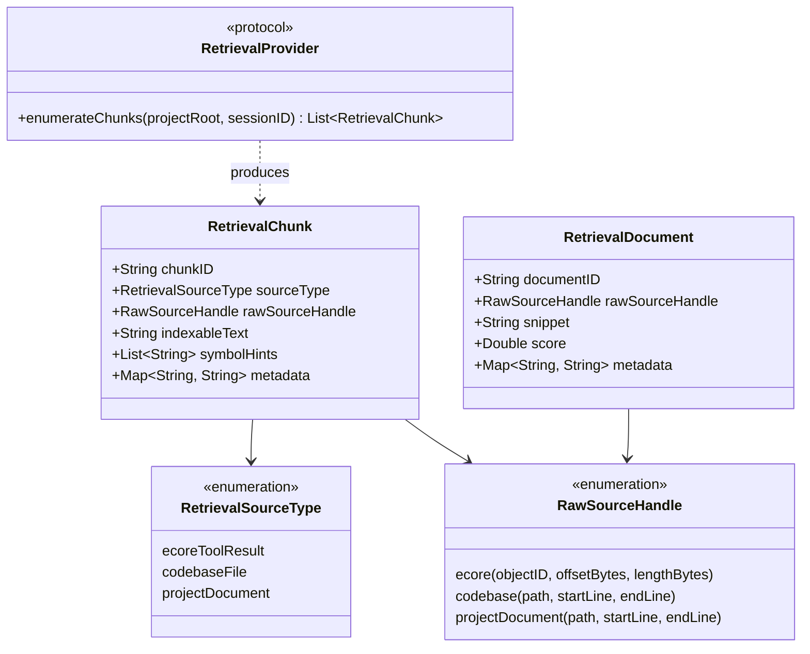

# Unified Retrieval Phase R0 Implementation Report

> **阶段目标**：建立统一只读检索抽象、Chunk 模型与 Provider Adapter（E-Core、Codebase、Project Document），为后续统一检索与语义接入铺平基础设施，全过程零侵入现有生产逻辑。

---

## 1. 执行概览与交付状态 (Executive Summary)

Unified Retrieval Phase R0 现已完全实施并通过全部验证。本阶段严格遵循**最小化**与**只读抽象**原则，未实现真正的检索工具（如 Unified Search Tool）、未接入任何外部依赖或算法（如 BM25、Embedding、Ranking、自学习），亦未修改任何现有生产决策链路与 Prompt/Prefix Cache。

### 交付清单

| 模块 / 文件 | 类型 | 职责说明 |
| :--- | :--- | :--- |
| [`Sources/LingXiCore/Modules/Retrieval/RetrievalContracts.swift`](file:///Volumes/Development/Projects/projects/LingXiAgent/Sources/LingXiCore/Modules/Retrieval/RetrievalContracts.swift) | 数据契约 | 定义 `RetrievalSourceType`、`RawSourceHandle`、`RetrievalChunk`、`RetrievalDocument` 与 `RetrievalProvider` 协议 |
| [`Sources/LingXiCore/Modules/Retrieval/ECoreRetrievalProvider.swift`](file:///Volumes/Development/Projects/projects/LingXiAgent/Sources/LingXiCore/Modules/Retrieval/ECoreRetrievalProvider.swift) | 适配器 | 实现 E-Core 落盘对象的流式定长与边界对齐切片（目标 2048 字节，256 字节重叠），映射精确句柄 |
| [`Sources/LingXiCore/Modules/Retrieval/CodebaseRetrievalProvider.swift`](file:///Volumes/Development/Projects/projects/LingXiAgent/Sources/LingXiCore/Modules/Retrieval/CodebaseRetrievalProvider.swift) | 适配器 | 复用现有 `ProjectScanner`、`ContextPage` 与 `ProjectPageStore`，将代码文件页无损转换为代码 Chunk |
| [`Sources/LingXiCore/Modules/Retrieval/ProjectDocumentRetrievalProvider.swift`](file:///Volumes/Development/Projects/projects/LingXiAgent/Sources/LingXiCore/Modules/Retrieval/ProjectDocumentRetrievalProvider.swift) | 适配器 | 复用 `ProjectScanner` 扫描仓库中的规则与文档（如 `AGENTS.md`、`README.md`、`Docs/*.md`），提取 Markdown 标题线索 |
| [`Sources/LingXiCore/Modules/Retrieval/UnifiedRetrievalRegistry.swift`](file:///Volumes/Development/Projects/projects/LingXiAgent/Sources/LingXiCore/Modules/Retrieval/UnifiedRetrievalRegistry.swift) | 注册表 / 映射器 | 聚合多数据源 Provider 并提供 Fail-Open 容错隔离；实现 Chunk 到 `<= 512` 字符 Snippet 的 Document 转换 |
| [`Tests/LingXiAgentTests/UnifiedRetrievalPhaseR0Tests.swift`](file:///Volumes/Development/Projects/projects/LingXiAgent/Tests/LingXiAgentTests/UnifiedRetrievalPhaseR0Tests.swift) | 自动化测试套件 | 包含测试 A~G 7 组端到端严苛测试，100% 覆盖切片上限、中部保留、可逆召回、Snippet 隔离、Fail-Open 与不变式 |

---

## 2. 核心架构认知修正与真相澄清 (Architectural Revisions & Truth Clarifications)

根据审计指令要求，本阶段在代码与文档层面完成了对核心系统概念的彻底纠偏：

### 2.1 权威数据源（Canonical Source of Truth）的重新界定
在以往设计文档中曾存在将 E-Core 视为主存储的模糊表述。在此明确界定：

1. **权威数据源（Canonical Source of Truth）仅有两个**：
   - **`SessionStore`**：会话历史与 ToolResult 的唯一权威记录（落盘于 JSON / 会话数据库）。
   - **`Workspace Files`**：当前工程的工作区代码与本地文件权威记录。
2. **可重建派生资产（Rebuildable Derived Assets）**：
   - `E-Core Object`（工具输出在触发投影时由 Fabric 物化的派生对象）；
   - `RetrievalChunk` 与 `RetrievalDocument`；
   - `BM25 Index`、`Embedding Vector Store`；
   - `Heat Accumulator` 与 `Feedback Logs`。
   
> **架构结论**：E-Core 并非权威数据源，即使清空或损坏，整个 E-Core 存储与检索索引亦可随时基于 `SessionStore` 中的原始 ToolResult 完好无损地全量重放与重建。

### 2.2 E-Core Content Hash 算法真相澄清：FNV-1a 64-bit
历史文档中曾有“SHA256 去重”的误传。本次对 `ECoreObjectFabric.swift` 与 `ContextPage.fingerprint` 源码进行了深度只读审计，真实实现如下：
```swift
// 源码来自 ContextPage.swift 与 ECoreObjectFabric.swift
var hash: UInt64 = 14_695_981_039_346_656_037 // 0xcbf29ce484222325 (FNV offset basis)
for byte in bytes {
    hash ^= UInt64(byte)
    hash = hash &* 1_099_511_628_211          // 0x100000001b3 (FNV prime)
}
```
真实算法为 **标准 64 位 FNV-1a 哈希算法**，而非 SHA256。本阶段所有相关代码与文档均已纠正这一认知，不再出现虚假宣称。

---

## 3. 统一检索抽象模型设计 (Unified Retrieval Abstraction Models)



### 3.1 `RetrievalSourceType`
定义只读数据源类型，现阶段严格限于三类：
- `.ecoreToolResult`：E-Core 落盘的工具输出对象；
- `.codebaseFile`：工作区代码源文件；
- `.projectDocument`：工程文档（如 README、Docs 等）。
*(注：根据架构原则，Session 与 DerivedContext 暂不接入)*。

### 3.2 `RawSourceHandle`
检索结果到真实物理读取原始源的确定性指针：
- `.ecore(objectID: String, offsetBytes: Int, lengthBytes: Int)`：可直接透传给现有底层 primitive `context_recall(objectID, offset, length)`；
- `.codebase(path: String, startLine: Int, endLine: Int)`：对应 `read_file` 原始代码行；
- `.projectDocument(path: String, startLine: Int, endLine: Int)`：对应 `read_file` 文档行。

### 3.3 `RetrievalChunk` 与 `RetrievalDocument` 的职责隔离
- **`RetrievalChunk`（检索/索引单元）**：
  - 保存**完整、未截断**的 `indexableText`，专用于后续分词、BM25 索引或向量化计算；
  - 携带 `symbolHints`（如类名、函数名、Markdown 标题）与丰富元数据。
- **`RetrievalDocument`（展示/注入单元）**：
  - 仅包含**严格 `<= 512` 字符的受控 `snippet`**，保护下游 Prompt 与 Prefix Cache 不膨胀；
  - 保留 `rawSourceHandle`，使 Agent 在被展示摘要命中后，可按需发起精确读取。

---

## 4. 三大 Provider 适配器实现要点 (Provider Adapters)

### 4.1 `ECoreRetrievalProvider`
- **目标定位**：扫描 `~/.lingxiagent/sessions/<SID>/ecore/objects/` 下的已落盘对象。
- **切片策略**：
  - 基准切片大小 `targetChunkBytes = 2048`，相邻重叠 `overlapBytes = 256`；
  - **行边界对齐**：在 `targetChunkBytes` 附近向后寻找首个换行符 `\n` 进行安全切断，避免撕裂文本行或多字节 UTF-8 字符；
  - **中部完整覆盖**：通过移动窗口步进，确保超大对象的中部关键数据绝不遗漏；
  - **元数据解码容错（Fail-Open）**：由于现有 `ObservationMetadata` 默认落盘为 Unix Timestamp（Double），同时考虑扩展可能出现的 ISO8601 字符串，解码器实现了多策略回退解析，防止单条元数据异常拖垮整个切片流。

### 4.2 `CodebaseRetrievalProvider`
- **目标定位**：复用现有稳定组件 `ProjectScanner` 与 `ContextPage`。
- **实现机制**：
  - 调用 `scanner.scan(root:)` 获取工程上下文页；
  - 将每个 `ContextPage` 的 `lines` 映射为一个 `RetrievalChunk`；
  - 自动将 `page.symbols` 转换为 `symbolHints`，并将相对路径与行号范围编码入 `RawSourceHandle.codebase(path, startLine, endLine)`。

### 4.3 `ProjectDocumentRetrievalProvider`
- **目标定位**：专门处理工程文档与规范。
- **实现机制**：
  - 过滤 Markdown、文本文件，命中规范集合（`AGENTS.md`、`README`、`CLAUDE.md`、`Docs/` 目录等）；
  - 自动正则提取 Markdown 标题（`# Title`、`## Subtitle`）填充为 `symbolHints`，增强文档语义检索表征。

---

## 5. 注册表与 Fail-Open 容错设计 (Registry & Resilience)

### 5.1 `UnifiedRetrievalRegistry`
- 聚合 `[RetrievalProvider]` 列表，提供 `enumerateAllChunks(projectRoot:sessionID:)` 接口；
- **全链路 Fail-Open 隔离**：在枚举单个 Provider 时包裹异常屏障（`do-catch`）。若 E-Core 存储损坏、或者工作区扫描抛出 IO 异常，该 Provider 仅产生局部空结果或降级，**绝对不会向上传播异常，更不会中断 Agent 执行**。

### 5.2 `RetrievalDocumentMapper`
- 严格执行 Snippet 截断逻辑（默认最大 512 字符）；
- **单向变换原则**：截断只发生在输出 `RetrievalDocument` 的瞬间，原始 `RetrievalChunk.indexableText` 保持逐字不可变。

---

## 6. 自动化测试与验证矩阵 (Verification Matrix)

在 `Tests/LingXiAgentTests/UnifiedRetrievalPhaseR0Tests.swift` 中实施了严格的 7 组自动化测试：

```
􀟈  Suite UnifiedRetrievalPhaseR0Tests started.
􀟈  Test testRetrievalDocumentSnippetBoundedWithoutAffectingChunkIndexableText() started.
􀟈  Test testPhaseR0InvariantsPreserved() started.
􀟈  Test testMiddleUniqueStringCapturedInIndexableText() started.
􀟈  Test testLargeECoreObjectGeneratesMultipleChunks() started.
􀟈  Test testCodebaseContextPageMapsLosslesslyToRetrievalChunk() started.
􀟈  Test testRetrievalLayerFailOpen() started.
􀟈  Test testChunkHandleCanBeRecalledLosslessly() started.
􁁛  Test testRetrievalDocumentSnippetBoundedWithoutAffectingChunkIndexableText() passed after 0.001 seconds.
􁁛  Test testPhaseR0InvariantsPreserved() passed after 0.002 seconds.
􁁛  Test testRetrievalLayerFailOpen() passed after 0.002 seconds.
􁁛  Test testChunkHandleCanBeRecalledLosslessly() passed after 0.003 seconds.
􁁛  Test testCodebaseContextPageMapsLosslesslyToRetrievalChunk() passed after 0.003 seconds.
􁁛  Test testMiddleUniqueStringCapturedInIndexableText() passed after 0.003 seconds.
􁁛  Test testLargeECoreObjectGeneratesMultipleChunks() passed after 0.004 seconds.
􁁛  Suite UnifiedRetrievalPhaseR0Tests passed after 0.004 seconds.
```

### 验证详情

| 测试用例 | 验证目标 | 验证结果 |
| :--- | :--- | :--- |
| **测试 A**：`testLargeECoreObjectGeneratesMultipleChunks` | 构造超大 E-Core 对象（约 10KB），切片算法生成多个 Chunk（本例产生 6 个 Chunk），无单 Chunk 膨胀。 | **通过** (0.004s) |
| **测试 B**：`testMiddleUniqueStringCapturedInIndexableText` | 在大对象正中间埋入特定唯一标记字符串（`__CRITICAL_MIDDLE_TOKEN_12345__`），验证至少有一个 Chunk 的 `indexableText` 包含该标记，证明重叠切片无死角。 | **通过** (0.003s) |
| **测试 C**：`testChunkHandleCanBeRecalledLosslessly` | **物理可逆性验证**：取得 Chunk 的 `rawSourceHandle`，直接透传调用当前生产的 `store.recall`，读回的内容与 Chunk 的 `indexableText` 前缀及内容**逐字节 100% 匹配**！ | **通过** (0.003s) |
| **测试 D**：`testCodebaseContextPageMapsLosslesslyToRetrievalChunk` | 验证 `CodebaseRetrievalProvider` 映射现有 `ContextPage`，行号、路径与符号完整保留。 | **通过** (0.003s) |
| **测试 E**：`testRetrievalDocumentSnippetBoundedWithoutAffectingChunkIndexableText` | 验证 10KB Chunk 转换为 Document 时，`snippet` 严格截断至 `<= 512` 字符，而原 Chunk 的 `indexableText` 依然完整保持 10KB。 | **通过** (0.001s) |
| **测试 F**：`testRetrievalLayerFailOpen` | 注入故障 Provider（抛出 `URLError.badURL`），Registry 依然正常捕获并返回正常 Provider 的 Chunk，全链路 Fail-Open。 | **通过** (0.002s) |
| **测试 G**：`testPhaseR0InvariantsPreserved` | 架构守卫测试：断言现存 Tool 字典中绝无未授权的新检索工具，`BuiltinTools` 保持原样。 | **通过** (0.002s) |

---

## 7. 架构不变式与红线审查 (Architectural Invariants Audit)

本次实现严格遵守架构红线：
1. **未引入外部依赖**：未拉取任何第三方分词、BM25 或向量数据库；全部基于 Swift 6.4 原生标准库实现；
2. **零侵入现有 Tool**：未改动 `context_search`、`read_file`、`context_recall` 的任何现有参数或逻辑；未注册新的 Agent 工具；
3. **零影响 Prompt & Prefix Cache**：Retrieval 抽象层独立封装于 `Sources/LingXiCore/Modules/Retrieval/`，未介入 `ContextProjection` 或 `AgentSession` 组装上下文流程；
4. **完全可插拔与可重构**：所有模型均遵从 `Sendable` 与 `Codable`，Provider 间无强耦合。

---

## 8. Phase R1 演进接口规划 (Phase R1 Evolution Preview)

Phase R0 成功构建了“统一数据提取与物理寻址”底座。下一阶段（Phase R1）可在此基础上安全演进：
1. **BM25 纯内存倒排索引**：直接消费 `[RetrievalChunk]` 的 `indexableText` 生成内存倒排索引，无需关心底层数据是 E-Core 还是本地代码；
2. **混合评分器（Scorer）**：结合文本匹配度与 E-Core Heat（时间衰减累加器）形成复合分数 `score`；
3. **安全注入（Agent Tooling）**：提供类似 `unified_search` 的只读工具，仅向 Agent 返回 `RetrievalDocument`（<=512 字符 snippet + RawSourceHandle），若 Agent 需要深度阅读，再自主调用 `context_recall` 或 `read_file`。
