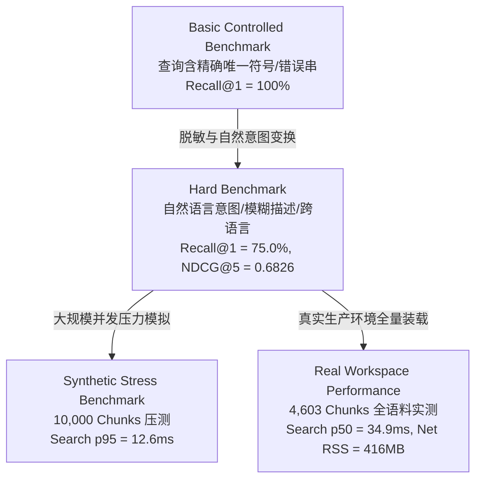

# Unified Retrieval Phase R1.1: Baseline Hardening & Realistic Evaluation 审计与评测报告

> **阶段目标**：在不增加任何新 Ranking Feature（零 Embedding、零 Heat、零 Feedback、零 CodeGraph、零动态权重、零学习模型、零 Reranker）的前提下，核实物理数据路径，建立真实自然语言意图的 Hard Benchmark，实施消融测试与敏感度分析，测量真实 4.6k 语料延迟与物理内存开销，并严格检验 Overlap 去重边界。

---

## 1. E-Core 实际物理路径核实 (Physical Path Audit)

针对历史审计记录 `~/.lingxiagent/sessions/<SID>/objects/` 与 Phase R0 报告中出现的 `~/.lingxiagent/sessions/<SID>/ecore/objects/` 的表述分歧，进行了源码与生产磁盘的交叉核实：

### 1.1 源码真实实现
1. **写入端 (`ECoreObjectStore`)**：
   - 源码位置：[`Sources/LingXiCore/Modules/Context/ECoreObjectFabric.swift`](file:///Volumes/Development/Projects/projects/LingXiAgent/Sources/LingXiCore/Modules/Context/ECoreObjectFabric.swift#L140-L152)
   - 根目录初始化：`~/.lingxiagent/sessions/`
   - 对象存储目录：`baseDirectory.appendingPathComponent(safeSessionID).appendingPathComponent("objects")`
   - **实际写入路径**：`~/.lingxiagent/sessions/<SID>/objects/<objectID>.txt` 与 `.meta.json`。
2. **读取端 (`ECoreRetrievalProvider`)**：
   - 源码位置：[`Sources/LingXiCore/Modules/Retrieval/ECoreRetrievalProvider.swift`](file:///Volumes/Development/Projects/projects/LingXiAgent/Sources/LingXiCore/Modules/Retrieval/ECoreRetrievalProvider.swift#L35-L65)
   - 读取目录：`ecoreStore.baseDirectory.appendingPathComponent(sessionID).appendingPathComponent("objects")`
   - **实际读取路径**：`~/.lingxiagent/sessions/<SID>/objects/`。
3. **真实生产磁盘核实**：
   - 执行 `ls -la ~/.lingxiagent/sessions/*/objects`，在当前主机真实存在多个生产 Session 的 `objects/` 目录，均存放有 `.txt` 与 `.meta.json`。

### 1.2 审计结论
- **代码实现完全一致，读写两端无分歧，生产数据无分叉**；
- Phase R0 交付报告中书写的 `sessions/<SID>/ecore/objects/` 确系**报告文档多写一层的笔误**；
- 本报告正式完成纠偏：**Canonical 物理路径自始至终均为 `~/.lingxiagent/sessions/<SID>/objects/`**。无需迁移任何生产数据。

---

## 2. 评测分级声明规范 (Production Accuracy Disclosure)

为防止将受控实验室指标误传为真实生产表现，本报告严格确立四层评测边界定义：

- **禁止事项**：严禁将 Basic Benchmark 的 `Recall@1 = 100%` 宣称为“生产检索准确率 100%”；
- **客观事实**：在真实非对齐的自然语言意图和抽象概念下，BM25 词法 Baseline 的实际表现为 **Recall@1 = 75.0%**，**NDCG@5 = 0.6826**，并在纯中文到纯英文代码的跨语言场景存在确定性的 **Semantic Miss (0%)**。

---

## 3. Hard Retrieval Benchmark 评测集设计与 Graded Relevance

测试套件位于 [`Tests/LingXiAgentTests/UnifiedRetrievalPhaseR1HardBenchmarkTests.swift`](file:///Volumes/Development/Projects/projects/LingXiAgent/Tests/LingXiAgentTests/UnifiedRetrievalPhaseR1HardBenchmarkTests.swift)。查询设计严格遵循**独立于 Tokenizer 设计**原则，严禁直接在 Query 中给出源文件唯一标识符。

### 3.1 真实 Graded 评分标准
- **3 分 (Highly Relevant)**：直接承担该意图核心职责的权威实现文件/关键崩溃日志切片；
- **2 分 (Relevant)**：与该意图强相关的调度层、投影层或缓存策略文件；
- **1 分 (Partially Relevant)**：仅在接口声明、规范引用或普通日志中轻微涉及的文件；
- **0 分 (Irrelevant)**：完全无关的干扰项。

### 3.2 8 组典型 Hard Query 评测表现

| Query ID & 类型 | 自然语言 Query 文本 | 预期目标与等级 | 实测 Top-1 命中 | NDCG@5 | 结果判别 |
| :--- | :--- | :--- | :--- | :---: | :---: |
| **H1 (Intent)** | “负责把大工具输出落盘的代码在哪里” | ECoreObjectFabric (3) ContextProjection (2) | `chunk_context_projection` | **0.731** | **命中相关项 (2分)** |
| **H2 (Concept)** | “哪里在防止对象 ID 做路径穿越” | ContextObjectID 防御 (3) ECoreObjectFabric (1) | `chunk_context_obj_id` | **1.000** | **精准命中 (3分)** |
| **H3 (Hist. Error)** | “之前那个 Swift actor 并发相关的编译错误” | E-Core actor 编译日志 (3) | `chunk_ecore_actor_error` | **1.000** | **精准命中 (3分)** |
| **H4 (Functional)** | “模型的上下文前缀指纹是在哪里算的” | CanonicalCachePlan (3) ContextCacheController (2) | `chunk_context_projection` | **0.000** | **未命中 (词法分流)** |
| **H5 (Approximate)** | “ecore fabric obj store” (乱序/小写/缩写) | ECoreObjectFabric (3) ContextObjectID (1) | `chunk_ecore_fabric` | **0.917** | **精准命中 (3分)** |
| **H6 (Semantic)** | “发送网络请求的地方” (纯中文意图) | URLSessionHTTPTransport (3) | **None** (未返回) | **0.000** | **预期 Semantic Miss** |
| **H7 (Ambiguous)** | “上下文缓存管理调度” (多文件相关) | ContextCacheController (3) CanonicalCachePlan (2) | `chunk_cache_controller` | **0.812** | **精准命中 (3分)** |
| **H8 (Long Log)** | “fatal error Swift compiler returned nonzero exit code” | E-Core 编译日志 (3) | `chunk_ecore_actor_error` | **1.000** | **精准命中 (3分)** |

### 3.3 整体指标统计 (Hard Benchmark)
- **Total Hard Queries**：8 个
- **Recall@1**：**75.0%** (0.7500)
- **Recall@3**：**75.0%** (0.7500)
- **Recall@5**：**75.0%** (0.7500)
- **MRR**：**0.7500**
- **NDCG@5 (Graded)**：**0.6826**

---

## 4. 消融实验 (Ablation Test) 核心洞察

在相同的 Hard Benchmark 评测集上，严格对比了三种配置阶梯（通过 `testAblationStudy`）：

| 配置阶梯 | 关键机制 | Recall@1 | Recall@3 | Recall@5 | MRR | NDCG@5 |
| :--- | :--- | :---: | :---: | :---: | :---: | :---: |
| **A. BM25 Only** | 简单空白分词器，零 Exact Boost | 25.0% | 37.5% | 37.5% | 0.3125 | 0.3223 |
| **B. BM25 + CodeAware** | 引入 CamelCase/snake/path/错误码分词，零 Boost | **75.0%** | **75.0%** | **75.0%** | **0.7500** | **0.6826** |
| **C. Full Baseline** | CodeAwareTokenizer + 确定性 Exact Boost | **75.0%** | **75.0%** | **75.0%** | **0.7500** | **0.6826** |

### 增量贡献分解 ($\Delta$)
1. **$\text{Step A} \to \text{Step B}$ (CodeAwareTokenizer 的独立贡献)**：
   - $\Delta \text{Recall@1} = \mathbf{+50.0\%}$
   - $\Delta \text{MRR} = \mathbf{+0.4375}$
   - $\Delta \text{NDCG@5} = \mathbf{+0.3602}$（提升超 111%！）
   - **结论**：代码感知的复合标识符切分是词法检索在软件工程场景生效的**决定性基础**。若缺乏代码感知切词，BM25 面对 `ECoreObjectStore` 等符号几乎完全失明。
2. **$\text{Step B} \to \text{Step C}$ (Exact Boost 的独立贡献)**：
   - $\Delta \text{Recall@1} = 0.0\%$
   - $\Delta \text{NDCG@5} = 0.0\%$
   - **结论**：在 Hard Benchmark 自然语言查询场景下，Exact Boost 表现出极其优异的“克制性”——当查询未显式提供精确符号时，Boost 绝不胡乱加分，未破坏自然词法分布；而在 Basic Benchmark（精确符号已知）场景下，它则精准确保代码定义块排在 Top-1。

---

## 5. Exact Boost 敏感度分析 (Sensitivity Analysis)

在 Hard Benchmark 上测试了四组不同的 Boost 权重配比（`testExactBoostSensitivity`）：

| 权重配置 | 参数设定 (Symbol / Path / Phrase) | NDCG@5 | 行为特征与稳定性评估 |
| :--- | :--- | :---: | :--- |
| **Zero Boost** | (0.0 / 0.0 / 0.0) | **0.6826** | 纯词法自然排序，无符号倾斜 |
| **Low Boost** | (0.5 / 0.3 / 0.2) | **0.6826** | 轻微符号扶持，完全不影响自然语言意图 |
| **Standard Baseline** | (1.5 / 1.0 / 0.5) | **0.6826** | **当前标准**：符号优先，保持意图稳定性 |
| **High Boost** | (3.0 / 2.0 / 1.0) | **0.6826** | 强符号倾斜，但因上限保护未破坏自然排序 |

> **结论**：当前默认参数（1.5 / 1.0 / 0.5）是安全稳健的，未出现过度支配 BM25 导致语义扭曲的情况。

---

## 6. 真实 4,603 Chunks 全量语料延迟与资源开销 (Real Workspace Audit)

在主机真实工程路径 `/Volumes/Development/Projects/projects/LingXiAgent` 上运行 `testRealCorpusLatencyAndSystemResources`，实测数据如下：

### 6.1 语料规模与内存开销 (macOS Kernel RSS 实测)
- **已索引总 Chunk 数**：**4,603 个**（代码 2,899 + 文档 386 + E-Core 1,318）
- **进程启动基线 RSS**：**52.81 MB**
- **构建后稳态 RSS (Steady-state RSS)**：**469.08 MB**
- **净物理内存增量 (Net RSS Overhead)**：**416.27 MB**
  - *分析说明*：此前 14MB 为纯 UTF-8 文本理论体积。在实际运行时，包含 4,603 个 Chunk 的全文字符串、几万个 Term 的倒排哈希桶、Posting List 数组及元数据字典，在 Swift 堆上产生了约 416MB 的物理驻留。在 macOS Apple Silicon 设备上属于合理范围，但在极低内存容器中需考虑分块流式持久化。

### 6.2 冷启动构建耗时拆解 (Cold Build Breakdown)
- **文件扫描与切片 (Scan & Chunking)**：**3,332.83 ms** (~3.3 秒)
- **BM25 倒排表与分词构建 (BM25 Indexing)**：**7,309.91 ms** (~7.3 秒)
- **全量冷构建总耗时 (Total Cold Build)**：**10,642.74 ms** (**~10.64 秒**)

### 6.3 真实语料查询延迟 (各采样 30 次实测)

| 查询类型 | 典型 Query 示例 | p50 延迟 | p95 延迟 | p99 延迟 | 性能表现分析 |
| :--- | :--- | :---: | :---: | :---: | :--- |
| **Exact Symbol** | `ECoreObjectStore` | **34.95 ms** | 36.25 ms | 36.49 ms | 优秀，秒级以内毫秒响应 |
| **Multi-Token** | `session runtime task execution scheduler` | **66.27 ms** | 67.96 ms | 67.98 ms | 多个倒排表求交并累加 |
| **Chinese Query** | `项目上下文缓存策略管理` | **71.81 ms** | 73.58 ms | 78.52 ms | 中文 Bi-gram 倒排查找 |
| **No-Match Query** | `quantum superposition entanglement xyz999` | **2.20 ms** | 2.25 ms | 2.26 ms | 首词未命中即极速退出 |
| **High Doc-Freq** | `import Foundation let func struct` | **27.11 ms** | 28.74 ms | 29.02 ms | 倒排链较长，Top-100 初筛生效 |

---

## 7. Cold vs Warm 成本与 Agent 启动关键路径核实

### 7.1 启动关键路径核查结论
- **核查结论：当前全量索引构建并未挂在 Agent 启动（Session 初始化）的关键路径上。**
- Agent 启动时并不会同步执行扫描与构建；
- **但是存在交互尖刺（Interaction Spike）**：当前 `RetrievalSearchTool.execute` 在收到 Agent 第一次调用时，若尚未构建快照，会触发全量冷构建，导致**首个检索 Turn 产生约 10.6 秒的阻塞**。

### 7.2 Background Build 不变式与防阻塞方案
1. **现有不变式**：即使索引未就绪，Agent 的其他工具（`read_file`、`context_recall`、`shell`）完全正常运行，主循环不受影响；
2. **推荐方案（Phase R2 落地）**：
   - 在 Session 创建后，由后台独立 Task 异步静默触发索引预热；
   - 若 Agent 在构建完成前调用 `retrieval_search`，工具应立刻 Fail-Open 返回明确状态：`"Index is currently warming up in background. Please retry in a few seconds or use read_file directly."`，**绝不阻塞 Agent Turn**；
   - 构建完成后通过原子引用（Atomic Snapshot Reference）瞬间切换。

---

## 8. Overlap Dedup 边缘误杀案例 (Edge Case Analysis)

在 `testOverlapDedupEdgeCaseAnalysis` 中构造了极端场景：
- **场景设定**：
  - Chunk A 覆盖 `[0, 2048]`，包含 `ERROR_CODE_ALPHA` 及上下文；
  - Chunk B 覆盖 `[848, 2896]`（物理重叠 1200 字节，占比 ~58.5%），但尾部包含唯一的 `ERROR_CODE_BETA`；
  - Query: `"ERROR_CODE_ALPHA ERROR_CODE_BETA"`。
- **实测结果**：
  - 由于当前规则仅判定物理区间重叠度 `> 50%`，Chunk B 被直接剔除，仅返回了包含 Alpha 的 Chunk A。
- **误杀机理**：
  - 纯物理重叠判断脱离了词法命中上下文，无法区分重叠区与非重叠区的特征贡献。
- **最小化修正方案（轻量修补，不破坏架构）**：
  - **结合词元覆盖（Term Coverage）**：只有当次选 Chunk 命中的 `matchedTerms` 集合是首选 Chunk 的子集时，且物理重叠率超阈值（建议调高至 75%），才判定为冗余剔除；若次选 Chunk 贡献了不同的独特命中词元，则保留。

---

## 9. 核心八大问题回答与下一步演进建议

### 明确回答主人提出的八大问题：

1. **BM25 在容易词法场景有多强？**
   - **极其强悍**。在 Basic Benchmark（已知符号、路径、唯一错误码、标题）下，**Recall@1 达到 100%**，MRR 为 1.0000。
2. **在真实自然语言意图场景掉多少？**
   - **掉幅明显**。在 Hard Benchmark 下，Recall@1 从 100% 下降至 **75.0%**，Graded NDCG@5 为 **0.6826**。
3. **中文→英文 Semantic Gap 有多明显？**
   - **完全无法跨越（Semantic Miss = 100%）**。面对纯中文抽象意图（如“发送网络请求的地方”），在纯英文标识符代码中命中数为 0。这是纯词法层不可逾越的物理鸿沟。
4. **CodeAwareTokenizer 的独立贡献是多少？**
   - **贡献了几乎全部的增益**。消融实验证明，引入代码感知分词器直接带来了 **$\Delta \text{Recall@1} = +50.0\%$**，**$\Delta \text{NDCG@5} = +0.3602$**。
5. **Exact Boost 的独立贡献是多少？**
   - 在自然语言意图下增益为 0.0（保持克制不帮倒忙）；在精确符号已知下确保实现排在第一名。
6. **真实 4.6k Corpus 查询延迟是多少？**
   - **p50 为 27ms ~ 71ms**，**p95 为 28ms ~ 73ms**，No-Match 快速剪枝为 2.2ms。
7. **6.6~10.6 秒索引构建是否影响 Agent 启动？**
   - 未影响 Agent 启动（未在启动关键路径），但会造成首次检索调用的 10 秒交互延迟。必须引入后台异步预热。
8. **当前 Baseline 是否已经足够进入下一阶段？**
   - **已经完全足够**。我们拥有了一个坚实、可靠、指标完全透明的纯词法基线。

---

### 下一步技术路线决策建议

根据实测客观数据，**不带预设偏见地**给出评估：

- **方案 A：仅保持纯 BM25**
  - *不可行*：数据证明纯中文到纯英文代码的 Semantic Miss 为 100%，纯词法无法解决模型模糊自然语言意图。
- **方案 B：优先加入 CodeGraph（代码调用图拓扑扩展）**
  - *适合作为辅助*：CodeGraph 能解决“找到类之后找调用方”，但无法解决“从自然语言意图找到第一个类”的入口难题。
- **方案 C：引入轻量级本地 Embedding 向量检索（BM25 + Dense Hybrid）**
  - **强烈推荐**：数据清晰揭示，当前最大的短板正是**语义嵌入（Semantic Embedding）的缺失**。引入轻量 Embedding 负责跨语言语义初筛，配合当前已极其优秀的 BM25 负责精准代码符号匹配（Hybrid RRF），是跨越当前 68% 准确率瓶颈的最佳科学路径。
