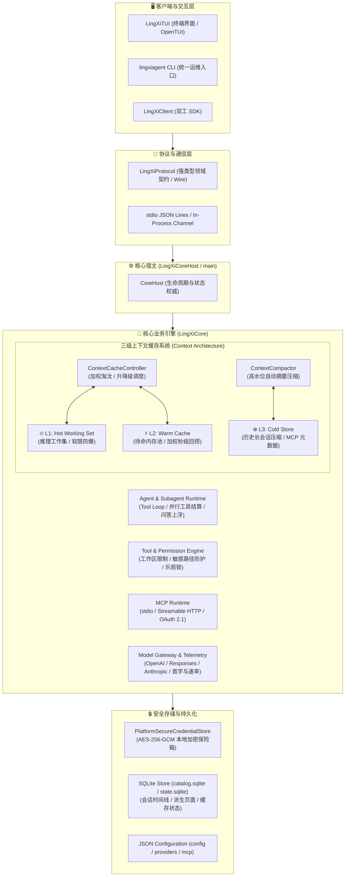

# LingXiAgent

> [!IMPORTANT]
> **系统平台支持说明（Platform Support）**
> - **当前支持**：本项目目前**仅支持 macOS**（macOS 13+）。
> - **暂不支持**：**Linux**、**Windows**、**HarmonyOS**、**ChromeOS**、**Android** 目前暂不支持，未来版本可能视生态成熟度与架构规划逐步评估支持。

LingXiAgent 是以纯 Swift 原生实现的现代化本地自主智能体（Agent Core）。它拥有完整的自主决策树、多级上下文缓存、动态工具调度、敏感权限拦截、多协议模型网关、MCP 服务运行时与本地加密持久化体系；外部模型通信仅在 Provider Adapter 边界做契约映射，严守领域模型的内聚与纯粹。

---

## 🌟 核心特性概览

* **极速原生响应**：全系统基于 Swift 6 现代并发（Concurrency & Actors）构建，内存占用低至数十兆，毫秒级启动与调度。
* **独创三级上下文缓存（L1 / L2 / L3）**：
  * **L1 Hot Working Set**：直接参与大模型推理的高热活跃工作集，受上下文预算（Context Budget）与软限制严格守护；
  * **L2 Warm Cache**：内存未压缩页面池，L1 超载时按 LRU 与相关度加权淘汰降级至 L2；再次命中时秒级提拔（Promote）回 L1；
  * **L3 Cold Store**：会话高水位自动压缩（Compaction）归档、历史工具大批次提炼摘要（`DerivedContextPage`）及全量 MCP 工具元数据池。
* **沉浸式现代终端界面（LingXiTUI）**：
  * 双栏布局：左侧实时状态监控看板（L1/L2/L3 缓存用量进度条、大模型服务端真实 Prompt Cache 命中率、活跃 MCP 与 Skills 计数、子代理树）；
  * 右侧主交互区：完整支持流式打字机渲染、代码高亮、交互式权限确认拦截与结构化问答弹窗；
  * **精准性能脚标**：每轮问答结束末尾自动输出暗调遥测参数：`⚡️ <model> · 耗时 <dur> · 首字 <latency> · <tokens/s> · <timestamp>`；
  * **跨工作区 `/resume` 会话恢复**：自动聚合扫描全盘会话并按工作目录层级分类，当前目录自动置顶，智能提取首行提示词摘要，跨目录切换时自动 `cd` 并完整水合恢复历史时间线。
* **全功能 MCP (Model Context Protocol) 运行时**：
  * 支持 `stdio` 与现代 `streamableHTTP` 双通道；
  * 自动工具发现、分页拉取与 Schema 按需短租约（Lease）；
  * 内置标准 RFC 9728 & RFC 8414 OAuth 2.1 浏览器自动授权与本地回送服务器；
  * **凭据双重回退**：本地 AES-256-GCM 独立加密保险箱与系统环境变量双向兜底。
* **统一运维 CLI (`lingxiagent`)**：提供 `doctor` 体系体检、`mcp` 状态与发现、`auth` 密钥与多模型认证等全套运维指令。

---

## 🏛️ 系统架构设计



### Swift Package 模块边界

| Target | 职责定位 | 依赖关系 |
| :--- | :--- | :--- |
| **`LingXiProtocol`** | 定义领域类型、消息、事件、流式数据帧（Wire Frame）及错误契约 | 纯原生，零外部依赖 |
| **`LingXiCore`** | 业务核心、状态权威，内含三级缓存、Tool/MCP/Provider 引擎与持久化 | 仅依赖 `LingXiProtocol` |
| **`LingXiClient`** | 访问 Core 的客户端 SDK，支持进程内驱动及 stdio 管道传输 | 仅依赖 `LingXiProtocol` |
| **`LingXiApplication`**| 应用层业务聚合驱动，实现 `/resume`、`/mcp`、`/skills` 等应用命令 | 依赖 `LingXiClient`、`LingXiProtocol` |
| **`LingXiTUI`** | 现代化终端用户界面，负责双栏渲染、事件消费与交互式输入 | 依赖 `LingXiApplication`、`LingXiTUIComponents` |
| **`LingXiCoreHost`** | 独立 Core 后台执行体，提供标准输入输出的 JSON Lines 协议服务 | 依赖 `LingXiCore`、`LingXiProtocol` |
| **`lingxiagent`** | 统一综合命令行入口（运行 TUI、doctor 体检、mcp 诊断、auth 密钥管理） | 整合各层入口 |

---

## 🔄 深度解析：三级上下文缓存（L1 / L2 / L3）机制

在日常开发与多轮复杂交互中，大模型物理显存（Context Window）极其宝贵。LingXiAgent 并不将历史内容无脑累加，而是设计了严密的**三级温度分层流转模型**：

```mermaid
flowchart TD
    Input["用户输入 / 工具返回 / 代码检索"] --> L1

    subgraph L1_Box["🔥 L1: 活跃工作集 (参与单次物理推理)"]
        L1["System Prompt + 活跃对话历史 + 正在运行的工具批次 + 常驻代码段"]
    end

    subgraph L2_Box["⚡ L2: 待命缓存池 (内存驻留，不占推理 Token)"]
        L2["LRU 换出代码页 / 高频备选文件 (保留完整 AST 文本，免磁盘重新扫描)"]
    end

    subgraph L3_Box["❄️ L3: 冷数据归档 (SQLite / 磁盘持久化)"]
        L3["历史庞大工具结果压缩摘要 ([Historical tool evidence]) + 长对话提炼 + MCP 42+ Schema 元数据"]
    end

    L1 -- "Token 突破 L1 SoftLimit (动态加权淘汰)" -->|Demote / Page-out| L2
    L2 -- "上下文再次命中检索 (加权 +2.0 秒级提拔)" -->|Promote / Page-in| L1
    
    L1 -- "会话超长触碰 High-Water Mark 水位线" -->|ContextCompactor 压缩| L3
    L3 -- "历史跨度大范围意图召回" -->|Recall / Page-in| L1
```

### 1. 各级缓存职责与行为特征

1. **🔥 L1: Hot Working Set（直接物理工作集）**
   * **作用**：唯一真正构造为本次 API 请求 Payload、直接送入大模型显存的内容。
   * **容量管理**：由模型的物理窗口（如 200k/1M Tokens）结合动态安全预留（Reserve）、**Target（约88%）**、**SoftLimit（约94%）** 和 **HardLimit** 严格防御。
   * **初期状态**：新会话开始时，所有内容均在 L1，此时 L2/L3 为 0。
2. **⚡ L2: Warm Cache（温待命缓存池）**
   * **作用**：在内存中缓存刚被 L1 挤出的完整代码片段和检索页面，**完全不消耗模型的单次物理推理 Token**。
   * **流转机制**：当阅读大量源码导致 L1 突破 SoftLimit 时，`ContextCacheController` 根据时间权重、访问频次与任务亲和度算法选出非置顶受害者，将其换出（Page-out）至 L2。如果后续对话重新提及该文件，系统直接从 L2 提拔（Promote）回 L1（获 +2.0 缓存权重加成），无需重新访问磁盘与解析语法树。
3. **❄️ L3: Cold Store（冷归档与压缩提炼库）**
   * **作用**：磁盘级持久化。当多轮对话导致历史消息与庞大工具输出（如几千行日志）逼近 High-Water Mark 时，`ContextCompactor` 启动：
     * 将已消费完的工具执行大包（Historical Tool Batches）精炼压缩为简洁的结构化证据摘要（`[Historical tool evidence]`），原始巨型文本落盘归档，腾出宝贵 L1 空间；
     * 全量 MCP 服务（如 Notion 的 42 个工具、Excel 的 25 个工具）平日仅将微量元数据存于 L3，仅在模型发起调用意图时按需建立短期 Lease 激活进入工作集。

---

## 🖥️ 现代化终端界面 (LingXiTUI) 细节

启动命令：`swift run lingxiagent`（或直接使用编译产物 `lingxiagent`）

### 1. 侧边栏实时感知看板（Sidebar）
* **三级缓存计量计**：实时展示 L1 / L2 / L3 当前占用 Token 数与容量上限的动态文本进度条；
* **真实提供商 Prefix Cache 监控**：直接从底层大模型服务商（DeepSeek、OpenAI、Anthropic 等）返回的 HTTP 遥测中提取，精确展示本轮 Prompt Cache 命中率及复用比例；
* **环境扩展指示**：实时列出当前启用的 Skills 数量与健康的 MCP 服务器（实时标注故障节点）；
* **后台任务与子代理树**：展示当前正在并发运行的子代理状态与任务进度。

### 2. 问答性能脚标（Telemetry Footnote）
每轮 Assistant 回答完毕后，内容末尾会自动附带极具现代极客质感的参数注脚：
```text
⚡️ deepseek-v4-flash · 耗时 1.34s · 首字 0.42s · 86.4 tps · 23:20:15
```
* **模型名称**：实际承载本次推理的 Provider 模型标识；
* **总耗时**：端到端完整执行时长；
* **首字延迟**：发起请求到接收首个 Token 数据帧的真实等待时间（First-token Latency）；
* **吐字速度**：流式生成期间的平均吞吐率（Tokens Per Second）；
* **完成时间**：精确到秒的本地时间戳。

### 3. 跨工作目录 `/resume` 智能会话管理器
在终端输入 `/resume` 命令，即可呼出全屏智能会话选择器：
* **按工作区层级聚合**：自动扫描所有会话，按所属项目根目录自动分组；
* **当前目录置顶排序**：当前所在工作区的历史会话自动置于首位优先展示；
* **会话摘要与时间轴**：自动提取首条 User 提示词的核心意图形成摘要，标注总消息数与最后活跃时间；
* **无缝工作区切换**：当选中非当前目录的会话时，系统**自动执行 `cd` 切换到对应工作目录**，并从 SQLite 中无损水合（Hydrate）恢复全量交互时间线，完美衔接上下文。

---

## 🔌 MCP 服务运行时与安全保障

LingXiAgent 现已实现极为健壮的 MCP 统一连接机制，当前已全量接入并验证通过 7 大核心服务（100+ 工具）：

| 服务 ID | 传输协议 | 端点 / 命令 | 健康状态 | 工具总数 | 核心能力 |
| :--- | :--- | :--- | :---: | :---: | :--- |
| **`openapi-mcp-core`** | stdio | `/opt/homebrew/bin/node` (阿里云桥接) | ✓ Healthy | 15 tools | 阿里云云原生资源查询、CLI 生成与文档深度检索 |
| **`notion`** | streamableHTTP | `https://mcp.notion.com/mcp` | ✓ Healthy | 42 tools | Notion 页面创建、数据库检索、会话与知识库全功能 |
| **`excel`** | stdio | `/Users/.../.local/bin/uvx excel-mcp-server` | ✓ Healthy | 25 tools | Excel 表格读取、公式语法校验、数据分析透视 |
| **`codebase-memory-mcp`** | stdio | `codebase-memory-mcp` | ✓ Healthy | 14 tools | 代码知识图谱、符号关系追踪与代码语义检索 |
| **`trivy`** | stdio | `/opt/homebrew/bin/trivy` | ✓ Healthy | 6 tools | 本地与镜像文件系统漏洞扫描、许可证审计 |
| **`context7`** | streamableHTTP | `https://mcp.context7.com/mcp` | ✓ Healthy | 2 tools | 全网主流开发库与框架官方最新技术文档实时检索 |
| **`penpot`** | streamableHTTP | `https://penpot.macserver...` | ✓ Healthy | 4 tools | 团队自建 Penpot 协同设计插件脚本执行与画板导出 |

### 凭据保险箱与双重回退保障
针对诸如阿里云 `ALIBABA_CLOUD_ACCESS_KEY_*` 或 Notion Token 等敏感凭证：
1. **本地加密保险箱（Vault）**：
   * 采用 AES-256-GCM 高强度加密，主密钥由机器唯一特征结合 PBKDF2（600,000 次）衍生保护；
   * 凭证安全落盘于 `~/.lingxiagent/credentials.vault`，彻底脱离对系统 Keychain 弹窗或第三方 Shell 环境变量的脆弱依赖。
2. **双重回退解析机制**：
   * 运行时解析器在拉取 MCP 环境变量与 Auth Token 时，自动执行**双重兜底**：`本地加密保险箱` ⇄ `当前进程环境变量`。无论从任何终端、桌面启动或非交互环境下执行，均可稳定自洽启动。

---

## 🛠️ 统一命令行手册 (`lingxiagent`)

`lingxiagent` 统一编译产物集成了开发、调试、运维全套子命令：

```bash
# 1. 启动交互式 TUI 界面
swift run lingxiagent
# 或指定工作目录
swift run lingxiagent --cwd /path/to/project

# 2. 全系统健康体检 (Doctor)
swift run lingxiagent doctor

# 3. MCP 服务运维与健康状态探测
swift run lingxiagent mcp list                  # 查看所有配置服务概览
swift run lingxiagent mcp status                # 全量在线连通性与工具发现探测
swift run lingxiagent mcp status <name>         # 单独深度探测指定服务
swift run lingxiagent mcp login <name>          # 启动 OAuth 2.1 浏览器全自动授权
swift run lingxiagent mcp auth <name> --bearer <token> # 录入 Bearer Token 存入保险箱
swift run lingxiagent mcp enable / disable <name>      # 快速启用或禁用指定服务

# 4. 模型与凭证保险箱管理 (Auth)
swift run lingxiagent auth list                 # 查看所有 Provider 当前认证状态
swift run lingxiagent auth status [product]     # 查看模型详情与上下文规格
swift run lingxiagent auth set <key> [value]    # 将任意自定义凭据安全存入加密保险箱
swift run lingxiagent auth import-env <NAME>    # 从当前环境抓取变量并写入保险箱
swift run lingxiagent auth matrix               # 输出全模型特性与协议兼容矩阵

# 5. 跨目录会话快速恢复
swift run lingxiagent resume                    # 交互式选择会话
swift run lingxiagent resume <session-id>       # 直接恢复指定 ID 会话
```

---

## 🛡️ 安全纪律与边界规范

LingXiAgent 严格恪守核心纪律准则：
1. **凭据绝对不可碰**：原始密钥仅在内存中短暂用于建连，绝不进入 Session、AgentRun、上下文、工具归档、协议报文或日志。
2. **破坏先备份**：任何针对配置文件、数据库与重要代码的破坏性操作前，均自动于工作区进行备份隔离；禁止随意进行无保护的硬清除。
3. **最小化原则**：非必要勿增依赖，能用系统与现有 Swift 原生能力解决的问题绝不随意引入外部三方包。
4. **沙箱与权限控制**：
   * 支持 `Strict`、`Agent`、`YOLO` 权限模式；
   * 严格实施路径包含校验（Path Containment）、符号链接逃逸检查与版本乐观锁（Optimistic Concurrency Control）。

---

## 🧪 构建与测试

```bash
# 完整构建所有 Target
swift build

# 运行全量自动化测试 (包含并发测试、协议契约、三级缓存与 MCP 回放)
swift test

# 快速回归核心 MCP 与配置解析测试
swift test --filter MCP
swift test --filter Auth
```

---

LingXiAgent, crafted for effortless coding. 🦊✨
