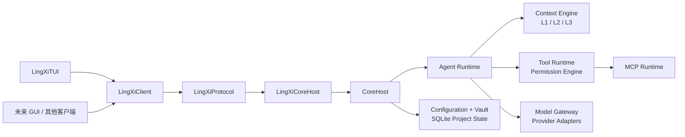
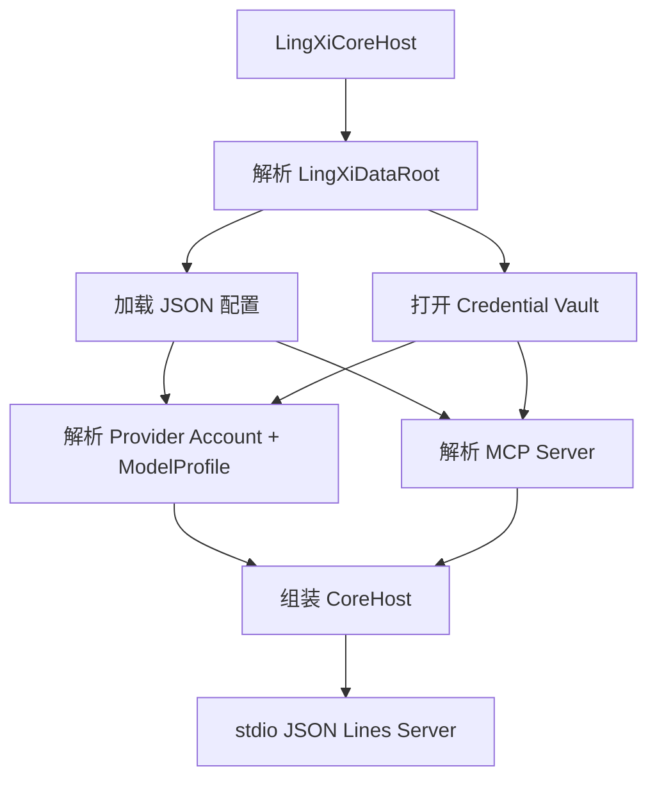

# LingXiAgent

LingXiAgent 是以 Swift 实现的本地 Agent Core。它拥有自己的会话、上下文、工具、权限、Provider、MCP 和持久化模型；外部模型协议只在 Provider Adapter 边界出现，不进入领域模型。

当前仓库完成了 P1-P13 稳定化阶段：可通过 stdio JSON Lines 启动 Core，并由参考 TUI 或 `LingXiClient` 使用统一的 `LingXiProtocol` 访问。P14 尚未开始。

## 当前状态

- 平台与工具链：macOS 13+、Swift 6、Swift Package Manager。
- 验收：`swift build`、串行 `swift test --no-parallel` 与并行 `swift test` 均通过，共 243 个测试、29 个测试套件。
- 离线回放：仓库内 VCR Golden 覆盖 Provider、内置工具、MCP、并行子代理、问答、权限、重启与持久化恢复；Replay 不会访问上游网络。
- 真实 Provider：`gpt-5.6-terra` 的 `full-core-stack-v1` Record 与仓库 Golden Replay 已通过验收。

不在当前范围：Workflow、Goal、长期记忆、GUI、远程运行时，以及 Anthropic OAuth 和 Builtin Provider 元数据验证。

## 已实现能力

| 领域 | 当前实现 |
|---|---|
| Core 生命周期 | `starting`、`ready`、`shuttingDown`、`stopped` 状态机；恢复失败会停止 Core，关闭时取消活跃工作、流、问答与受管进程。 |
| 会话与运行 | Session、消息历史、流式 turn、用量、失败终态；同一 Session 的 turn 串行化，不同 Session 可并行。 |
| Agent 与子代理 | Provider 无关的 Agent/tool loop、并行工具结算、子 Session、AgentRun 树、取消、问答上浮；子 Session 与初始 Run、终态与结果均原子持久化。 |
| 上下文 | L1 会话工作集、L2 项目热区、L3 项目页与符号/引用索引；预算计算、分页、派生页、显式 compact 与协议校验。 |
| 工具与权限 | 读文件、目录列表、写入、补丁、workspace shell、技能加载和交互式问答；路径限制、敏感路径保护、版本冲突检查、超时与受管进程生命周期。 |
| Provider | OpenAI-compatible Chat Completions、OpenAI Responses、Anthropic Messages 的请求转换、SSE 流解析与工具调用；模型能力由显式 `ModelProfile` 声明。 |
| MCP | `stdio` 与 Streamable HTTP；工具发现、分页、按请求租约加载 schema、大小/预算限制、凭据预加载、stdio 超时与受控环境。 |
| 持久化 | JSON 配置、SQLite 项目状态、会话、AgentRun、上下文和工具批次；可重建缓存可独立失效，持久化真相不因迁移被丢弃。 |
| 凭据 | `CredentialRef` 引用、AES-256-GCM 加密 vault、PBKDF2-HMAC-SHA256（600,000 次）派生、v1 明文 vault 自动迁移并保留加密备份。 |
| 验证 | Provider HTTP、MCP、持久化、工具边界、子代理、VCR 与架构边界回归测试。 |

## 架构



包边界由 `Package.swift` 固定：

| Target | 职责 | 依赖 |
|---|---|---|
| `LingXiProtocol` | 领域类型、命令、响应、事件、流与 wire 编码 | 无 |
| `LingXiCore` | 业务能力、状态权威、Provider/MCP/工具/持久化实现 | `LingXiProtocol` |
| `LingXiClient` | Core 的客户端 SDK；进程内或 stdio 连接 | `LingXiProtocol` |
| `LingXiCoreHost` | 独立 Core 进程与 stdio server | `LingXiCore`、`LingXiProtocol` |
| `LingXiTUI` | 参考终端客户端，不保存权威会话历史 | `LingXiClient`、`LingXiProtocol` |

生产代码中不包含 VCR 或 cassette 实现；Provider HTTP transport 是注入边界。`LingXiProtocol` 不依赖 UI 框架、HTTP 或特定 IPC 实现。

### 启动流程



## 快速开始

```sh
swift build
swift test
swift run LingXiTUI
```

`LingXiTUI` 会启动同目录中的 `LingXiCoreHost` 子进程。默认配置没有可用 Provider，因此 TUI 可用于检查 Core 与协议通路，但发送对话前必须先配置 Provider、Account、ModelProfile 与对应凭据。

参考 TUI 支持以下命令：

| 命令 | 行为 |
|---|---|
| `new` | 创建并切换到新 Session |
| `history` | 查看当前 Session 的权威历史 |
| `context` | 查看 L1 上下文与 L2/L3 缓存概况 |
| `perf` | 查看性能报告，需要 `LINGXI_PERF_DEBUG=1` |
| `subagents` | 显示当前根 Session 的子代理树 |
| `cache` | 查看项目缓存与索引状态 |
| `compact` 或 `/compact` | 显式压缩当前 Session 的上下文 |
| `permission` | 查看当前权限策略与执行配置 |
| `permission ask|auto readOnly|workspace|fullAccess` | 设置权限策略与执行范围 |
| `mode strict|agent|yolo` | 应用预设权限配置 |
| `quit` 或 `exit` | 关闭客户端与 Core 子进程 |

## 数据目录与配置

Core 启动时解析数据目录：优先使用 `LINGXI_DATA_ROOT`，未设置时使用 `~/.lingxiagent`。环境变量仅用于启动、诊断、测试或显式调试注入，不是 Provider 或 MCP 的持久化配置来源。

| 文件或目录 | 用途 |
|---|---|
| `config.json` | Core、Agent、权限、上下文及运行时配置 |
| `providers.json` | 自定义 Provider、Account、ModelProfile、默认模型选择 |
| `mcp.json` | MCP Server 定义 |
| `plugins.json` | 插件配置 |
| `credentials.vault` | 加密凭据 vault |
| `credentials.vault.v1-migration-backup` | v1 明文 vault 自动迁移时产生的加密备份 |
| `catalog.sqlite` | 项目目录与内容索引 |
| `projects/<project-id>/state.sqlite` | Session、AgentRun、上下文和工具批次等项目状态 |

内置默认文件与 JSON Schema 位于 [`Sources/LingXiCore/Resources/Configuration`](Sources/LingXiCore/Resources/Configuration)。`providers.json` 以显式 `customProviders`、`accounts`、`modelProfiles` 和 `defaultSelection` 表达运行时选择；不会根据 Provider 名称或模型名称猜测 wire、能力或上下文窗口。

`mcp.json` 支持 `stdio` 和 `streamableHTTP`。HTTP 端点必须使用 HTTPS，除非是 loopback HTTP；stdio 命令必须使用绝对路径，并受到清理后的环境与 `timeoutSeconds` 约束。

### 凭据

配置文件中只保存 `CredentialRef`，不保存密钥值。Host 从 `LINGXI_CREDENTIALS_PASSPHRASE` 取得 vault passphrase，该值不会持久化。首次写入、读取已有加密 vault 或迁移 v1 vault 时需要此变量；尚不存在 vault 的读取返回空值。

`FileCredentialStore` 是程序化凭据管理接口：

```swift
let store = try FileCredentialStore(
    dataRoot: dataRoot,
    passphrase: ProcessInfo.processInfo.environment["LINGXI_CREDENTIALS_PASSPHRASE"]
)
try await store.setSecret("provider-token", for: CredentialRef("my-provider"))
```

不要把 passphrase、API key、token 或实际 vault 内容提交到仓库、会话历史、日志、fixture 或普通 JSON 配置。

## Provider 与 MCP

Provider 解析的优先级如下：

1. 显式测试或调试注入。
2. AgentRun 的 `ModelSelection`。
3. 数据目录中的持久化配置。
4. 已验证的 Builtin Provider 默认定义。
5. 显式 unresolved error。

| Wire | 流式输出 | 工具调用 | 并行工具 | 推理增量 | 远程状态 |
|---|---:|---:|---:|---:|---:|
| OpenAI-compatible Chat Completions | 是 | 是 | 是 | 兼容扩展字段 | 否 |
| OpenAI Responses | 是 | 是 | 是 | 是 | 仅 `ModelProfile` 显式启用 |
| Anthropic Messages | 是 | 是 | 是 | 原生 thinking delta | 否 |

Builtin Provider 目录包含稳定产品 ID，但未记录官方来源的条目不会声称 endpoint、认证方式、wire 或模型能力，且不可解析为运行时 Provider。该元数据验证属于 P14；Anthropic OAuth 当前未实现。

## 客户端接口

`CoreEndpoint` 是 Core 对外的正式 Swift 契约：

```swift
public protocol CoreEndpoint: Sendable {
    func handle(_ command: ClientCommand) async throws -> CoreResponse
    func openDataStream(_ command: ClientCommand) async throws -> OpenedStream
    func toolOutputEvents() async -> AsyncStream<ToolOutputChunk>
    func events() async -> AsyncStream<CoreEvent>
}
```

`LingXiClient` 封装了这一契约，可通过 `LingXiClient.inProcess(endpoint:)` 用于嵌入式/测试场景，或通过 `LingXiClient.stdioCore()` 启动并连接 Core 子进程。常用 API：

| API | 说明 |
|---|---|
| `coreInfo()`、`coreState()`、`ping()` | Core 探测与生命周期状态 |
| `createSession()`、`sessions()`、`session(_:)` | Session 创建、列表和权威历史 |
| `sendMessage(sessionID:content:)` | 发起一轮对话，返回 `AsyncThrowingStream<StreamChunk, Error>` |
| `events()` | 订阅 turn、工具、权限、问答与 AgentRun 控制面事件 |
| `toolOutputEvents()` | 订阅工具 stdout/stderr 数据面 |
| `replyPermission(_:)`、`replyQuestion(_:)` | 响应交互式权限与提问 |
| `compact(_:)`、`context(_:)`、`projectCache()`、`performance(_:)` | 上下文与调试信息 |
| `listAgentRuns(_:)`、`getAgentTree(_:)`、`subagentResult(_:)`、`cancelAgentRun(_:)` | 子代理与 Run 查询、取消 |

流式 chunk 中的 `kind` 为 `text` 或 `reasoning`；对应 turn 的完成或失败状态通过 `events()` 返回。工具 stdout/stderr 同样走独立数据面，不混入控制面事件。

### stdio JSON Lines wire

`LingXiCoreHost` 通过标准输入输出收发一行一个 JSON 的 `WireMessage`。消息类型如下：

| `kind` | 方向 | 内容 |
|---|---|---|
| `request` | Client -> Core | 请求 ID 与 `ClientCommand` |
| `response` | Core -> Client | 同一请求 ID 与 `CoreResponse` |
| `event` | Core -> Client | 状态、turn、工具、权限、问答、子代理等语义事件 |
| `chunk` | Core -> Client | `StreamChunk`，承载 text/reasoning 增量 |
| `toolOutput` | Core -> Client | `ToolOutputChunk`，承载 stdout/stderr |
| `streamEnd` | Core -> Client | Stream 终态，可带 `CoreError` |

控制面处理请求、响应与语义事件；数据面承载高频模型增量和工具输出。二者共享 stdio 物理通道，但在协议层独立路由。

`ClientCommand` 覆盖 Core 信息和状态、Session 管理、Provider 状态、权限与问答回复、上下文/性能/缓存、上下文压缩、子代理查询与取消，以及 `sendMessage`。完整、可编码的命令与响应定义见 [`Sources/LingXiProtocol`](Sources/LingXiProtocol)。

## 安全边界

- 原始凭据仅在 vault 解密后短暂用于 Provider/MCP 解析，不进入 Session、AgentRun、上下文、工具归档、协议消息、日志或 VCR fixture。
- `credentials.vault` 使用 AES-256-GCM，密钥以 PBKDF2-HMAC-SHA256、600,000 次迭代派生；关联数据固定为 `LingXiAgent credentials.vault v2`。
- workspace 工具会验证路径包含关系、符号链接逃逸、敏感路径和二进制文件；写入与编辑默认要求版本一致。
- shell 在 workspace 内执行，剥离秘密环境变量，受超时和进程生命周期管理。
- MCP schema 仅以请求级 lease 加载，受单 schema 与总预算限制；禁用服务不要求其凭据存在。

## 测试与验证

```sh
# 构建
swift build

# 默认并行全量测试
swift test

# 串行全量测试，适合定位时序或资源问题
swift test --no-parallel

# 只运行仓库 Golden 的完整离线回放
swift test --filter FullCoreStackV1Tests/fullCoreStackV1
```

完整验收证据、已知限制与 P14 入口判定见 [`Docs/Architecture/P1-P13-FINAL-ACCEPTANCE.md`](Docs/Architecture/P1-P13-FINAL-ACCEPTANCE.md)。模块级稳定化矩阵、Provider/MCP 约束和持久化说明见 [`Docs/Architecture/P1-P13-Stabilization.md`](Docs/Architecture/P1-P13-Stabilization.md)。
