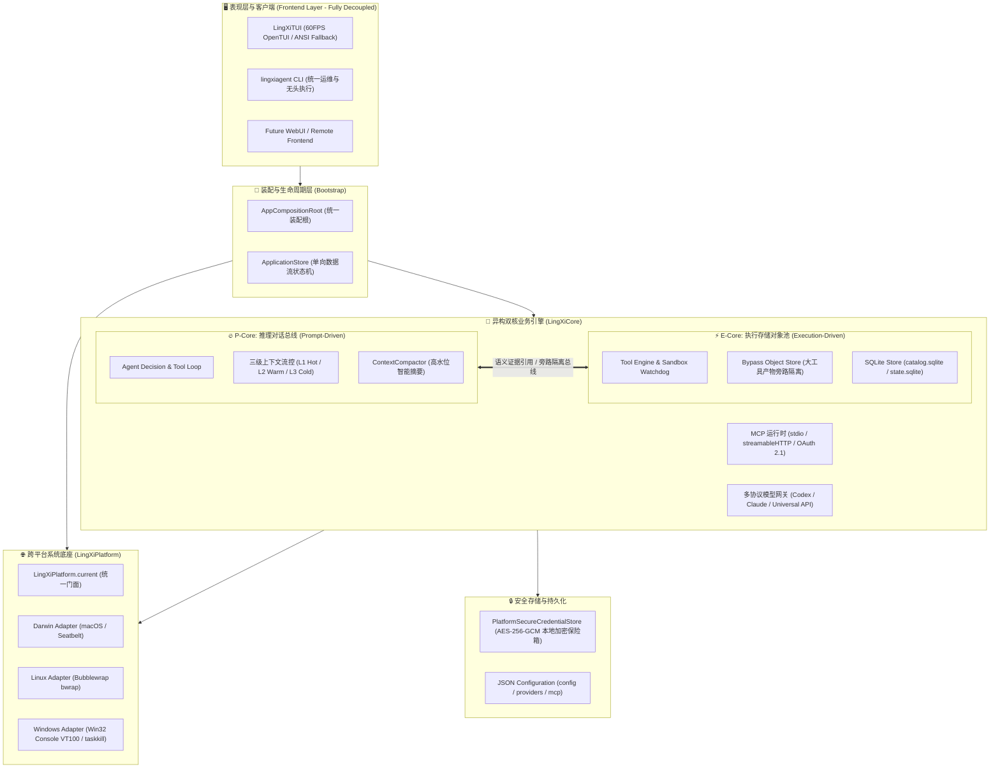
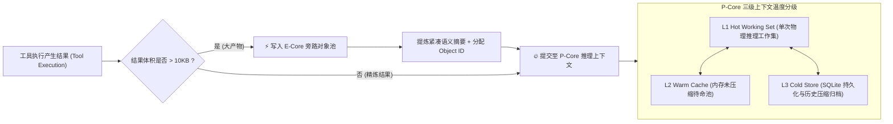

# LingXiAgent

<p align="center">
  <span style="font-size: 64px;">🦊</span><br/>
  <strong>Native Swift AI Coding Agent with Heterogeneous Dual-Core Architecture</strong><br/>
  <em>新一代纯 Swift 原生打造的终端 AI 编程智能体 · 全面支持 macOS · Linux · Windows</em>
</p>

<p align="center">
  <a href="https://agent.lingxifox.cn"></a>
  <a href="https://agent.lingxifox.cn/docs"></a>
  <a href="https://models.lingxifox.cn"></a>
  <a href="https://github.com/LingXiFox/LingXiAgent/releases"></a>
  <a href="LICENSE"></a>
</p>

---

> [!IMPORTANT]
> **全平台原生支持 (Platform Support)**
> - **全面支持**：本项目已完成原生跨平台重构，全面支持 **macOS** (Apple Silicon / Intel)、**Linux** (Ubuntu / Debian / Arch，x86_64 与 AArch64) 与 **Windows** (x86_64 与 ARM64)。
> - **底层保障**：由独立底座模块 `LingXiPlatform` 负责三平台纯原生系统调用抽象、Bubblewrap 容器沙箱、Win32 控制台虚拟终端处理与进程树级联深度灭活。

---

## ⚡ 快速安装与上手 (Quick Install)

### macOS / Linux (一键安装)
在终端中执行官方一键安装器（自动检测系统架构、配置环境并部署二进制）：
```bash
curl -fsSL https://agent.lingxifox.cn/install.sh | bash
```

### Windows (PowerShell 一键安装)
在原生 Windows PowerShell 中直接运行：
```powershell
irm https://agent.lingxifox.cn/install.ps1 | iex
```

安装完成后，新开终端直接输入 `lingxiagent` 即可秒级开启会话。完整使用手册与高级配置，请参阅 **[LingXiAgent 官方技术文档中心](https://agent.lingxifox.cn/docs)**。

---

## 🌟 核心特性概览

* **⚡ 极致原生性能与轻量占用**：全系统基于 Swift 6 现代并发（Concurrency & Actors）构建，冷启动仅需 ~10ms，运行期内存低至 ~35MB，告别高昂的 Node.js/Electron 运行时开销。
* **🧠 P-Core / E-Core 异构双核架构**：
  * **P-Core (Prompt-Driven 推理总线)**：守护纯净高密的推理工作集，严格控制上下文预算，保持模型 100% 的注意力聚焦与超高的服务端 Prompt Cache 命中率；
  * **E-Core (Execution Storage 执行存储)**：承载大规模工具执行产物。当测试日志、代码块或分析结果大于 10KB 时，**自动旁路沉淀**入专用对象池，仅向推理层提交紧凑语义引用，彻底根治 Token 爆炸与遗忘。
* **🖥️ 表现层与核心彻底解耦 (Frontend 契约)**：
  * TUI 全面降维为纯受控客户端，遵循 `@MainActor Frontend` 协议，不私自启动或管理核心；
  * 核心生命周期、Stdio IPC 与 Store 装配统一由 `AppCompositionRoot` 统一接管，为未来接入 WebUI、GUI 与远端 RPC 奠定架构基础。
* **🛡️ 动态宿主感知与反封锁伪装**：
  * 动态识别底层网络协议栈与平台指纹，让 TLS JA4/TCP 握手特征与应用层 User-Agent 保持 100% 原生一致；
  * 完整注入官方 Companion Headers，杜绝上游风控封锁与人机验证。
* **🔑 官方订阅与通用 API 物理隔离双轨制**：
  * 支持 ChatGPT Plus/Pro (Codex OAuth)、Claude Code 官方订阅免 API 费用直连；
  * 无缝兼容 75+ 通用商业与开源大模型（OpenAI、DeepSeek、Anthropic、Qwen、SenseNova 等）。
* **🔌 全功能 MCP (Model Context Protocol) 运行时与 Skills 体系**：
  * 原生支持 `stdio` 与现代 `streamableHTTP` 双通道；
  * 内置 RFC 9728 & RFC 8414 OAuth 2.1 浏览器本地回送授权；
  * 工具 Schema 分页拉取与短租约（Lease）调度；兼容标准 `SKILL.md` 技能动态注入。
* **⏳ 后台命令异步执行与模型休眠唤醒 (Background Tasks)**：
  * 内置原生 `run_background_command` 与 `manage_background_command` 工具及 `/tasks` 管理命令；
  * 模型派发后台命令后**自动进入休眠挂起**，绝不消耗空转 Token；任务完成、超时或异常时自动唤醒模型读取日志完成收尾汇报。
* **🛑 Esc 全局无死角熔断中断**：
  * 按下 `Esc` 键立即熔断一切活动状态（包含正在思考中的模型、休眠挂起中的任务、活跃的前台工具调用）；
  * 深度级联向后台所有子进程树发送强杀信号（`SIGKILL` / `taskkill`），彻底清空一切空转残留。
* **⌨️ 现代终端编辑与历史健壮水合**：
  * 输入框支持 `Left / Right / Home / End / Up / Down` 字符级精准光标导航；
  * 支持 `/new` 快速新建会话与跨工作区 `/resume` 断点续存，具备历史消息就地去重与空时间线兜底水合能力。
* **🤝 开放编辑器标准协议支持 (ACP - Agent Client Protocol)**：
  * 原生实现标准 ACP 协议（JSON-RPC 2.0 over Stdio），支持 `initialize`、`session/new`、`session/load`、`session/prompt` 与 `session/cancel`；
  * 可直接作为 Agent 后端接入 **Zed IDE**、**JetBrains** 与 **Neovim** 等现代编辑器，后台双向流式转送文本增量、思考流与工具交互。
* **🔍 多语言 LSP 代码智能语义矩阵 (Language Server Protocol)**：
  * 内置跨平台语言服务器编排器（`LSPCoordinator`），涵盖 **Swift** (`sourcekit-lsp`)、**Python** (`pyright`/`pylsp`)、**TypeScript/JavaScript** (`vtsls`/`typescript-language-server`)、**Rust** (`rust-analyzer`)、**Go** (`gopls`)、**C/C++** (`clangd`)；
  * 为 Agent 提供 `definitions`、`references`、`document_symbols`、`diagnostics`、`hover`、`completion` 六大精确代码语义能力；
  * 具备实时文件同步与环境平滑降级（LSP 未安装或崩溃时安全回退至正则与 Index 引擎），保障 Agent 稳定可靠。
* **⚡ 多语言代码格式化引擎 (Code Formatter - 对标 OpenCode 规范)**：
  * 内置 `format_file` 工具与写盘后置自动格式化（Auto-format on save），写完代码自动保持排版美观；
  * 自动感知项目本地及全局环境：Swift (`swift-format`)、Python (`ruff`/`black`)、TypeScript/JavaScript/Web (`prettier`/`biome`)、Rust (`rustfmt`)、Go (`gofmt`)、C/C++ (`clang-format`)；
  * 具备 15 秒超时看门狗与静默平滑降级，格式化器未就绪或报错绝不阻断 Agent 生成流程。
* **🗺️ 原生代码图谱与拓扑分析引擎 (Codebase Knowledge Graph - 对标 codebase-memory)**：
  * 内置轻量有向图模型与 AST 拓扑提取器（`codebase_graph` 工具），实现零外部重型依赖的本地代码认知图谱；
  * 支持 `architecture`：自动提取高层架构分层（api / core / infra / test）、模块依赖拓扑及核心高扇入热点符号（Hotspots）；
  * 支持 `trace`：沿着 `calls` 关系进行双向 BFS 拓扑遍历（`inbound` 追查调用方，`outbound` 追查被调用方，支持 1-5 级深度追溯）；
  * 支持 `search` 拓扑符号检索与增量时间戳轻量本地持久化缓存。
* **🔒 本地加密保险箱 (Vault)**：
  * 采用 AES-256-GCM 高强度加密，凭据安全落盘于本地保险箱；
  * 支持 `本地加密保险箱` ⇄ `当前进程环境变量` 双重自动回退。

---

## 🏛️ 系统架构设计 (Architecture Blueprint)



### Swift Package 模块职责定位

| Target | 职责定位 | 核心依赖 |
| :--- | :--- | :--- |
| **`LingXiProtocol`** | 纯强类型契约层，定义领域实体、流式帧（Wire Frame）、错误码与 RPC 协议 | 纯原生，零外部依赖 |
| **`LingXiPlatform`** | 跨平台系统调用抽象层（Darwin/Linux/Windows 原生适配、沙箱、进程树级联灭活） | 纯原生系统接口 |
| **`LingXiCore`** | 业务权威中心，内含 P-Core 推理总线、E-Core 旁路对象池、Tool/MCP/Provider 引擎 | `LingXiProtocol`, `LingXiPlatform` |
| **`LingXiClient`** | 驱动 Core 的双工客户端 SDK，支持进程内通道及 Stdio JSON Lines 管道通信 | `LingXiProtocol`, `LingXiPlatform` |
| **`LingXiApplication`**| 应用层业务聚合与表现层契约，定义 `Frontend` 协议与 `AppCompositionRoot` | `LingXiClient`, `LingXiProtocol`, `LingXiPlatform` |
| **`LingXiTUI`** | 纯表现层受控终端，遵循 `Frontend` 契约，支持双栏渲染与富文本流式交互 | `LingXiApplication`, `LingXiTUIComponents`, `LingXiPlatform` |
| **`LingXiCoreHost`** | 独立 Core 后台服务执行体，提供标准 Stdio JSON Lines 协议管道 | `LingXiCore`, `LingXiProtocol`, `LingXiPlatform` |
| **`lingxiagent`** | 统一综合命令行入口（运行 TUI、doctor 体检、mcp 诊断、auth 鉴权管理） | 整合各层入口 |

---

## 🔄 深度解析：P-Core 与 E-Core 双核异构与分级流控

在复杂编程工程与多轮长会话中，传统 Agent 将成千上万行代码重构记录、测试输出与报错日志无脑堆入对话上下文，导致模型推理显存被垃圾数据淹没，引发高昂费用与“注意力迷航”。LingXiAgent 设计了严格的**异构双核旁路总线**：



### 1. 双核协同机制
1. **执行大结果旁路隔离**：当执行 `shell` 产出几十 KB 编译日志或大型文件读取时，E-Core 拦截原始数据并存入本地对象存储池，仅向 P-Core 注入结构化证据摘要（`[Tool output archived to E-Core ID: obj_xxx]`），上下文净省 85% 以上空间。
2. **三级上下文温度流转**：
   - **🔥 L1 (Hot Working Set)**：直接参与大模型推理的高热活跃工作集，受上下文预算（Context Budget）与动态 SoftLimit 严格防爆守护；
   - **⚡ L2 (Warm Cache)**：内存未压缩页面池，L1 超载时按 LRU 与相关度加权淘汰降级至 L2；再次命中时秒级提拔（Promote）回 L1；
   - **❄️ L3 (Cold Store)**：当历史长会话逼近高水位（High-Water Mark）时，`ContextCompactor` 执行语义提炼归档，释放工作集空间。

---

## 🖥️ 沉浸式终端界面 (LingXiTUI)

启动方式：终端执行 `lingxiagent`。

```text
┌─ 🦊 LingXiAgent ──────────────────────────┬─ Conversation ────────────────────────────────┐
│ 🧠 Context Budget (L1/L2/L3):             │ Assistant                                     │
│   [████████████░░░░░░░░] 62.4k / 200k     │ 我已使用 edit_file 完成了底层协议解耦。       │
│                                           │ 代码修改已通过本地沙箱单元测试回归验证。      │
│ ⚡ Prompt Cache Efficiency:                │                                               │
│   Hit Rate: 82.3% (3,072 / 3,747 tokens)  │ ⚡️ deepseek-chat · 1.2s · 0.3s · 88tps · 22:30 │
│                                           ├───────────────────────────────────────────────┤
│ 🔌 Active MCP Servers:                    │ > 请继续为 Linux 平台增加 Bubblewrap 沙箱策略 │
│   ● openapi-mcp-core  ● notion  ● trivy   │                                               │
└───────────────────────────────────────────┴───────────────────────────────────────────────┘
```

* **双栏监控看板**：左侧实时展示三级缓存水位、大模型服务端真实 Prompt Cache 命中率、活跃 MCP 服务状态与子代理树；
* **精准性能注脚**：每轮问答末尾自动输出暗调遥测参数：`⚡️ <model> · 耗时 <dur> · 首字 <latency> · <tokens/s> · <timestamp>`；
* **跨工作区 `/resume` 会话恢复**：全盘智能扫描会话并按工作目录层级聚合，当前目录自动置顶；跨目录切换时**自动 `cd` 并从 SQLite 完整水合恢复历史时间线**；
* **快捷按键与 Slash 命令**：
  * `Esc`：全局熔断中断，立即杀死后台进程树并终止当前执行；
  * `Tab / Shift+Tab`：在 Normal / Plan / Boost 智能体模式间切换；
  * `← / → / Home / End`：输入框内字符精准游走定位；
  * `/tasks`：实时列出、检查与终止后台异步任务；
  * `/new`：秒级开辟全新对话流，自动重置视口与输入焦点。

---

## 🛠️ 统一命令行运维手册 (`lingxiagent`)

```bash
# 1. 启动交互式 TUI 终端
lingxiagent
lingxiagent -C /path/to/project       # 指定工作目录启动
lingxiagent -y "运行测试并修复报错"     # YOLO 自动放行模式运行

# 2. 全系统健康诊断 (Doctor)
lingxiagent doctor                    # 一键体检系统环境、沙箱能力、凭据与 MCP

# 3. 官方订阅与提供商鉴权管理 (Auth)
lingxiagent auth list                 # 查看所有 Provider 当前认证状态
lingxiagent auth login openai-codex   # 登录 OpenAI ChatGPT Plus/Pro (Codex OAuth)
lingxiagent auth login anthropic-claude-subscription # 登录 Claude Code 订阅
lingxiagent auth set <KEY> [VALUE]    # 将自定义密钥安全存入本地加密保险箱
lingxiagent auth matrix               # 查看模型兼容与上下文特性矩阵

# 4. MCP 服务运维与健康状态探测 (MCP)
lingxiagent mcp list                  # 查看已配置的全部 MCP 状态
lingxiagent mcp status                # 全量在线连通性与工具发现探测
lingxiagent mcp login <name>          # 启动 RFC 9728 OAuth 2.1 浏览器全自动授权
lingxiagent mcp enable / disable <name> # 快速启用或禁用指定服务

# 5. 会话管理与无头执行 (Exec & Resume)
lingxiagent resume --last             # 恢复上一次未完成的会话
git diff | lingxiagent exec "代码审查" # 通过管道输入进行无头自动化分析

# 6. ACP 模式运行 (用于 Zed / JetBrains / IDE 集成)
lingxiagent acp                       # 以 Agent Client Protocol 标准服务端启动 (Stdio JSON-RPC 2.0)
```

#### 接入 Zed IDE (ACP 标准支持)
在 Zed 的 `settings.json` 中配置外部 Assistant：
```json
{
  "assistant": {
    "version": "2",
    "default_model": {
      "provider": "acp",
      "model": "LingXiAgent"
    },
    "providers": {
      "acp": {
        "command": "lingxiagent",
        "args": ["acp"]
      }
    }
  }
}
```

---

## 🛡️ 跨平台系统支持与安全规范

LingXiAgent 严格恪守核心纪律准则：
1. **凭据绝对不可碰**：原始密钥仅在内存中短暂用于建连，绝不进入 Session、上下文、工具归档、协议报文或日志。
2. **破坏先备份**：任何针对配置文件、数据库与重要代码的破坏性操作前，均自动于工作区进行备份隔离。
3. **平台安全防护**：
   - **macOS (Darwin)**：POSIX 独立进程组隔离、Seatbelt 沙箱 profile、`SecRandomCopyBytes` 密码级强随机数；
   - **Linux**：集成 Bubblewrap (`bwrap`) 容器命名空间沙箱与只读挂载隔离，`/dev/urandom` 强随机数源；
   - **Windows**：Win32 控制台虚拟终端 VT100 原生支持，`taskkill /F /T` 级联深度杀灭进程树，严格路径包含防穿透。

---

## 🧪 自动化测试套件

```bash
# 完整构建所有 Target
swift build

# 运行全量自动化测试 (包含并发测试、协议契约、双核旁路、跨平台抽象与 MCP 回放)
swift test

# 快速运行跨平台与解耦专项测试
swift test --filter PlatformAbstractionAndDecouplingTests
swift test --filter ToolRuntimeTests
```

---

## 📜 授权许可与知识产权规范 (Licensing & Terms)

LingXiAgent 采用清晰严密的 **多轨分层许可体系（Multi-Tiered Licensing Scheme）**：

| 组件层级 (Layer) | 覆盖目录 (Directories) | 授权协议 (License) | 本地构建/体验 | 二次分发/镜像/上架 | 商业化/SaaS/代售 |
| :--- | :--- | :--- | :---: | :---: | :---: |
| **底座核心 (Core)** | `Sources/LingXiCore`<br/>`Sources/LingXiRuntime`<br/>`Sources/LingXiPlatform`<br/>`Sources/LingXiProtocol`<br/>`Sources/LingXiStorage`<br/>`Sources/LingXiAppCommon` | **[LCSAL-1.0](LICENSE-CORE)**<br/>*(源码可用 / 个人自用)* | ✅ **允许** | ❌ **严禁二次上架或镜像** | ❌ **严禁商业化** |
| **表现层客户端 (Frontend)** | `Sources/LingXiTUI`<br/>`Sources/LingXiCLI` (表现层入口)<br/>未来的 `LingXiGUI` / `LingXiWebUI` | **[PolyForm Noncommercial 1.0.0](LICENSE-FRONTEND)**<br/>*(源码开放 / 自由分发)* | ✅ **允许** | ✅ **允许自由分发二次上架**<br/>*(须保留署名与非商业声明)* | ❌ **严禁商业化** |
| **第三方库 (Vendor)** | `Vendor/OpenTUI/` | 各自上游原始开源许可 (GPLv3 等) | 遵循原协议 | 遵循原协议 | 遵循原协议 |

* **个人开发者自用**：欢迎任何人克隆至本地，研究、学习、构建并作为个人开发助手单机体验；
* **严禁二次分发 Core**：**严禁**将 Core 及其衍生代码制作镜像、二次打包或重新上架至 GitHub、GitLab、Gitee、云盘或三方包管理镜像源；
* **严禁商业使用**：无论是 Core 还是 Frontend，均**严禁用于任何商业盈利、付费 API/Token 代理或 SaaS/PaaS 托管运营**；
* **协作规范**：欢迎在 [Issues](https://github.com/LingXiFox/LingXiAgent/issues) 提交反馈与设计讨论；所有 Pull Request 均须通过所有者（@LingXiFox）显式审查批准后方可合并。

详细法律文本请阅读根目录 **[LICENSE](LICENSE)**、**[LICENSE-CORE](LICENSE-CORE)** 与 **[LICENSE-FRONTEND](LICENSE-FRONTEND)**。

---

<p align="center">
  LingXiAgent, crafted for effortless coding. 🦊✨
</p>
