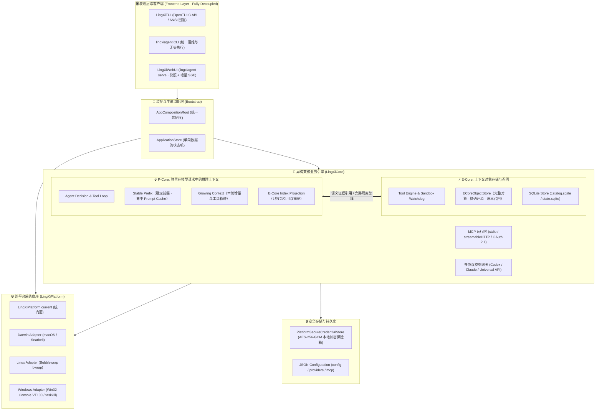
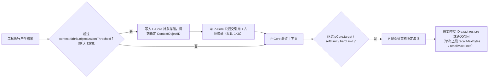

# LingXiAgent

<p align="center">
  <span style="font-size: 64px;">🦊</span><br/>
  <strong>Native Swift AI Coding Agent with Heterogeneous Dual-Core Architecture</strong><br/>
  <em>新一代纯 Swift 原生打造的终端 AI 编程智能体 · macOS / Linux 官方支持 (CLI + TUI + WebUI) · Windows 实验性支持</em>
</p>

<p align="center">
  <a href="https://agent.lingxifox.cn"></a>
  <a href="https://agent.lingxifox.cn/docs.html"></a>
  <a href="https://models.lingxifox.cn"></a>
  <a href="https://github.com/LingXiFox/LingXiAgent/releases"></a>
  <a href="LICENSE"></a>
</p>

---

> [!IMPORTANT]
> **平台支持口径 (Platform Support Matrix)** — 正式 release 版本以 GitHub Releases 为准，产品版本常量在 `Sources/LingXiProtocol/ProductVersion.swift`
> 
> | 操作系统 | 支持级别 | 交付形态 | 预编译发布包 (Prebuilt) | 源码构建 (Source Build) | 平台专属能力边界说明 |
> | :--- | :--- | :--- | :--- | :--- | :--- |
> | **macOS** | Supported (release blocker) | CLI + TUI | `arm64` (Apple Silicon) | Apple Silicon / Intel | 全功能就绪：Seatbelt 原生沙箱、Browser Use、视觉桌面感知 (Computer Use) |
> | **Linux** | Supported (release blocker) | CLI + TUI | `x86_64` (Ubuntu/Debian/Arch) | x86_64 / AArch64 | 核心就绪：Bubblewrap 沙箱、Browser Use；桌面视觉 Computer Use 暂不开放 |
> | **Windows** | Supported (x86_64 预编译包已发布) | CLI + TUI | `x86_64` (`lingxiagent-windows-x86_64.zip`) | x86_64 / ARM64（ARM64 仅源码路径） | Win32 抽象完整：VT100 控制台、`%PATHEXT%`、`taskkill /T` 进程树；`sqlite3.dll` 随包发布。桌面视觉能力按宿主实际可用性如实申报 |
> 
> 表现层由纯受控客户端 `LingXiTUI` 驱动，系统底层由独立平台层 `LingXiPlatform` 与 `CSQLite` 提供跨平台强一致保障。
> 历史遗留问题与复现路径记录在 `Docs/V1-Cross-Platform-Baseline-Audit.md` 的 V1.1.0 交接章节。

---

## ⚡ 快速安装与上手 (Quick Install)

### macOS / Linux (一键安装)
在终端中执行官方一键安装器（自动检测系统架构、配置环境并部署二进制）：
```bash
curl -fsSL https://agent.lingxifox.cn/install.sh | bash
```

> [!NOTE]
> - **预编译与架构**：macOS 预编译发布包针对 Apple Silicon (`arm64`)，Linux 预编译发布包针对 `x86_64`。Intel Mac (`x86_64`) 或 AArch64 Linux 运行安装脚本时，若系统已安装 Swift，将自动浅克隆极速源码编译安装。
> - **安装产物**：安装器将自动部署三个可执行入口与配套资源：
>   - `lingxiagent`：主程序入口（交互式 TUI、CLI 子命令、ACP 守护进程）；
>   - `LingXiTUI`：独立终端 TUI 视图入口；
>   - `LingXiCoreHost`：内核服务宿主（支持 Stdio IPC 通信）；
>   - `LingXiAgent_LingXiCore.bundle` 与 `Sidecars`（Browser 自动化等扩展能力）。
> - **推荐系统依赖**：`grep` 与 `glob` 工具在运行时依赖系统的 `ripgrep` (`rg`)。推荐提前安装：
>   - macOS: `brew install ripgrep`
>   - Linux (Ubuntu/Debian): `sudo apt install ripgrep`
>   - Linux (Arch): `sudo pacman -S ripgrep`

### Windows (x86_64 预编译包已发布)
自 v1.1.0 起 Windows 有正式预编译包：`lingxiagent-windows-x86_64.zip`（附同名 `.sha256`），
解压后直接运行，`sqlite3.dll` 与资源包已随包放在同一目录。官方安装器：
```powershell
irm https://agent.lingxifox.cn/install.ps1 | iex
```
ARM64 Windows 与其余非 x86_64 架构走源码构建（需本机 Swift 工具链）：
```powershell
swift build -c release --product lingxiagent
swift build -c release --product LingXiCoreHost
swift build -c release --product LingXiTUI
swift build -c release --product lingxiagent-ops
```

安装完成后，新开终端直接输入 `lingxiagent` 开启会话。完整使用手册与高级配置见
**[LingXiAgent 官方技术文档](https://agent.lingxifox.cn/docs.html)**；插件开发见
**[LingXiPluginSDK 文档](https://agent.lingxifox.cn/sdk.html)**。

---

## 🌟 核心特性概览

* **⚡ 原生编译，无脚本运行时**：全系统基于 Swift 6 现代并发（Concurrency & Actors）构建，交付的是原生二进制，不依赖 Node.js / Bun / Electron 运行时。启动耗时与常驻内存随终端模拟器与宿主环境变化，本项目不发布未经复现的 benchmark 数字。
* **🧠 P-Core / E-Core 上下文双核分工**：
  * **P-Core（Prompt-resident reasoning context，`PCoreContextEngine`）**：决定什么留在模型请求的上下文里——稳定前缀、递增上下文与 E-Core 索引投影；淘汰由 P 侧保留策略决定，并配合上游 Prompt Cache；
  * **E-Core（Context object store / recall，`ECoreObjectStore`）**：保存被 page-out 的完整对象，提供引用索引、按 `ContextObjectID` 精确还原与语义召回。工具输出超过 `context.fabric.objectizationThreshold`（默认 32,768 字节）即对象化，P-Core 只持有引用与摘要。
* **🖥️ 表现层与核心彻底解耦 (Frontend 契约)**：
  * TUI 全面降维为纯受控客户端，遵循 `@MainActor Frontend` 协议，不私自启动或管理核心；
  * 核心生命周期、Stdio IPC 与 Store 装配统一由 `AppCompositionRoot` 统一接管，CLI / TUI / WebUI 三个正式前端共用同一套契约，GUI 与远端 RPC 沿用同一入口。
* **🛡️ 宿主感知的客户端请求画像（`ClientFingerprint`）**：
  * 按渠道动态生成出站 `User-Agent` 与伴随请求头，其中操作系统与架构字段取自真实宿主（`ClientFingerprint.currentPlatform()`），不硬编码其它平台的字符串；
  * 只影响应用层 HTTP 头部：它不改变传输层 TLS/TCP 栈，因此不存在也不宣称「TLS/JA3/JA4 指纹伪装」，更不承诺任何「绕过风控」的效果——上游如何判定由其自身策略决定。
* **🔑 官方订阅与通用 API 物理隔离双轨制**：
  * 支持 ChatGPT Plus/Pro (Codex OAuth)、Claude Code 官方订阅免 API 费用直连；
  * 通用模型清单以 [Models Hub](https://models.lingxifox.cn) 发布的 `models.json` 为准（Provider 与模型数量随上游变化，仓库与文档不写死计数）；实际可选用哪些还取决于本机运行时契约与账号可用性。
* **🔌 全功能 MCP (Model Context Protocol) 运行时与 Skills 体系**：
  * 原生支持 `stdio` 与现代 `streamableHTTP` 双通道；
  * 内置 RFC 9728 & RFC 8414 OAuth 2.1 浏览器本地回送授权；
  * 工具 Schema 分页拉取与短租约（Lease）调度；兼容标准 `SKILL.md` 技能动态注入。
* **⏳ 后台命令异步执行与模型休眠唤醒 (Background Tasks)**：
  * 内置原生 `run_background_command` 与 `manage_background_command` 工具及 `/tasks` 管理命令；
  * 模型派发后台命令后**自动进入休眠挂起**，绝不消耗空转 Token；任务完成、超时或异常时自动唤醒模型读取日志完成收尾汇报。
* **🛑 Esc 全局无死角熔断中断**：
  * 按下 `Esc` 键立即熔断一切活动状态（包含正在思考中的模型、休眠挂起中的任务、活跃的前台工具调用）；
  * 深度级联向后台所有子进程树发送强杀信号（`SIGKILL` / `taskkill`），彻底清空一切空转残留。
* **⌨️ 现代终端编辑与历史健壮水合**：
  * 输入框支持 `Left / Right / Home / End / Up / Down` 字符级精准光标导航；
  * 支持 `/new` 快速新建会话与跨工作区 `/resume` 断点续存，具备历史消息就地去重与空时间线兜底水合能力。
* **🤝 开放编辑器标准协议支持 (ACP - Agent Client Protocol)**：
  * 原生实现标准 ACP 协议（JSON-RPC 2.0 over Stdio），支持 `initialize`、`session/new`、`session/load`、`session/prompt` 与 `session/cancel`；
  * 可直接作为 Agent 后端接入 **Zed IDE**、**JetBrains** 与 **Neovim** 等现代编辑器，后台双向流式转送文本增量、思考流与工具交互。
* **🔍 多语言 LSP 代码智能语义矩阵 (Language Server Protocol)**：
  * 内置跨平台语言服务器编排器（`LSPCoordinator`），涵盖 **Swift** (`sourcekit-lsp`)、**Python** (`pyright`/`pylsp`)、**TypeScript/JavaScript** (`vtsls`/`typescript-language-server`)、**Rust** (`rust-analyzer`)、**Go** (`gopls`)、**C/C++** (`clangd`)；
  * 为 Agent 提供 `definitions`、`references`、`document_symbols`、`diagnostics`、`hover`、`completion` 六大精确代码语义能力；
  * 具备实时文件同步与环境平滑降级（LSP 未安装或崩溃时安全回退至正则与 Index 引擎），保障 Agent 稳定可靠。
* **⚡ 多语言代码格式化引擎 (Code Formatter - 对标 OpenCode 规范)**：
  * 内置 `format_file` 工具与写盘后置自动格式化（Auto-format on save），写完代码自动保持排版美观；
  * 自动感知项目本地及全局环境：Swift (`swift-format`)、Python (`ruff`/`black`)、TypeScript/JavaScript/Web (`prettier`/`biome`)、Rust (`rustfmt`)、Go (`gofmt`)、C/C++ (`clang-format`)；
  * 具备 15 秒超时看门狗与静默平滑降级，格式化器未就绪或报错绝不阻断 Agent 生成流程。
* **🗺️ 原生代码图谱与拓扑分析引擎 (Codebase Knowledge Graph - 对标 codebase-memory)**：
  * 内置轻量有向图模型与 AST 拓扑提取器（`codebase_graph` 工具），实现零外部重型依赖的本地代码认知图谱；
  * 支持 `architecture`：自动提取高层架构分层（api / core / infra / test）、模块依赖拓扑及核心高扇入热点符号（Hotspots）；
  * 支持 `trace`：沿着 `calls` 关系进行双向 BFS 拓扑遍历（`inbound` 追查调用方，`outbound` 追查被调用方，支持 1-5 级深度追溯）；
  * 支持 `search` 拓扑符号检索与增量时间戳轻量本地持久化缓存。
* **🔒 本地加密凭据保险箱**：
  * 凭据统一存放在数据目录的 `credentials.vault`：AES-256-GCM 认证加密，密钥来自口令派生（PBKDF2-HMAC-SHA256，≥100,000 轮）或机器绑定的保护性密钥，文件权限收紧到 `0600`；macOS Keychain 只做一次性迁移读取；
  * 配置文件里不允许出现明文凭据：`providers.json` / `mcp.json` 的凭据字段只接受 `{env:VAR}` 与 `{vault:...}` 引用形式；`{vault:...}` 是唯一的持久凭据源，`{env:VAR}` 只作开发 / CI / 命令行临时覆盖用（Dock/Finder 启动的 GUI 继承 launchd 环境，读不到登录 shell 的变量），`LINGXI_<PROVIDER_ID>_API_KEY` 是显式覆盖层，优先级最高；
* **🎨 现代交互式 TUI 体系与 24-bit TrueColor 主题引擎**：
  * 内置 6 套高保真配色主题（LingXiAgent Dark、LingXiAgent Light、Catppuccin Mocha、Nord Aurora、Dracula、Monochrome Minimal），支持 24-bit RGB TrueColor 与 ANSI 动态回退；
  * 全局快捷键 `Ctrl+T` 或 `/theme` 呼出弹出式**主题选择器 (Theme Picker)**，支持按键即时搜索过滤、光标上下切换与免重启即时热重载；
  * **交互操作全面浮层化 (Interactive Pickers)**：`/mode` (Build/Plan/Explore 模式直选)、`/permissions` (Ask/Auto/YOLO 权限策略直选)、`/reasoning` (Auto/Off/Low/Medium/High/Max 思考等级直选) 均支持方向键直选即生效，告别手打二级参数；
  * **大篇幅查阅全面模态化 (Modal Overlays)**：快捷键速查 (`/keybindings`)、代码变更审查 (`/diff`)、技能库清单 (`/skills`)、系统仪表盘 (`/status`)、双核上下文 (`/context`)、性能报表 (`/perf`)、MCP 监视器 (`/mcp`) 均收敛至居中浮动模态卡片，支持 `j`/`k`/上下平滑滚动与 `Esc` 退出，彻底告别终端滚屏刷屏与对话流污染。
* **🖥️ 浏览器与操作系统级视觉桌面感知 (Browser & Computer Use)**：
  * 内置高精度双显示器视觉捕获与屏幕坐标计算（`computer_batch`），支持 0 误差动态租借工具调度；
  * 原生支持无头与有头真实浏览器会话控制，实现端到端自动化。

---

## 🏛️ 系统架构设计 (Architecture Blueprint)


```mermaid
flowchart TD
    subgraph UI_Layer["🖥️ 表现层与客户端 (Frontend Layer - Fully Decoupled)"]
        TUI["LingXiTUI (OpenTUI C ABI / ANSI 回退)"]
        CLI["lingxiagent CLI (统一运维与无头执行)"]
        WebClient["LingXiWebUI (lingxiagent serve · 快照 + 增量 SSE)"]
    end

    subgraph Bootstrap_Layer["🚀 装配与生命周期层 (Bootstrap)"]
        Root["AppCompositionRoot (统一装配根)"]
        Store["ApplicationStore (单向数据流状态机)"]
    end

    subgraph Platform_Layer["🌐 跨平台系统底座 (LingXiPlatform)"]
        PlatformFacade["LingXiPlatform.current (统一门面)"]
        DarwinAdapter["Darwin Adapter (macOS / Seatbelt)"]
        LinuxAdapter["Linux Adapter (Bubblewrap bwrap)"]
        WindowsAdapter["Windows Adapter (Win32 Console VT100 / taskkill)"]
    end

    subgraph Core_Engines["🧠 异构双核业务引擎 (LingXiCore)"]
        subgraph P_Core["🔥 P-Core: 驻留在模型请求中的推理上下文"]
            ReasoningLoop["Agent Decision & Tool Loop"]
            StablePrefix["Stable Prefix（稳定前缀 · 命中 Prompt Cache）"]
            GrowingCtx["Growing Context（本轮增量与工具轨迹）"]
            IndexProj["E-Core Index Projection（只投影引用与摘要）"]
        end

        subgraph E_Core["⚡ E-Core: 上下文对象存储与召回"]
            ToolRuntime["Tool Engine & Sandbox Watchdog"]
            ObjectStore["ECoreObjectStore（完整对象 · 精确还原 · 语义召回）"]
            StateDB["SQLite Store (catalog.sqlite / state.sqlite)"]
        end

        MCPRuntime["MCP 运行时 (stdio / streamableHTTP / OAuth 2.1)"]
        ModelGateway["多协议模型网关 (Codex / Claude / Universal API)"]
    end

    subgraph Persistence["🔒 安全存储与持久化"]
        Vault["PlatformSecureCredentialStore (AES-256-GCM 本地加密保险箱)"]
        ConfigJSON["JSON Configuration (config / providers / mcp)"]
    end

    UI_Layer --> Bootstrap_Layer
    Bootstrap_Layer --> Platform_Layer
    Bootstrap_Layer --> Core_Engines
    Core_Engines --> Platform_Layer
    Core_Engines --> Persistence
    P_Core <== "语义证据引用 / 旁路隔离总线" ==> E_Core
```

### Swift Package 模块职责定位

| Target | 职责定位 | 核心依赖 |
| :--- | :--- | :--- |
| **`LingXiProtocol`** | 纯强类型契约层，定义领域实体、流式帧（Wire Frame）、错误码与 RPC 协议 | 纯原生，零外部依赖 |
| **`LingXiPlatform`** | 跨平台系统调用抽象层（Darwin/Linux/Windows 原生适配、沙箱、进程树级联灭活） | 纯原生系统接口 |
| **`LingXiCore`** | 业务权威中心，内含 P-Core 推理总线、E-Core 旁路对象池、Tool/MCP/Provider 引擎 | `LingXiProtocol`, `LingXiPlatform` |
| **`LingXiClient`** | 驱动 Core 的双工客户端 SDK，支持进程内通道及 Stdio JSON Lines 管道通信 | `LingXiProtocol`, `LingXiPlatform` |
| **`LingXiApplication`**| 应用层业务聚合与表现层契约，定义 `Frontend` 协议与 `AppCompositionRoot` | `LingXiClient`, `LingXiProtocol`, `LingXiPlatform` |
| **`LingXiTUI`** | 纯表现层受控终端，遵循 `Frontend` 契约，支持双栏渲染与富文本流式交互 | `LingXiApplication`, `LingXiTUIComponents`, `LingXiPlatform` |
| **`LingXiCoreHost`** | 独立 Core 后台服务执行体，提供标准 Stdio JSON Lines 协议管道 | `LingXiCore`, `LingXiProtocol`, `LingXiPlatform` |
| **`lingxiagent`** | 用户前端入口：无参数进入 TUI，`serve` 起 WebUI | 整合各层入口 |
| **`lingxiagent-ops`** | 运维与批处理入口：`auth` / `models` / `mcp` / `skills` / `exec` / `review` / `doctor` / `resume` / `acp` / `task` / `completion`（`lingxiagent` 遇这些动词只转介到这里） | 链接 Core 做后端管理 |

此外两个**独立仓库、独立 MIT、独立 SemVer** 的公共 Swift Package 不属于本仓库的 target：`LingXiModelSDK`（模型目录消费者）与 `LingXiPluginSDK`（插件作者），本仓库自己也通过公开 SwiftPM 入口消费它们。

---

## 🔄 深度解析：P-Core 与 E-Core 的上下文分工

一次工具调用就可能返回上万行测试日志或整份文件。如果它们全部留在模型请求里，上下文窗口会被低价值数据填满，既推高成本也稀释注意力。LingXiAgent 因此把「留在请求里的内容」与「完整内容的存放与取回」拆成两个核心：


```mermaid
flowchart LR
    ToolExec["工具执行产生结果"] --> SizeCheck{"超过 context.fabric.objectizationThreshold？（默认 32KB）"}
    SizeCheck -- "是" --> Objectize["写入 E-Core 对象存储，得到稳定 ContextObjectID"]
    Objectize --> Projection["向 P-Core 只提交引用 + 占位摘录（默认 1KB）"]
    Projection --> PCore["P-Core 驻留上下文"]
    SizeCheck -- "否" --> PCore
    PCore --> Retention{"超过 pCore.target / softLimit / hardLimit？"}
    Retention -- "是" --> Evict["P 侧保留策略决定淘汰"]
    Evict --> Recall["需要时按 ID exact restore 或语义召回<br/>（单次上限 recallMaxBytes / recallMaxLines）"]
```

### 协同规则

1. **对象化而非截断**：超阈值的大输出写入 E-Core 得到稳定 `ContextObjectID`，P-Core 只持有引用与占位摘录；原文没有被丢弃，可按 ID 精确还原或经 `context_recall` 语义召回。
2. **淘汰由 P 侧决定**：`context.pCore` 的 `target / softLimit / hardLimit` 是驻留预算，超限时的取舍是 P 侧保留策略的职责。
3. **E-Core heat 不参与淘汰**：heat（含 `heatDecayHalfLifeSeconds` 衰减）只服务召回排序、缓存与可观测性。
4. **配置键即事实**：上述阈值全部来自 `config.json` 的 `context` 分段，语义以 `Sources/LingXiCore/Configuration/ConfigurationTypes.swift` 为准，详见 [/docs.html#arch-context](https://agent.lingxifox.cn/docs.html#arch-context)。

> 历史文档中的「P/E-Core context PCore / RecallCache / ProjectIndex」与 `ContextCompactor` 冷热分级语义**已废弃**；当前架构只有 P-Core 与 E-Core 两个核心。`config.json` 里残留的 `pCore/recallCache/projectIndex`、`ecoreStorageEnabled` 等旧键只用于向后兼容读取，写入只落新的 P/E 键。

---

## 🖥️ 沉浸式终端界面 (LingXiTUI)

启动方式：终端执行 `lingxiagent`。

```text
┌─ 🦊 LingXiAgent ──────────────────────────┬─ Conversation ────────────────────────────────┐
│ 🧠 P-Core Context Budget:                 │ Assistant                                     │
│   [████████████░░░░░░░░] 62.4k / 200k     │ 我已使用 edit_file 完成了底层协议解耦。       │
│                                           │ 代码修改已通过本地沙箱单元测试回归验证。      │
│ ⚡ Prompt Cache Efficiency:                │                                               │
│   Hit Rate: 82.3% (3,072 / 3,747 tokens)  │ ⚡️ deepseek-chat · 1.2s · 0.3s · 88tps · 22:30 │
│                                           ├───────────────────────────────────────────────┤
│ 🔌 Active MCP Servers:                    │ > 请继续为 Linux 平台增加 Bubblewrap 沙箱策略 │
│   ● openapi-mcp-core  ● notion  ● trivy   │                                               │
└───────────────────────────────────────────┴───────────────────────────────────────────────┘
```

> 上面的界面是**布局示意（演示数据）**，其中的数字不代表实测指标。

* **双栏监控看板**：左侧实时展示 P-Core 上下文预算、上游真实 Prompt Cache 命中、活跃 MCP 服务状态与子代理树；
* **精准性能注脚**：每轮问答末尾自动输出暗调遥测参数：`⚡️ <model> · 耗时 <dur> · 首字 <latency> · <tokens/s> · <timestamp>`；
* **跨工作区 `/resume` 会话恢复**：全盘智能扫描会话并按工作目录层级聚合，当前目录自动置顶；跨目录切换时**自动 `cd` 并从 SQLite 完整水合恢复历史时间线**；
* **快捷按键与全套弹出式交互 (Pickers & Modals)**：
  * `Ctrl + T` 或 `/theme`：呼出**主题选择器**，24-bit TrueColor 即选即换；
  * `Esc`：关闭当前模态浮层 / 全局熔断中断，杀死后台所有活动进程树；
  * `Tab / Shift+Tab`：在 `AgentRunMode` 的 Build / Plan / Explore 之间循环切换（`ApplicationStore` 的 `next` 顺序）；
  * `← / → / Home / End`：输入框内字符精准游走定位；
  * `/mode`：无参弹出 **Agent 模式选择器**（Build / Plan / Explore 上下键直选）；
  * `/permissions`：无参弹出 **安全与权限策略选择器**（Ask / Auto / YOLO 直选）；
  * `/reasoning`：无参弹出 **思考等级选择器**（Auto / Off / Low / Med / High / Max 直选）；
  * `/keybindings`：弹出 **快捷键速查面板**（可滚动查阅，Esc 退出）；
  * `/diff`：弹出 **工作区 Git 变更审查器**（支持长篇 diff 平滑滚动）；
  * `/tasks`：弹出 **后台任务监控面板**，支持状态轮询与定向强杀；
  * `/status` / `/context` / `/perf` / `/mcp` / `/skills`：居中模态卡片查阅，告别行内刷屏；
  * `/new`：立即开辟全新对话流，自动重置视口与输入焦点。

---

## 🌐 浏览器工作台 (`lingxiagent serve`)

WebUI 是与 CLI / TUI 并列的第三个正式前端，跑的是同一个真实 Core：它不自己维护 Goal、Todo、
Subagent 生命周期或分支预测，只消费共享的 Frontend Contract（快照 + 增量帧），因此不存在
Mock Runtime，也不需要用户在运行期安装 Node.js / npm —— 页面资源随发布包一起交付。

```bash
lingxiagent serve                    # 启动真实 CoreHost + WebUI，默认只监听 127.0.0.1，随机端口，自动开浏览器
lingxiagent serve --port 8080        # 指定端口
lingxiagent serve --no-browser       # 只起服务（无 GUI 环境或 SSH 转发场景）
lingxiagent serve --host 127.0.0.1   # 显式回环地址；`localhost` / `::1` 等等价拼写都会归一到实际监听地址
lingxiagent serve --allow-remote     # 显式放开非回环绑定，此时必须提供访问 token
```

- 退出：`Ctrl-C`（Windows 走控制台控制事件）会先关停 HTTP/SSE 服务，再回收 CoreHost 与 sidecar，
  不留孤儿进程；`lingxiagent --help` 与 `--version` 与 CLI、TUI 保持同一份路由定义。
- 安全边界：默认只监听回环；`Host` 校验与 Origin/自定义头校验拒绝跨站调用；静态资源路径防穿透；
  非回环绑定必须显式 opt-in 且带 token。

## 🛠️ 统一命令行运维手册 (`lingxiagent`)

```bash
# 1. 启动交互式 TUI 终端
lingxiagent
lingxiagent -C /path/to/project       # 指定工作目录启动
lingxiagent -y "运行测试并修复报错"     # YOLO 自动放行模式运行

# 2. 全系统健康诊断 (Doctor)
lingxiagent-ops doctor                    # 一键体检系统环境、沙箱能力、凭据与 MCP

# 3. 官方订阅与提供商鉴权管理 (Auth)
lingxiagent-ops auth list                 # 查看所有 Provider 当前认证状态
lingxiagent-ops auth login openai-codex   # 登录 OpenAI ChatGPT Plus/Pro (Codex OAuth)
lingxiagent-ops auth login anthropic-claude-subscription # 登录 Claude Code 订阅
lingxiagent-ops auth set <KEY> [VALUE]    # 将自定义密钥安全存入本地加密保险箱
lingxiagent-ops auth matrix               # 查看模型兼容与上下文特性矩阵

# 4. MCP 服务运维与健康状态探测 (MCP)
lingxiagent-ops mcp list                  # 查看已配置的全部 MCP 状态
lingxiagent-ops mcp status                # 全量在线连通性与工具发现探测
lingxiagent-ops mcp login <name>          # 启动 RFC 9728 OAuth 2.1 浏览器全自动授权
lingxiagent-ops mcp enable / disable <name> # 快速启用或禁用指定服务

# 5. 会话管理与无头执行 (Exec & Resume)
lingxiagent-ops resume --last             # 恢复上一次未完成的会话
git diff | lingxiagent-ops exec "代码审查" # 通过管道输入进行无头自动化分析

# 6. ACP 模式运行 (用于 Zed / JetBrains / IDE 集成)
lingxiagent-ops acp                       # 以 Agent Client Protocol 标准服务端启动 (Stdio JSON-RPC 2.0)
```

#### 接入 Zed IDE (ACP 标准支持)
在 Zed 的 `settings.json` 中配置外部 Assistant：
```json
{
  "assistant": {
    "version": "2",
    "default_model": {
      "provider": "acp",
      "model": "LingXiAgent"
    },
    "providers": {
      "acp": {
        "command": "lingxiagent",
        "args": ["acp"]
      }
    }
  }
}
```

---

## 🛡️ 跨平台系统支持与安全规范

LingXiAgent 严格恪守核心纪律准则：
1. **凭据绝对不可碰**：原始密钥仅在内存中短暂用于建连，绝不进入 Session、上下文、工具归档、协议报文或日志。
2. **改文件可回溯**：每次文件写入记录进 mutation journal（含改前/改后哈希与内容、所属会话与轮次），配合 `/undo` 与按轮次回滚；Git 工作区仍是主要防线，Agent 不替代版本控制。
3. **平台安全防护**：
   - **macOS (Darwin)**：POSIX 独立进程组隔离、Seatbelt 沙箱 profile、`SecRandomCopyBytes` 密码级强随机数；
   - **Linux**：集成 Bubblewrap (`bwrap`) 容器命名空间沙箱与只读挂载隔离，`/dev/urandom` 强随机数源；
   - **Windows**：Win32 控制台虚拟终端 VT100 原生支持，`taskkill /F /T` 级联深度杀灭进程树，严格路径包含防穿透。

---

## 🧪 自动化测试套件

```bash
# 完整构建所有 Target
swift build

# 运行全量自动化测试 (包含并发测试、协议契约、双核旁路、跨平台抽象与 MCP 回放)
swift test

# 快速运行跨平台与解耦专项测试
swift test --filter PlatformAbstractionAndDecouplingTests
swift test --filter ToolRuntimeTests
```

---

## 📜 授权许可与知识产权规范 (Licensing & Terms)

LingXiAgent 采用清晰严密的 **多轨分层许可体系（Multi-Tiered Licensing Scheme）**：

| 组件层级 (Layer) | 覆盖目录 (Directories) | 授权协议 (License) | 本地构建/体验 | 二次分发/镜像/上架 | 商业化/SaaS/代售 |
| :--- | :--- | :--- | :---: | :---: | :---: |
| **底座核心 (Core)** | 以 [`LICENSE-MATRIX.md`](LICENSE-MATRIX.md) 的逐 target 清单为准：`LingXiCore`、`LingXiCoreHost`、`LingXiPlatform`、`LingXiProtocol`、`LingXiApplication`、`LingXiClient`、`CSQLite` | **[LCSAL-1.1](LICENSE-CORE)**<br/>*(源码可用 / 个人自用 / 禁商用)* | ✅ **允许本地编译自用** | ❌ **严禁**（仅官方 release 产物可非商用原样转发） | ❌ **严禁** |
| **表现层客户端 (Frontend)** | `LingXiTUI` / `LingXiTUIApp` / `LingXiTUIComponents`、`LingXiWebUI`、`LingXiFrontendKit`、`LingXiMacApp`（逐 target 以矩阵为准） | **[PolyForm Noncommercial 1.0.0](LICENSE-FRONTEND)**<br/>+ 附加条款 | ✅ **允许** | ⚠️ **受限**：第三方改版只能以**源码**形式分发；二进制只有官方 release 一份 | ❌ **严禁商业化** |
| **公共开发者 SDK** | 不在本仓库：[`LingXiModelSDK`](https://github.com/LingXiFox/LingXiModelSDK)、[`LingXiPluginSDK`](https://github.com/LingXiFox/LingXiPluginSDK)，各自独立仓库与独立 SemVer | **MIT** | ✅ **允许** | ✅ **允许**（源码与二进制均可，含修改后版本） | ✅ **允许**（含闭源产品链接引用；唯一义务是保留版权与许可声明） |
| **第三方库 (Vendor)** | `Vendor/OpenTUI/` | 各自上游原始开源许可 (GPLv3 等) | 遵循原协议 | 遵循原协议 | 遵循原协议 |

* **个人开发者自用**：欢迎任何人克隆至本地，研究、学习、构建并作为个人开发助手单机体验；
* **严禁二次分发 Core**：**严禁**将 Core 及其衍生代码制作镜像、二次打包或重新上架至 GitHub、GitLab、Gitee、云盘或三方包管理镜像源；
* **严禁商业使用**：无论是 Core 还是 Frontend，均**严禁用于任何商业盈利、付费 API/Token 代理或 SaaS/PaaS 托管运营**；
* **协作规范**：欢迎在 [Issues](https://github.com/LingXiFox/LingXiAgent/issues) 提交反馈与设计讨论；所有 Pull Request 均须通过所有者（@LingXiFox）显式审查批准后方可合并。

详细法律文本请阅读根目录 **[LICENSE](LICENSE)**、**[LICENSE-CORE](LICENSE-CORE)** 与 **[LICENSE-FRONTEND](LICENSE-FRONTEND)**。

---

<p align="center">
  LingXiAgent, crafted for effortless coding. 🦊✨
</p>
